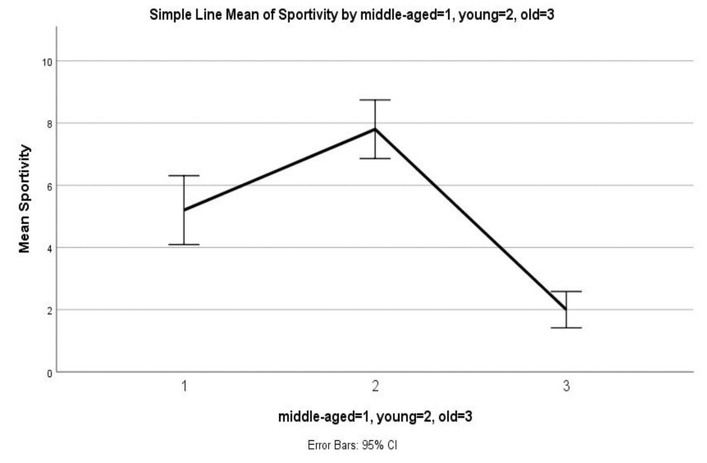
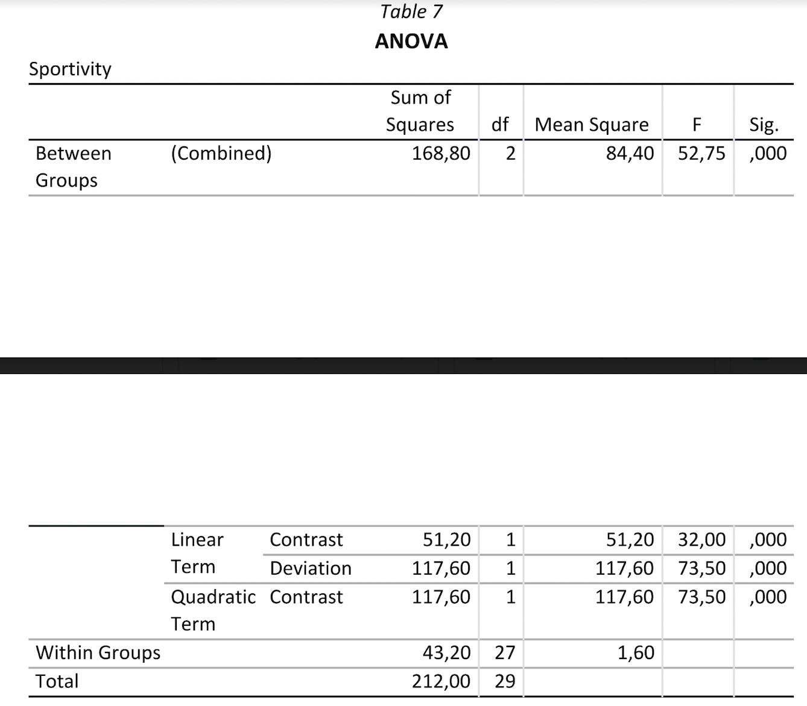
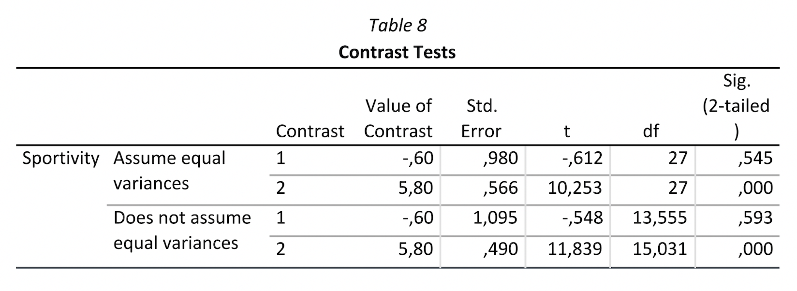
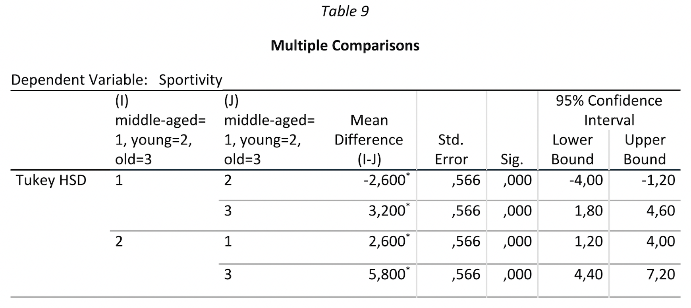
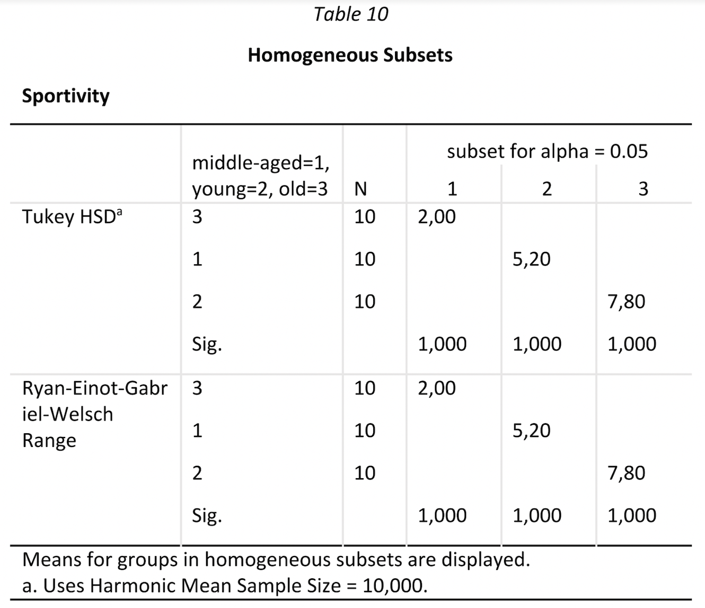

- [Abstract](#abstract)
- [Introduction](#introduction)
- [Method](#method)
- [Analysis in SPSS](#analysis-in-spss)
- [Results](#results)
- [Discussion](#discussion)

## Abstract

This experiment examined the level of sportiness of individuals from three age groups: young, middle-aged, and old. Thirty participants (10 from each age group) rated their level of sportiness in the past year on a scale from 1 to 10. Age was found to have a significant effect on sportiness levels, with the youngest individuals having significantly higher levels than the older groups, but this difference was not significant between the middle-aged and the old individuals.

## Introduction

Generally, the level of physical activity decreases with age. To evaluate this assumption in the general population, individuals from different ages (young, middle aged, old) were asked to rate their general sportiness during the past
year on a scale from 1 (lowest) to 10.

- **Null hypothesis (H0):** Mean level of sportiness is the same for all age groups.
- **Alternative hypothesis (H1):** Mean level of sportiness is not the same for all age groups.
- **Alternative hypothesis (H2):** There is a difference in sportiness levels between the young group and the old group.

## Method

- **Participants**: 30 subjects (10 young, 10 middle-aged, 10 old). 
- **Materials**: Online survey including questions about age and self-evaluation of physical activity on a scale from 1 to 10, where 10 represents the highest level of sportiness. 
- **Design**: The outcome (dependent) variable is the level of sportiness, measured at level from 1 to 10. The grouping factor (independent variable) is age, at three levels (young, middle-aged, old). The middle-aged group is the control group. The experiment has one condition. 
- **Procedure**: Participants from each age group rated their general sportiness during the past year on a scale from 1 to 10. 
- **Analysis**: Since the experiment has one factor and one outcome variable with three conditions, a one-way ANOVA was conducted. The assumptions of ANOVA (i.e., under which the F statistic is reliable) are the same as for all parametric tests (Field 2009:359): 

    - The dependent variable (in this case, the level of sportiness) is metric, measured on an interval scale.
    - Homogeneity of variances: the variances in each experimental condition should be equal.
    - Independence of observations: the samples should be independent.
    - Normality: The distributions within groups should be normally distributed. 

## Analysis in SPSS

Therefore, the selected options for ANOVA in SPSS are (Field, 2009:379): 

- **Descriptive**, to obtain the means, standard deviations, standard errors, ranges and confidence intervals of each mean, which assist in interpreting the results. 
- **Homogeneity of variance**, to test this assumption. 
- **Brown-Forsythe and Welch**, which are alternative versions of the F-ratio, useful in case the assumption of homoscedasticity is broken. 
- **Means plot**, to obtain a line graph of the group means before the analysis.
- **Exclude cases analysis by analysis**, to exclude all cases that have a missing value for either the independent or the dependent variable used in this analysis.

The F-ratio of ANOVA indicates whether the model fitted to the data accounts for more variation than extraneous factors, but it does not specify where the differences between groups lie (Field 2009:360). Therefore, it is necessary to run planned comparisons or post-hoc tests, which consist of pairwise comparisons that are designed to compare all different combinations of the treatment groups 2009:372). In this case, a post-hoc test was run, because there were no hypotheses prior to collecting the data. The following post-hoc tests were selected:

- **R-E-G-W-Q**, which controls the Type I error rate, has good statistical power, and is used when the sample sizes are equal and population variances are similar.
- **Tukey**, which is similar to R-E-G-W-Q, but with less statistical power.
- **Dunnett**, which controls both experimental groups against the control group and controls Type I error rate. The parameters in SPSS were: 
    - Control category: First (i.e., the control group is coded first).
    - Test: 2-tailed (because Hypotheses 1 and 2 are two-tailed).
- **Games-Howell**, which has good statistical power and is run if the population variances might not be similar (Field 2009:375).

A **planned comparison** was run as well for practice reasons, depicted in the table below. 

| Group | Contrast 1 | Contrast 2 |
| ----- | ----- | ----- |
| middle-aged | -2 | 0 |
| young | 1 | 1 |
| old | 1 | -1 |

In this test, the groups to be compared are coded with positive or negative values (weights), so that groups coded with positive weights are compared against groups coded with negative weights, and the sum of weights for a comparison should be 0 (Field 2009:365).

In Contrast 1, the control group (middle-aged) was compared to the two test groups (young and old). The groups were coded with values so that their sum equals 0. The control group was coded first (because it was the group coded as 1 in the variables list) as -2. Next, the young group (coded as 2 in the variables list) was coded as 1. Finally, the old group (coded as 3 in the variables list) was coded as 1. 

In Contrast 2, only the two test groups (young and old) were compared. Like in Contrast 1, the groups were coded in the same order and with values so that their sum equals 0. First, the control group was coded as 0 (to mark that it is excluded from the calculation), then the young group was coded as 1, and finally the old group was coded as -1. 

## Results

First, the mean of sportiness by age group was observed. The line graph depicted in Figure 5 indicates that the mean of sportiness is different between the three groups, namely the young group shows the highest level of sportiness (M = 7.80, SD = 1.317), followed by the middle-aged group (M = 5.20, SD = 1.54), and lastly the old group (M = 2, SD = .816). The error bars do not overlap, which indicates that there are between-group differences.

The assumption of homoscedasticity is met, as indicated by Levene’s test Sig. > .05 (Table 6).

Table 7 shows the ANOVA summary table. 

Within Groups shows the unsystematic variation within the data (Field, 2009:383), due to natural individual differences indicated by the residual sum of squares (SSR = 43.20) and the average amount of unsystematic variation is indicated by the mean squares (MSR = 1.60). The between-group effect labeled Combined is the overall experimental effect, represented by the sum of squares for the model (SSM = 168.80) and mean squares (MSR = 84.40).

The F-ratio for the combine between-group effect indicates whether the group means are the same (F(2)= 52.75). The likelihood of an F-ratio of 52.75 to occur if there was no effect in the population is 0 (Sig. < .001), which means that the level of sportiness is significantly different between the age groups. For the linear trend (Linear Term, tests whether the means increase across groups in a linear way) F(1) = 32, Sig. < .001, which indicates that the level of sportiness decreases with age. For the quadratic trend (Quadratic Term, tests whether the pattern of trends is curvilinear) F = 73.50, Sig. < .001, so the contrast is significant (Field, 2009:383).

Thus, the null hypothesis is rejected.

Table 8 reports the contrasts, where Assume equal variances represents the value of the contrasts. 

This table is considered because the assumption of homogeneity of variance was met. For Contrast 1 (control group vs. test groups) Sig. (2-tailed) = .545, which means that the levels of sportiness do not differ significantly between middle-aged individuals and old and young individuals. For Contrast 2 (young vs. old) Sig. (2-tailed) < .001, which means that sportiness differs significantly between old and young individuals. 

The post-hoc tests (Table 9) Tukey HSD and Games-Howell indicate that all groups differ significantly from each other (Sig. < .05). However, Dunnett’s test indicates that the old group and middle-aged group do not differ significantly (Sig. = 1), which is in contradiction with the results in the planned contrasts. 

In Table 10, Tukey’s test and the R-E-G-W-Q test are two tests that display subsets of groups that have the same means. In each subset only one group is displayed, which means that its mean is different than the means of the other two groups. The groups in the subsets have unequal means (Sig. = 1), so there are no two groups that are similar. The Harmonic Mean Sample Size represents the relation between variance and sample size, in order to reduce bias that might arise due to unequal sample sizes (Field, 2009:387).

## Discussion

The data provided statistically significant evidence that mean levels of sportiness are significantly different across age groups and there was a significant effect of age on levels of sportiness, F(2)= 52.75, p < .05. There was a significant linear trend (F(1) = 32, p < .05), indicating that the level of sportiness decreases with age: the older, the lower physical activity.

The level of sportiness of the young group was significantly higher than that of than the old group, t(27) = 10.25, p < .05, whereas the level of sportiness of the middle-aged group was not significantly higher than that of the old group, t(27) = -.612, p > .05.

However, this study has several limitations. First, the sample size in each group (N = 10) is small, so the results cannot be generalized. Second, the results are based on self-reported data, which allows for over-/underestimates of individual sportiness levels by the participants. These factors should be controlled for in future studies investigating the effect of age on sportiness. 