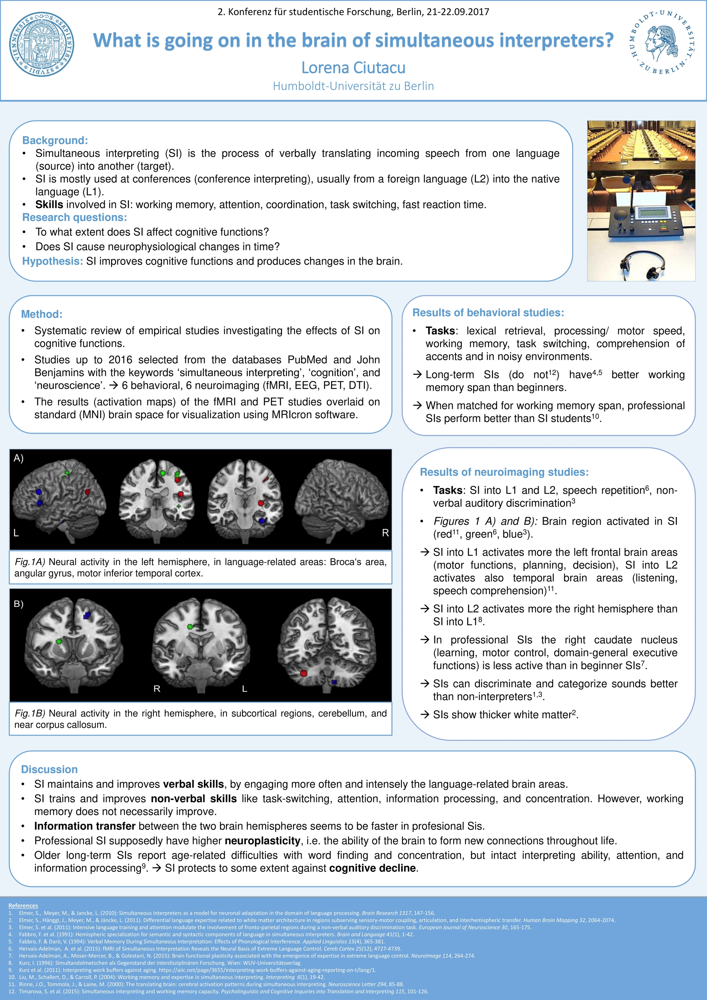

I am typing this post from a coffee shop around Humboldt University of Berlin, sipping the fifth coffee today and leafing through my notes from the [**2nd Conference for Student Research** (Forschung Vermitteln-Communicating Research)](https://www.hu-berlin.de/de/einrichtungen-organisation/verwaltung/bolognalab/zweite-konferenz-fuer-studentische-forschung). In the past two days (21-22.9.2017) I've attended 16 out of **80 talks** and **52 posters** of (under)graduate students from all over the world. The diverse programme included sessions on biology & health, film & media, environment, computer science, law, technology, sociology, and not least linguistics. I'm always eager to learn from other disciplines, so I skipped the language-related talks to attend some about winery, immunoglobin therapy for neuromuscular dystrophy, heart rate variability, the complex symptoms of Tourette syndrome, a sociological film analysis of *Her...*

The highlight for me was the first poster session, where I had the chance to expose my first **conference poster.** I presented my BA thesis about **what's going on the brain of simultaneous interpreters,** specifically what brain areas are activated in simultaneous interpreting (SI) and how it affects cognitive functions. To get the bigger picture, I did a systematic literature review and ALE meta-analysis of neuroimaging studies carried on professional/long-term SIs. This revealed that SI into the native language engages the **prefrontal cortex** (responsible for planning and speech production), the **fronto-parietal** regions and **auditory cortex** (responsible for auditory attention and categorization), as well as the **right caudate nucleus** (involved in learning, motor control, and some domain-general executive functions). A surprising finding was the altered white matter in the most anterior and posterior parts of the **corpus callosum**, which connects and enables communication between the two hemispheres. These findings indicate that for professional SIs the task of switching between languages becomes automated and they rely on more non-linguistic skills than on language control, but also that language proficiency causes plastic adaptations in regions involved in motor aspects of speech and in interhemispheric information transfer. In short, we could say that SI is not only about language, but also about sound and movement.

I think the best part of the conference was the poster session, when I had the opportunity to make contacts from all over the world, to exchange ideas and tips with like-minded people about research projects, funding opportunities or campus life at different institutions, but also about personal interests. Overall, the conference was well organized and the team created a nice atmosphere, even a small concert on the first evening. The next Conference for Student Research will be hosted by the University of Bochum around September 2018, I'm already looking forward to it!