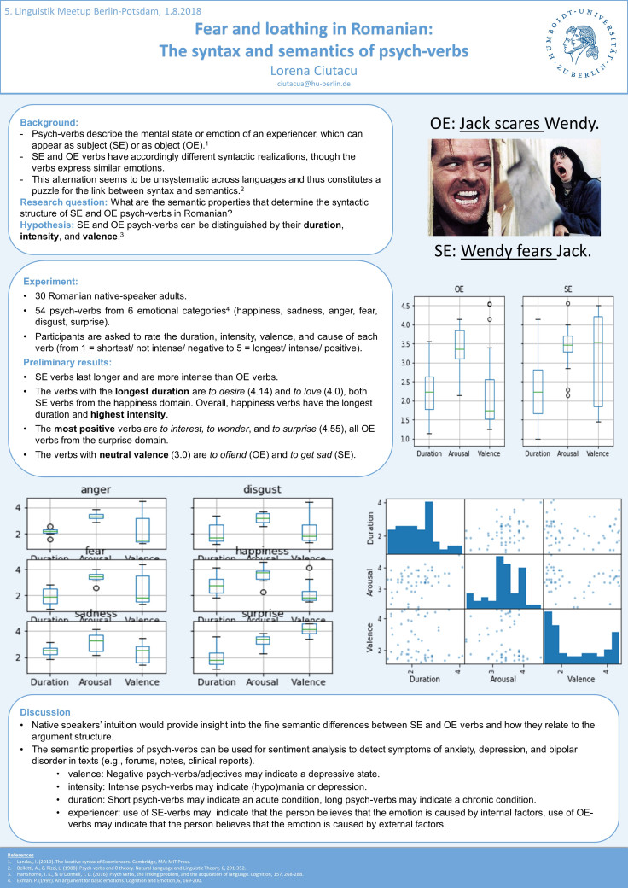

Wednesday marked the first day of the last summer month and I celebrated by presenting a poster at the 5th Linguistics Meetup Berlin-Potsdam, hosted at the Potsdam University. Whereas last year I gave a talk about the impairment of concrete vs. abstract words in semantic dementia, this year I contributed with a poster about my ongoing MA dissertation on Romanian psych-verbs.

And here is the list of Romanian psych-verbs used in the study (visualized in Orange):

