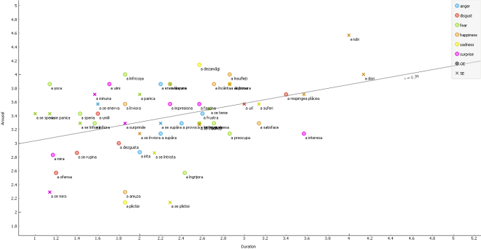

Wednesday marked the first day of the last summer month and I celebrated by presenting a poster at the **5th Linguistics Meetup Berlin-Potsdam**, hosted at the Potsdam University. 

Whereas last year I gave a [talk about semantic dementia](/linguistik-meetup-berlin), this year I contributed with a poster about my ongoing Master's dissertation on **Romanian psych-verbs**.

And here is the list of Romanian psych-verbs used in the study (visualized in Orange):

Update: You can read more about the research method and data analysis of this project in [this blog post](/romanian-psych-verbs-study).|