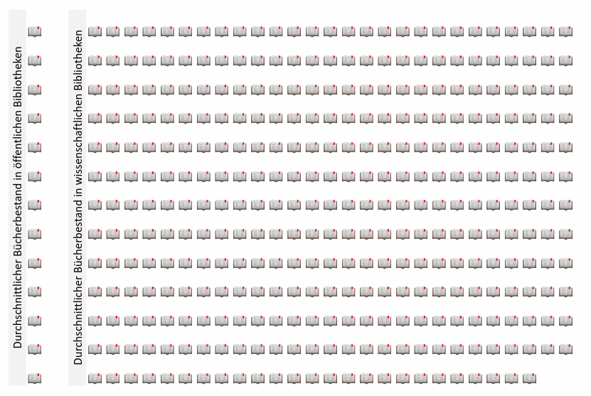

{: .mx-auto.d-block :}

Am 23. April 2020 feiern alle Bücherwürmer den [Welttag des Buches](https://www.welttag-des-buches.de/)! Letztes Jahr habe ich zu diesem Anlass eine [Infografik zum Stand der Buchproduktion in Österreich](https://lorenaciutacu.com/2019/04/23/weltbuchtag-2019-oesterreich/) erstellt. Dieses Jahr liegt mein Fokus auf der Situation der Bibliotheken in Deutschland.

Auf der [Webseite des Statistischen Bundesamtes](https://www-genesis.destatis.de/genesis/online?levelindex=3&levelid=1587381269102&downloadname=&operation=ergebnistabelleDiagramm&option=diagramm&diagrammTyp=0&zeichnePunkte=false#abreadcrumb) habe ich Daten zu Haupt- und Zweigstellen der Bibliotheken in Deutschland von 2000 bis 2018 gefunden. Ich habe die Daten heruntergeladen, analysiert und sie auf einem [Dashboard in Google Data Studio ](https://datastudio.google.com/s/hjMWSwuxXN0)visualisiert. Hier sind die wichtigsten Erkenntnisse, die ich aus der Datenanalyse gewonnen habe:

-   In Deutschland gibt es **8.152 öffentliche Bibliotheken** (Haupt- und Zweigstellen) mit **113.083 Büchern** und **745 wissenschaftliche Bibliotheken** mit **260.060 Büchern**. Das bedeutet im Durchschnitt 13 Bücher pro öffentliche bzw. 349 pro wissenschaftliche Bibliothek, oder ein **Verhältnis von 1:26**. Die wissenschaftliche Bibliotheken sind also selten, aber groß.

{: .mx-auto.d-block :}

-   **Bayern** hat die meisten Bibliotheken (**1853**) und **Bremen** die wenigsten (**13**). Wenn wir aber diese Zahlen im Verhältnis zur Bevölkerung jedes Bundeslands betrachten, schneidet **Rheinland-Pfalz** am besten (ca. **1 Bibliothek zu 6.000 Personen)**, im Gegensatz zu **Berlin** (ca. **1 Bibliothek zu 55.000 Personen**).

{: .mx-auto.d-block :}

Anzahl von öffentlichen Bibliotheken nach Bundesland (2018)

-   Im Jahr 2018 gab es in **Nordrhein-Westfalen **die meisten **Bibliotheksbesuche** (24.702) und **Entleiher** (1.554). Das entspricht ungefähr 475 Besuche pro Woche. Im Gegensatz dazu sind in **Saarland** nur 642 Bibliotheksbesuche und 40 Entleiher.
-   In allen Bundeländern betragen die **Entleiher weniger als 1%** der Bevölkerung.
-   Deutschlandweit nimmt der Anzahl von Bibliotheken, Entleiher und Bibliotheksbesuche ab. Es gibt **23% wenigere Bibliotheken** und **15% wenigere Entleiher** als vor 20 Jahren.

Zusammenfassend lässt sich einen negativen Trend in der Anzahl von Bibliotheken, Bibliotheksbesuche und Entleiher in Deutschland feststellen. Das ist enttäuschend, weil Bibliotheken nicht nur eine allumfassende Bildungsfunktion erfüllen, sondern zugleich die Geschichte und Kultur einer Stadt prägen. Also meine Empfehlung für eine entspannende Aktivität: in einer Bibliothek ein Buch lesen oder sogar Filme ausleihen.