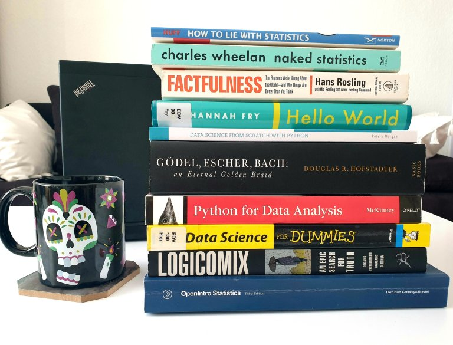

{: .mx-auto.d-block :}

If you're reading this post around its publishing date in April 2020, chances are you're at home, responsibly isolating yourself amid COVID-19 curfews around the world. What a better time than now to read actual books on data-related topics, that you've been postponing for too long in favor of short articles...

To give you some food for thought for these days, I curated a **top 10** list of books straight from my bookshelves:

**1. *Logicomix* by A. Doxiadis/C. Papadimitrou/A. Papados/A. Di Nonna** is a graphic novel about the life and work of philosopher Bertrand Russell. It's an insightful visual journey into his brilliant mind, the logical foundations of maths and modern philosophy.

**2. *OpenIntro Statistics* by D. Diez/C. Barr/M. Cetinkaya-Rundel** is a manual of statistics, for data types to logistic regression, with applications in R. After every chapter, there are practice exercises with solutions. It's also [available online for free](https://www.openintro.org/book/os/), along with the datasets used in the book.

**3. *Naked Statistics* by C. Wheelan** is a funny book about stats with examples of applications in real life. The concepts are explained in a simple and entertaining way, making stats and maths fun.

**4. *How to Lie with Statistics* by D. Huff** is a classic bestseller on the (tricky) uses of stats. Published in 1954, the methods of distorting data representations for sales interests are still valid today. Read it if you want to not be fooled -- or if you want to fool people yourself.

**5. *Factfulness* by H. Rosling** is an eye-opening book about global trends, social inequality, and how data representation can help make sense of the world. It presents ten instincts people have when interpreting data, and how to overcome them in order to evaluate situations more clearly. I could write a whole post about my admiration for Hans Rosling! Till then, you can also check out his [Gapminder](https://www.gapminder.org/) project and visualization tool.

**6. *Python for Data Analysis* by W. McKinney** provides a detailed overview on all steps involved in data analysis, from library installation and data wrangling to time series and visualization. Some code information is outdated, but it explains well the steps and workflow of data science projects.

**7. *Data Science for Dummies* by Lillian Pierson** gives you an overview of the skills you need as a data scientist, most common models, data visualization techniques, and business applications of data science.

**8. *Data Science from Scratch with Python* by P. Morgan** is a concise introduction to machine learning algorithms, with short practice exercises in Python.

**9. Hello World by H. Fry** is about the use of algorithms in different areas of everyday life, from cars and art to crime and medicine. It also presents cases about the repercussions of data bias, along with thoughts about the future applications of algorithms.

**10. *Gödel, Escher, Bach* by D. Hofstadter** is "a metaphorical fugue on minds and machines in the spirit of Lewis Carroll". That sums up the essence of this extraordinary book, it delves into concepts used in computer science, linguistics, philosophy, and AI. I just started reading it and I'm captivated! Curious what I'll learn in the following 700 pages...

Get a cup of tea and enjoy the read!