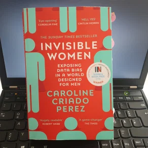

{: .mx-auto.d-block :}

<strong>Title</strong>: Invisible Women

<strong>Author</strong> Caroline Criado Perez

<strong>Publisher</strong>: Vintage

<strong>Published</strong>: March 2020

<strong>Pages</strong>: 432

<strong>Rating</strong>: 🌕🌕🌕🌕🌖

---

In her book *[Invisible Women](https://amzn.to/2EVQzAb),* Caroline Criado Perez illustrates with tenths of real-world examples and scientific studies how women are being discriminated against in all areas of everyday life: from housing and public transport planning, to cars and smartphones design and, maybe most obviously, healthcare and workplaces.

An example related to my experience is **academia**. Now, this one generally has had its own problems and criticism related to the working conditions, but a closer look reveals gender inequalities too and "the myth of meritocracy".

> If Silicon Valley meritocracy is a religion, its God is a white male Harvard dropout. [...] academia is, like tech, a strong follower of the religion.

Female students and academics are less likely than males to get funding, meetings with professors, mentoring, or even full jobs. These opportunities represent a necessary basis for an academic career. The progress is strongly determined by the number of published articles in scientific journals, as well as the number of citations, which is a key metric in determining research impact. But generally, it seems that research perceived to have been done by men is associated with greater scientific quality. Several studies found that women are systematically cited less than men, and female-authored papers are accepted more often or rated higher under double-blind review (when neither author nor reviewer are identifiable).

Like the stress to "publish or perish" wasn't enough, women are also asked to do more undervalued admin work and teaching, which is viewed as less valuable than research.  In class, women are more likely to be harshly evaluated on **warmth vs. comepetence** by their students. "Female professors are penalised if they aren't deemed sufficiently warm and accessible. But if they are warm and accessible, they can be penalised for not appearing authoritative or professional. On the other hand, appearing authoritative and knowledgeable as a woman can result in student disapproval, because this violates gender expectations." So it is not surprising that "less effective male professors routinely receive higher students evaluations than more effective female teachers."

Another example related to my studies and work is that even **speech recognition systems** are biased. Google's speech recognition is 70% more likely to recognize male voices than female voices. This might not sound like a dramatic problem for a virtual assistant, but it is when it comes to voice-command systems in cars and medical devices.

On a basic level, the common problem of all examples presented in the book lies in **data collection and analysis**.

> Brilliance bias is in no small part a result of a data gap: we have written so many female geniuses out of history, they just don't come to mind as easily. The result is that when 'brilliance' is considered a requirement for a job, what is really meant is 'a penis'.

Too often it's considered that including women in studies, segregating data by sex/gender, or designing different products for women is unnecessary or too complicated. But, as proven, it really isn't; and even if it were, it's worth it!

As much as I like Perez's caustic remarks, in some cases I would have found it more helpful to point with a call to action or objective analysis. Nevertheless, it's a great book, infuriating, yet necessary to read -- by women and men!