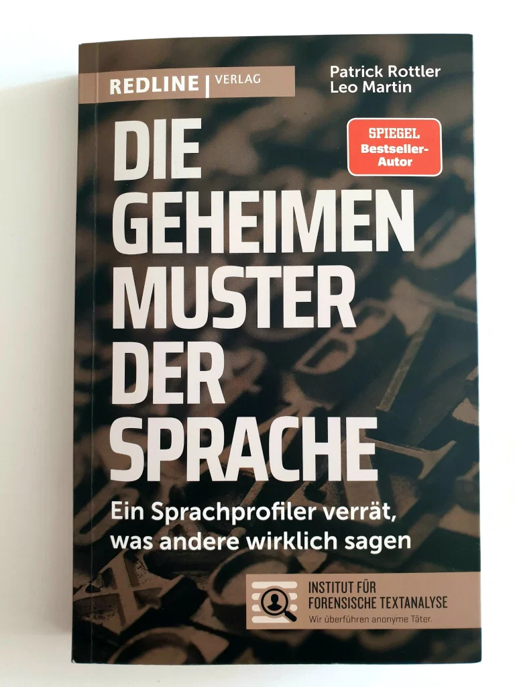

<strong>Titel: </strong>Die geheimen Muster der Sprach

<strong>Autor: </strong>Patrick Rottler & Leo Martin

<strong>Verlag: </strong>Redline

<strong>Erschienen: </strong>2020

<strong>Seitenanzahl: </strong>238

<strong>Bewertung: </strong> 🌕🌕🌑🌑🌑

---

Als Linguistin und Krimiliebhaberin war ich sehr gespannt über die Veröffentlichung eines neuen Buches über **forensische Linguistik**! Diese Teildisziplin der Linguistik beschäftigt sich mit geschriebener Sprache im Zusammenhang von kriminalistischen Fragestellungen und Ermittlungen, zum Beispiel Erpressung oder Drohungen in anonymen Briefen und E-Mails. Solche Fälle landen auf dem Tisch von **Patrick Rottler** und **Leo Martin**, Sprachprofiler am [Institut für forensische Textanalyse.](https://sprachprofiler.de/) Ihre Arbeit und Kenntnisse in Kommunikations- und Kriminalwissenschaft teilen sie im Buch [*Die geheimen Muster der Sprache* ](https://amzn.to/2Z3Lug2)mit*. *

### Inhalt

Aus den etwa 200 Seiten lernen die Leser wie Sprachprofiler anonyme Briefe analysieren, wann sie Täterprofile bestimmen, wie sie die Glaubwürdigkeit des Gegenübers abschätzen, welche psychologische Fallen bei der Bewertung von Informationen auftreten, wie sich unser Persönlichkeitstyp durch unsere Sprache verrät, und wie wir unsere Kommunikation verbessern können. Diese grundlegende Konzepte der Kommunikationspsychologie und Sprachwissenschaft werden anhand von realen anonymen Schreiben erklärt, die die Autoren als Aufträge bekommen haben.

**Wie werden Autoren von anonymen Schreiben überführt?**

Die Sprachprofiler untersuchen jeden Text auf mehreren Ebenen und analysieren die Worte, Anleitungen, Zeitformen, Redewendungen, Satzzeichen, Groß-/Kleinschreibung und Komplexität der Sätze. Wenn es einen Kreis von möglichen Tätern gibt, vergleichen sie das anonyme Schreiben mit Texten von jedem der Verdächtigen. Dabei suchen sie zuerst nach Unterschieden und dann nach Gemeinsamkeiten, um die Umschuldsvermutung zu respektieren. Sollte eine verdächtige Peron als Täter in Frage kommen, bestimmen sie den Grad der Wahrscheinlichkeit: wahrscheinlich, mit hoher Wahrscheinlichkeit, mit sehr hoher Wahrscheinlichkeit oder mit an Sicherheit grenzender Wahrscheinlichkeit.

> Irgendwann fällt der Täter immer aus dem Muster. Und spätestens, wenn es um die Forderung geht, wird sein Deutsch dann wieder besser. Ganz einfach, weil er verstanden werden will. [...] Der Täter kann sich schon mal nicht schlauer stellen, als er ist.
>
> *S. 44*

### Meinung

Was mich an diesem Buch stört sind der **abwertenden, arroganten Ton** gegenüber den Tätern, Opfern und Lesern zugleich.

> Hier ein kleines Beispiel auf »Alltagsniveau« heruntergebrochen: Stellen Sie sich vor, Sie sind heute fünfundzwanzig Jahre alt. [...] es kämen Ihnen Worte wie Fotoapparat, SMS oder CD fremd vor. Sie wären von Ihnen und Ihre Generation so weit entfernt wie im Alphabet das A vom Z.
>
> *(S. 42)*

Wenn es um anonyme **Briefe aus aufgeklebten Zeitungsbuchstaben** geht, behaupten die Autoren, dass diese in Wirklichkeit die absolute Ausnahme sind. Diese professionelle Meinung wäre informativ genug, aber sie gehen einen Schritt weiter und schreiben, dass:

> [...] der Täter seine Bildung aus dem Kinderfernsehen hat. Seinen IQ würden wir dann auf Höhe der Zimmertemperatur einschätzen und lägen damit vermutlich sogar einigermaßen richtig.
>
> *(S. 56)*

Diese Bemerkung ist humorlos, abwertend, böse und ausgrenzend zu Menschen mit geistlichen Behinderungen; sie reflektiert auch den unreifen und shikanierenden Charakter der Autoren.

Zum Illustrieren von Kommunikationsstilen verwenden sie nicht wenige **sexistische Andeutungen und Beispielsituationen**:

> Ein Macher, oft auch eine Macherin [...] Der Kontakter und die Kontakterin [...] Der Analytiker, oft eine Analytikerin [...] Der Visionär, oft eine Visionärin.
>
> *(S. 135-144)*

Das sind vier unterschiedliche Kommunikationsstile, die natürlich nicht geschlechtsspezifisch sind. Trotzdem implizieren die Autoren in ihrer Beschreibung, dass nur "der Kontakter und die Kontakterin" gleichmäßig sind, während eine Macherin, Analytikerin und Visionärin "oft (auch)" gibt, aber eher als Ausnahme.

Als zwei weitere Beispiele haben sich die Autoren Situationen ausgedacht, in denen Frauen als bedienend, schwach, hilfsbedürftig und passiv-aggressiv, während Männer fordernd, stark, hilfsbereit und Opfer von launischen Frauen sind.

> Wenn er betont beiläufig fragt: »Schatz, hast du auch so Durst wie ich?«, weiß sie genau, was auf ihr Ja dann folgt: »Sehr gut, wenn du eh zum Kühlschrank gehst, dann bring mir doch bitte ein Bier mit!«. Und ihm ist klar, was sie wirklich meint, wenn sie sagt: »Puh, Schatz, der Koffer ist aber schwer...«. Dann ist für ihn Schleppen angesagt.
>
> *(S. 215)*

Ich weiß nicht wo und in welcher Ära die Autoren Kommunikationswissenschaft studiert haben oder wer ihre Gefühle verletzt hat, aber heutzutage gibt es zahlreiche relevantere Beispiele, die Kommunikationsstile besser und korrekter illustrieren können.

Nicht zuletzt überspitzen die Autoren in manchen Fällen die **Bedeutung ihrer Arbeit**. In einem Fall stellt sich der Täter, Autor eines anonymen Briefes, selbst -- und löst also den Fall. In einem anderen Fall findet ein Mitarbeiter ein Stück des anonymen Schreibens neben dem Bürotisch eines anderen Mitarbeiters -- und löst also auch den Fall. Trotzdem klopfen sich die Sprachprofiler selbst auf die Schulter.

### Fazit

Dieses Buch enthält zwar manche interessante Informationen über das spannende Feld der forensischen Linguistik und die Arbeitsweise eines Sprachprofilers. Allerdings liest es sich eher wie ein Werbungsbuch für das Institut für forensische Textanalyse, wo die zwei arbeiten. Ich hoffe nur, sie arbeiten professioneller und realistischer als sie schreiben.