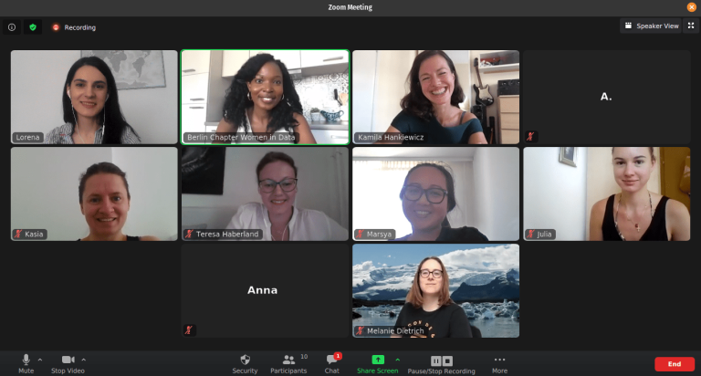

{: .mx-auto.d-block :}

[Women in Data](https://www.womenindata.org/) is an international non-profit organization dedicated to increasing diversity in data-related careers by organizing conferences, networking events, and mentorship programs around the world. The **Berlin Chapter of WiD** was just founded in May this year and I was very excited to join as a Marketing Coordinator.

This week, **27-31 July 2020**, we hosted our first event: the **online symposium "Skills To Last A Decade"**. Sixteen incredible women working in tech and data roles, mainly in Germany, shared their knowledge and advice in 14 talks on different topics, from data journalism to Artifical Intelligence and career skills.

I had the chance to moderate two insightful talks: **Diana Nanova'**s ["Celebrating a decade of data with BigQuery Machine Learning"](http://youtube.com/) and **Kamila Hankiewicz's** ["How Do Machines Learn To Understand Humans?](http://youtube.com/)"

You can watch all the recorded talks **here**. If you want to stay updated about future events of WiD Berlin, follow me on [Instagram](https://www.instagram.com/datalingo/).