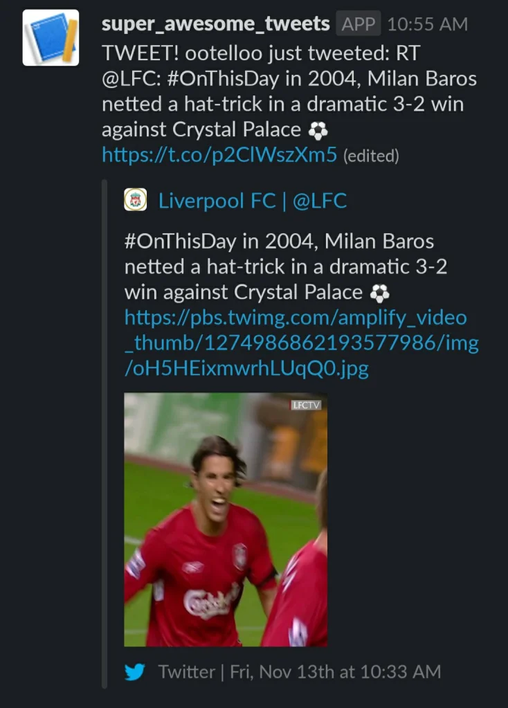

>Project completed in week 7 (09.11.-13.11.20) of the Data Science Bootcamp at Spiced Academy in Berlin.

This week's project was the most complex and difficult so far. The **challenge** was to create a database of tweets, along with their sentiment score, and post positive tweets in a Slack channel. This pipeline had to be orchestrated with [Docker Compose](https://docs.docker.com/compose/). Here's my quick and messy hand-drawn schema of the pipeline:

<figure>Schema of the ETL pipeline</figure>

In this post, I'll show you how I set up each step.

**Note** that the purpose of this project was mainly educational, giving the bootcamp students the opportunity to learn and work with different tools. There are probably more efficient ways of achieving the same result (for example, using only one database).|

#### Table of contents
[0. Prerequisites & tech stack](#0-prerequisites--tech-stack)\
[1. Collecting tweets](#1-collecting-tweets)\
[2. Storing tweets in MongoDB](#2-storing-tweets-in-mongodb)\
[3\. Performing ETL job](#3-performing-etl-job)\
&nbsp;&nbsp;&nbsp; [3\.1\. Extracting tweets from MongoDB](#31-extracting-tweets-from-mongodb)\
&nbsp;&nbsp;&nbsp; [3\.2\. Transforming tweets with sentiment scores](#32-transforming-tweets-with-sentiment-scores)\
&nbsp;&nbsp;&nbsp; [3\.3\. Loading tweets into PostgreSQL](#33-loading-tweets-into-postgresql)\
[4\. Extracting tweets from Postgres](#4-extracting-tweets-from-postgres)\
[5\. Posting tweets with a Slackbot](#5-posting-tweets-with-a-slackbot)\
[6\. Creating the Docker Compose pipeline](#6-creating-the-docker-compose-pipeline)\
[Friday Lightning Talk](#friday-lightning-talk)

## 0\. Prerequisites & tech stack
Here's an overview of the apps, services, and libraries I used in this project:

| Apps & Databases | Python libraries |
|------------------|------------------|
| Twitter          | [`tweepy`](https://www.tweepy.org/) & [`vader`](https://pypi.org/project/vaderSentiment/) |
| Slack            | [`slackclient`]()    |
| [MongoDB](https://account.mongodb.com/account/register) | [`pymongo`](https://pymongo.readthedocs.io/en/stable/) |
| [PostgreSQL](https://www.postgresql.org/download/) | [`psycopg2-binary`](https://www.psycopg.org/docs/install.html) & [`sqlalchemy`](https://www.sqlalchemy.org/) |
| [Docker-Compose](https://docs.docker.com/compose/) | - |

## 1\. Collecting tweets
To collect tweets, I used the [Twitter API](https://developer.twitter.com/en/docs/twitter-api) along with the `tweepy` library.

First, I [created an app on Twitter](https://developer.twitter.com/en/docs/apps/overview) and got my credentials (API key and Access Token). Then, I wrote the [Python code for streaming live tweets](https://github.com/lorenanda/tweets-docker-pipeline/tree/main/docker-compose/tweet_collector), using `tweepy` with my Twitter credentials. I chose to stream the hashtag *#OnThisDay* (thought it would be interesting to get a daily notification of what happened years ago) and collected the tweet text and user handle.

```python
from tweepy import OAuthHandler, Stream, API
from tweepy.streaming import StreamListener
tweet = {
    'username': t['user']['screen_name'],
    'text': t['text'],
}

stream_listener = StreamListener()
stream = tweepy.Stream(auth=api.auth, listener=stream_listener)
stream.filter(track=['OnThisDay'])
```

## 2\. Storing tweets in MongoDB
After collecting the tweets, I had to store them in MongoDB, a non-relational (NoSQL) database that stores data in JSON-like documents. Since the tweet data is collected as key-value pairs (JSON format), MongoDB is a good way to store this information.

First, I had to create a MongoDB instance, set up a cluster, and create a database and a collection within it:

1.  Create a MongoDB account
2.  Set up a cluster: *cloud.mongodb.com > Clusters > Create New Cluster*
3.  Create a database: *Cluster > Collections > Create Database*
4.  Create a collection: *Cluster > Collections > Database > Create Collection*
5.  Create a field: *Collection > Insert document > Type the field `text` below `_id`*
6.  Allow access to the database: *Project > Security > Network Access > IP Access List > Add your IP address.*
7.  Connect to the database from your terminal:\
    `mongo "mongodb+srv://YourClusterName.mongodb.net/YourDatabaseName" --username YourUsername`

Second, I wrote the [Python code for storing tweets in MongoDB](https://github.com/lorenanda/tweets-docker-pipeline/tree/main/docker-compose/tweet_collector) using the `pymongo` library.

```python
import pymongo

client = pymongo.MongoClient(host='mongo_container', port=27018)
db = client.tweets_db

def warning_log(tweet):
    logging.critical('\n\nTWEET: ' + tweet['username'] + 'just tweeted: ' + tweet['text'])
    db.collections.onthisday.insert_one(tweet)
```

The host `mongo_container` is one of the Docker containers, explained in [section 5](#creating-a-docker-compose-pipeline).

## 3\. Performing ETL job
The ETL (Extract, Transform, Load) job involves three actions: extracting tweets from MongoDB, analyzing their sentiment, and storing them into a new Postgres database. Here is the [Python code for the ETL job](https://github.com/lorenanda/tweets-docker-pipeline/tree/main/docker-compose/etl_job).

### 3\.1\. Extracting tweets from MongoDB
To extract the tweet texts from MongoDB, I used again the `pymongo` library.

```python
def extract_tweets():
    tweets  = list(db.onthisday.find())
    if tweets:
        t = random.choice(tweets)
        logging.critical("Random tweet: "+t["text"])
        return t
```
### 3\.2\. Transforming tweets with sentiment scores
To analyze the sentiment of the tweets, I used the `VADER` library , which returns (among others) a compound sentiment score.

```python
from vaderSentiment.vaderSentiment import SentimentIntensityAnalyzer

def transform_tweets(tweet):

    tweet_text = tweet['text'].replace("\'","")

    sia = SentimentIntensityAnalyzer()
    tweet_sia = sia.polarity_scores(tweet_text)['compound']

    return tweet_sia
```
### 3\.3\. Loading tweets into PostgreSQL
To load the tweets with their sentiment scores into a Postgres database, first you need––well, a Postgres database. I installed Postgres, then created a database and a table for tweets right from the terminal:

1. Connect to Postgres: `psql`
2. Create a database: `createdb twitter`
3. Go into the created database: `psql twitter`
4. Create columns in the database: `CREATE TABLE tweets (text varchar(280), score numeric(4,3);`

Then, I wrote the Python code for inserting tweets into the `tweets` table, using the `sqlalchemy` library.

```python
def load_tweets(tweet, sentiment):

    insert_query = """
    INSERT INTO tweets VALUES ('{tweet["text"]}', {tweet_sia});
    """

    engine.execute(insert_query)
    logging.critical(f'Tweet {tweet["text"]} loaded into Postgres.')
```
## 4\. Extracting tweets from Postgres
After having a database of tweets and their sentiment score in place, I had to select and extract *some* tweets, that would be sent to Slack.

```python
query = pg.execute(
    "SELECT text FROM tweets ORDER BY sentiment DESC LIMIT 1")
msg = str(list(query))
output = f'NEW TWEET! {user} just tweeted: {msg} \nSentiment score: {blob_score}'
```

## 5\. Posting tweets with a Slackbot
The last step in the pipeline is posting tweets in a Slack channel. To do this, first I [created a Slackbot](https://slack.com/intl/en-de/help/articles/115005265703-Create-a-bot-for-your-workspace). 

Then, I wrote the Python code for posting tweets in a Slack channel, including the code from the previous step:

```python
import time
import slack
from sqlalchemy import create_engine
import config

engine = config.PG_ENGINE
webhook_url = config.WEBHOOK_SLACK


while True:
    logging.critical("\n\nPositive tweet:\n")
    query = pg.execute(
        "SELECT text FROM tweets ORDER BY sentiment DESC LIMIT 1")
    msg = str(list(query))
    logging.critical(msg + "\n")
    output = f'NEW TWEET! {user} just tweeted: {msg} \nSentiment score: {blob_score}'
    data = {'text': output}
    requests.post(url=webhook_url, json=data)

    time.sleep(30)
```

And :tada: –– here's the tweet that was posted in Slack:

<figure>Tweet posted by Slackbot</figure>

## 6\. Creating the Docker Compose pipeline
The final touch of this project is *orchestration*. The individual Python scripts for each step work when you run them manually, but the goal is to run this pipeline from beginnning to end with only one command. This is where **Docker Compose** comes in.

> Compose is a tool for defining and running multi-container Docker applications. With Compose, you use a YAML file to configure your application’s services. Then, with a single command, you create and start all the services from your configuration.

Each of the five previous steps (or the rectangles in my messy schema) represents a [**Docker container**](https://www.docker.com/resources/what-container), so in my `docker_compose.yml` file I had five containers (services): `tweet_container`, `postgres_container`, `mongo_container`, `etl_container`, and `slackbot_container`. 

For the two database containers, I used [Docker images](), since they didn't depend on custom code stored in my project folders. For the other three containers, I referefenced the respective code location (`build`) and their dependencies (`depends_on`) (for example, the `tweet_collector` depends on `postgres` and `mongo`, since the tweets are stored in these databases).

I also used [Docker `volumes`](https://docs.docker.com/storage/volumes/) to keep the data when the containers are stopped (data persistence).

```yml
version: '3'

services:
  tweet_container:
    build: tweet_collector/
    depends_on:
      - postgres_container
      - mongo_container
    volumes:
      - ./tweet_collector/:/app
  
  postgres_container:
    build: postgresdb
    image: postgres:13.0
    ports:
      - 5555:5432
    environment:
      - POSTGRES_USER=your_user
      - POSTGRES_PASSWORD=your_password

  mongo_container:
    build: mongodb
    image: mongo
    ports:
      - 27018:27018
    volumes:
      - ./mongodb:/app
  
  etl_container:
    build: etl_job/
    depends_on:
      - postgres_container
      - mongo_container
    volumes:
      - ./etl_job/:/app

  slackbot_container:
    build: slackbot/
    depends_on:
      - mongo_container
      - postgres_container
    volumes:
      - ./slackbot/:/app
```

Finally, here some of the CLI commands I used for managing the Docker containers (you can find more in [their docs](https://docs.docker.com/engine/reference/commandline/cli/)):

- `docker images` to list all the used images (postgres and mongo)
- `docker ps -a` to list all my containers
- `docker -v` to mount volumes
- `docker build` to build an image from a Docker file
- `docker run` to run the containers

And that was it: my very first dockerized ETL pipeline –– a week's work and a few hours writing packed in a 6-minute blog post.
## Friday Lightning Talk

This week I focused on the Transform part of the project, which was about Sentiment Analysis. When we learned about the VADER library, some colleagues asked how the training data is collected and who rates the training texts. To answer these questions, I decided to present one of my dearest personal projects in which I did exactly that: I created a list of emotion verbs and asked native speakers to rate their valence, arousal, and duration. You can read more about this project (and data analysis) [on GitHub](https://github.com/lorenanda/psych-verbs) and in this [blog post]({ poster-linguistik-meetup-potsdam/ }) from a student conference.