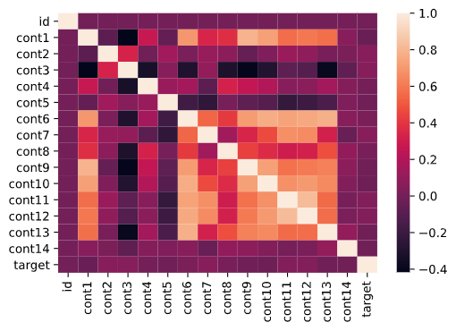

At the beginning of the new year 2021, Kaggle created a new format of competitions aimed at beginners. On the 1st of each month, a month-long Playground competition is launched, where you can practice your ML skills on simple tabular datasets. Apart from competitive experience, the top 3 teams get to win some Kaggle merchandise!

* Dataset: January Playground Challenge
* Topic: Regression
* Code: GitHub

The train set contains 300.000 data points with 14 features (continuous between 0 and 1) and 1 target variable (continuous between 6 and 10). The test set, used for making predictions, contains 200.000 data points with the same 14 features. The results are evaluated with the RMSE score.

First of all, I did a quick exploratory analysis. I was mainly interested in the correlation matrix, since in datasets with lots of features like this one, it’s likely that some of the variables are correlated – and it turned out this was the case:

The train set contains 300.000 data points with 14 features (continuous between 0 and 1) and 1 target variable (continuous between 6 and 10). The test set, used for making predictions, contains 200.000 data points with the same 14 features. The results are evaluated with the RMSE score.

First of all, I did a quick exploratory analysis. I was mainly interested in the correlation matrix, since in datasets with lots of features like this one, it’s likely that some of the variables are correlated – and it turned out this was the case:

{: .mx-auto.d-block :}

Moving on to the modelling part, I first split the train set further into a train and test set, then tried four models:

* Linear Regression just for fun, though I expected it to be too simplistic for this data set.
* Random Forest Regressor, without and with Recursive Feature Elimination. Contrary to my expectation, I got a better score with all features included.
* Gradient Boosting Regressor with 100 estimators and a depth of 5 was slightly better that RFR.
* XGBoost with GridSearchCV for finding the optimal hyperparameters. As expected, this model performed best, with little tweaking and from what I see it’s widely used in Kaggle competitions.

I submitted the predictions of each model on Kaggle and here are the RMSE scores achieved:

MODEL   | RMSE
XGBoost | 0.69995

My best score placed me on position 281 out of 913. As always, there’s room for improvement, maybe by tweaking the XGBoost hyperparameters or trying out other models.

In conclusion, this Kaggle challenge was a good simple exercise for trying out regression models, though the data set was uninformative and not really fun to work with. But I look forward to the February challenge!