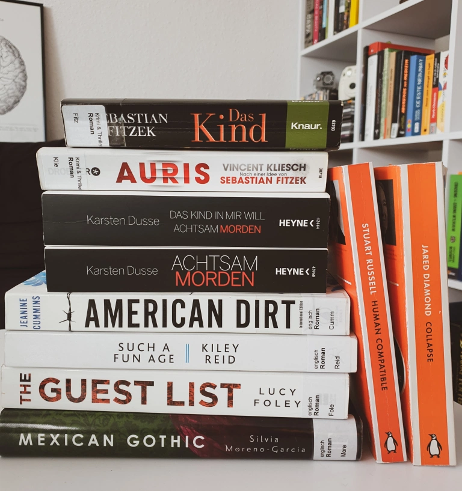

For the sixth year in a row, I'm taking on the [Goodreads Reading Challenge](https://www.goodreads.com/user_challenges/25475893). My goal for 2021 is to read at least 36 books, of which [12 related to tech](/2021-01-09-tech-books-to-read-in-2021). January is usually my most productive reading month, since there's not much going on, while things are slowly getting back on track after the winter holidays, especially these days with lockdowns and other restrictions. This is why this month I managed to read **13 books**, both fiction and non-fiction. Here are my thoughts on each of them:

FICTION
-------

### *Achtsam morden* by Karsten Dusse
🌕🌕🌕🌕🌕 A burned-out lawyer starts to practice mindfulness, incorporating it in his work, personal life… and crimes. I stumbled upon this book on the 30th of December, while frantically browsing for books to fill my unpredictably isolated holidays with. I could tell already from the title and the blurb that I was going to like it, so I ordered the second part right away. It is a page-turner of legally proofed mindful crimes and dark humour that I would recommend to anyone into these topics. Unfortunately, it’s only available in German for now.

### *Das Kind in mir will achtsam morden* by Karsten Dusse
🌕🌕🌕🌕🌗 The wacky crimes continue with more blood, drugs, psychological insights, and social satire. The second part of the series can well be read as a stand-alone, since the background story and previous events are mentioned at key points – but where would be the fun in that? I subtracted half a moon because, compared to the first volume, this one is slightly more predictable and a bit cheesy for my taste in some parts.

### *The Guest List* by Lucy Foley
🌕🌕🌕🌕🌑 When a group of old friends gather on an eerie Irish island to attend a popular wedding, secrets starts to transpire… This is an exciting whodunit puzzle at a too-soon-too-fast-too-good-to-be-true wedding, set in a matching gloomy Irish landscape. I particularly liked the slowly unfolding stories of each character as a way to justify their actions and build suspense until the very end. There are quite a few clues along the way to solve the bloody mystery, but it was still an entertaining read.

### *Mexican Gothic* by Silvia Moreno-García
🌕🌕🌕🌑🌑 A 20-something socialite goes to the countryside in order to visit her troubled cousin, only to find out that her distant in-laws and the creepy house harbour a dark secret. This is one of those books where the atmosphere and setting are have a greater effect than the story. And in this case, the good thing is that the story only takes off in the last few pages, alas at a rushed pace and with unexpected fantastical elements. Though it is a markedly horror story set in a haunted house, I personally didn’t feel that scary thrill that was insinuated by the blurb. Mostly I liked the scenes depicting 1950s Mexico in both a lively city and deserted countryside, as well as the contrast between high-class vs. lower-class lifestyle, mentality, and social expectations. I recommend this book if you like historical fiction, gothic decor, and Jane Eyre.

### *The Child* by Sebastian Fitzek
🌕🌕🌕🌑🌑 A hospitalised 10-year-old boy claims he had murdered several people in the past and asks for a lawyer to help find the bodies, thus triggering a series of unnerving events. This was my second Fitzek and it was quite disappointing after [Therapy](https://www.amazon.de/gp/product/B004X2X76U/ref=as_li_tl?ie=UTF8&camp=1638&creative=6742&creativeASIN=B004X2X76U&linkCode=as2&tag=lorena069-21&linkId=fb2cdbd05da973f2e7d4b39830a507a7). It made a pretty entertaining Berlin underground thriller that handled several dark themes, perhaps one too many. There are two main things that I didn't like in this book: first, the contouring of the main character, who shows surprisingly little logical thinking, persuasive power, and investigative skills for a criminal lawyer; second, the mention of a developmental psychological disorder without any further explanation or substantial reason.
[`Deutsche Rezension`](https://www.goodreads.com/review/show/3768797936?book_show_action=false)

### *Auris* by Vincent Kliesch
🌕🌕🌗🌑🌑 As a linguist, I find the idea of a thriller about forensic phonetics really original, and it's why I picked up this book. However, to my disappointment, the eponymous profiler plays only an episodic role (and even then, his speech analyses are quite exaggerated). Instead of him, the main role takes Jula, an annoying podcaster who tends to just show off and ends almost every sentence with an aggressive exclamation mark. Apart from the characters, the dialogue is also not well constructed, especially in key moments when findings or clues are explained too explicitly. Overall, this book is just not interesting or engaging enough to make me read the sequels, not even after the typical plot twist at the end.
[`Deutsche Rezension`](https://www.goodreads.com/review/show/3734697892?book_show_action=false)

### *Station Eleven* by Emily St. John Mandel
🌕🌕🌗🌑🌑 When a flu pandemic wipes out the majority of the population in a matter of days, the survivors have to reaadapt and rebuild communities, while keeping themselves entertained with dreams and memories of a life lost. A post-pandemic novel with theatre references – from the blurb, this should have quickly become one of my favourite books. But it turned out to be disappointingly boring, with an overly intertwined plot, are-we-there-yet action, and plain characters. The aspect that bothered me most was the ableist vision in this pandemic scenario. I did like some of the meditative observations about searching for meaning and the life of Hollywood’s rich and famous. But then again, you can get the same introspections from BoJack Horseman. Hower, though it didn’t make a lasting impression on me, I would still recommend this book if you like post-apocalyptic stories, cultural studies, and slow-paced writing.

### *Such a Fun Age* by Kiley Reid
🌕🌗🌑🌑🌑 When a 20-something Black babysitter is accused of kidnapping the baby in a supermarket, it marks a turning point in her life and her employer’s family, with regards to relationships, activism, and aspirations. To me, this was an overhyped book with a deceptively intriguing blurb. After the first few pages, I rushed through this book to end the annoying reading experience. The beginning was promising, as the issues of race, class, and transactional relationships were introduced. But then, instead of exploring them further, the action turned to a melodramatic highschool-crush triangle. All characters seemed stuck with a teenage mentality rather then acting their 20s-30s, except for baby Briar, who was unrealistically verbal and rational for her 3 years. The dialogue was exaggerated and forced, especially the wanna-be slang between Emira and her friends and the cringy superficial conversations of the rich white moms – it only discredited the characters with almost every line. Too bad the book didn’t manage to open a real discussion about performative activism and woke culture that it could have.

### *American Dirt* by Jeanine Cummins
🌕🌗🌑🌑🌑 After a drug cartel kills her family at a party, a mom and her eight year-old son set to leave their Mexican hometown Acapulco for the USA, embarking on a dangerous immigration trip. In the controversy surrounding this book, I side with the opinion that this story was not Cummins’ to tell. I know she said “I wished someone slightly browner than me would write it”, to which I’d add a slightly better writer as well. Apart from the serious issues with migrant stereotypes and the white gaze, the writing style is clumsy and unpolished, mainly reflected in the description of the characters. At times, the action gets filled with Hollywood special effects and the tone turns melodramatic. The text is sprinkled with Spanish words, which I assume was intended as a technique for authenticity, but to me it seemed like the author was just trying too hard to fit in (?) and chose only basic or random words. 

NON-FICTION
-----------

### *Human Compatible* by Stuart Russell
🌕🌕🌕🌕🌕 This is definitely one of the best books on AI to date. The premise is that the tech scene’s goal has been to create human-level or superhuman AI, but there was little consideration of what would happen if that actually succeeded. How will the machines evolve (themselves)? How could AI be misused and what groups would profit from it? To what extent are we humans an impediment for AI? Russell answers these question from different points of view and fields related to AI, from physics and logic to linguistics and law. Most important are the philosophical considerations on the ethics and morality of developing intelligent machines, what makes us humans, and how our future could look like. A thought-provoking and entertaining read!

### *Collapse* by Jared Diamond
🌕🌕🌕🌕🌑 A fascinating and thoroughly documented look at ancient and modern societies around the world, from which we should learn how to preserve our environment. However, it didn’t offer an engaging reading experience, because the descriptions of each society were way too detailed and academic, at times even repetitive, especially the parts about the soil and climate conditions. So if you want to just get to the point, you can skip straight to Part 4 and read about the practical lessons Diamond draws from the previous chapters.

### *The Fire Next Time* by James Baldwin
🌕🌕🌕🌕🌕 The two letters that make up this book express a beautifully written, yet powerful account of James Baldwin’s childhood in Harlem, his experience with and thoughts on the intricacies of race and class in America, as well as the role of the Christian church in preserving these structures.

### *Der kleine Alltagsbuddhist* by Maren Schneider
🌕🌕🌕🌕🌕 This is a tiny pocket book that I used to carry with me everywhere, just in case I get so anxious or annoyed that I need urgent Buddhist advice. This month, I took the time to sit down and re-read it fully. It contains Buddhist philosophy, meditations, and small practical exercises for everyday life, that anyone could benefit from.