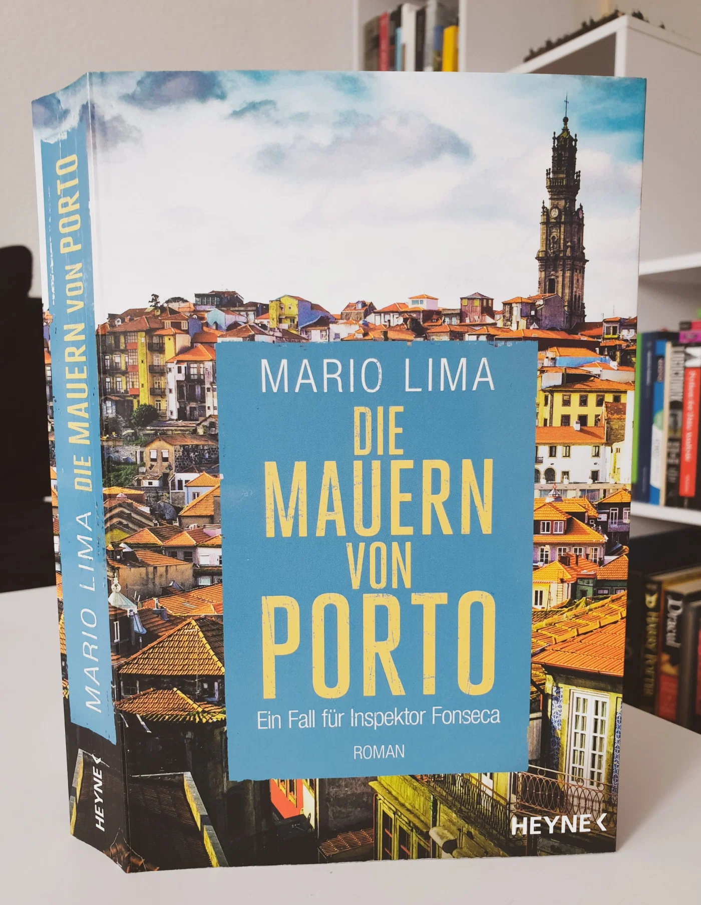
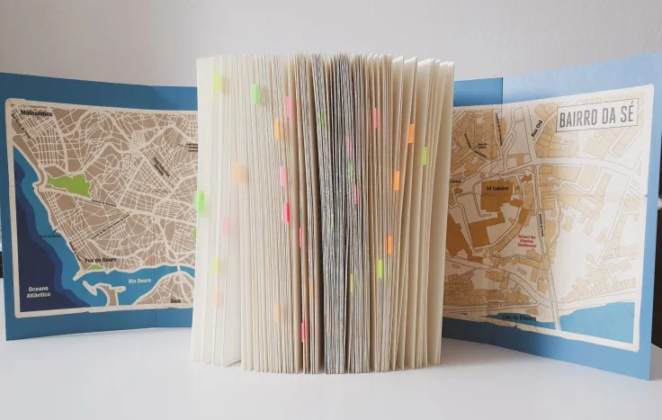

<strong>Titel: </strong>Die Mauern von Porto. Ein Fall für Inspektor Fonseca #3

<strong>Autor: </strong>Mario Lima

<strong>Verlag: </strong>Heyne

<strong>Erschienen: </strong>8. Februar 2021

<strong>Seitenanzahl: </strong>368

<strong>ISBN: </strong>978-3-453-44113-2

<strong>Bewertung: </strong> 🌕🌕🌕🌕🌑

---

Danke an Random House Bloggerportal und Heyne Verlag für die freundliche Bereitstellung dieses Rezensionsexemplars! Somit konnte ich auf eine spannende Reise durch Porto gehen und einen neuen Autor entdecken. Mario Lima ist eigentlich das Pseudonym eines deutschen Autors, der seit vielen Jahren im Norden Portugals lebt. *[Die Mauern von Porto](https://shop.randomhouse.de/shop/article/42754860/mario_lima_die_mauern_von_porto.html)* ist das dritte Buch in der Serie *Inspektor Fonseca*, nach *[Barco Negro](https://shop.randomhouse.de/shop/article/30206421/mario_lima_barco_negro.html)* und *[Tod in Porto](https://shop.randomhouse.de/shop/article/38461864/mario_lima_tod_in_porto.html)*.

Klappentext
-----------

Ein neuer Fall führt Inspektor Fonseca und sein Team in den ältesten Teil von Porto, in das enge und verwinkelte Bairro da Sé. Nach einem Brand findet die Feuerwehr zwei Skelette, eingemauert in einem alten, leerstehenden Haus. Es handelt sich um zwei weibliche Mordopfer, die Mordkommission nimmt die Ermittlungen auf. Auch die Bewohner des Bairro sind nicht untätig, denn der Fall wühlt alte Konflikte wieder auf, jeder scheint etwas zu wissen. Und jeder will Gerechtigkeit. Als ein weiterer Mord geschieht, muss Fonseca schnell handeln...

Meinung
-------

Was mir von Anfang an sehr gefallen hat sind das kleine **Glossar** der portugiesischen Ausdrücke und die zwei **Klappkarten** von Porto bzw. dem Bairro da Sé, die im Buch enthalten sind. Dadurch war es noch spannender, die Figuren durch die Stadt zu verfolgen und die beschriebenen Standorte zu visualisieren.

Um den mörderischen Fall wird eine authentische und dynamische **Atmosphäre** geschafft. Durch kurze Szenen werden das Alltagsleben und die Sorgen der Einwohner des Bairros, die Redeweise und Werte der Menschen, sowie kulinarische Spezialitäten wie Pasteis de Nata oder Vinho Verde illustriert.

Das Buch bietet aber mehr als nur ein spannender und atmosphärischer Krimi. Der Mörder wird dem Leser spätestens im ersten Drittel enthüllt. Ab diesem Punkt wird es ein Rätsel um das Motiv des Täters und es geht mehr um Ermittlungsmethoden, parallele Underground-Welte, und die Beziehungen zwischen den Figuren. Jede hat eine Hintergrundsgeschichte, die ihre Entscheidungen beeinflusst und das macht sie zu komplexen Personen.

Im Zusammenhang mit diesem Mordfall werden andere schwere **Themen** wie Familiengewalt, die Drogenszene Portos, Kolonialgeschichte von Portugal und Angola, die Krise auf dem Arbeitsmarkt, und Korruption im Justizsystem diskutiert.

Mich hat besonders die **Debatte über** **Mordverjährung** (S. 134-137) beeindruckt. In Portugal verjährt Mord nach fünfzehn Jahren, d.h. nach dieser Zeit ist die Strafverfolgung und Verurteilung ist nicht mehr möglich und der Fall wird definitiv abgeschlossen. Inwiefern ist dieses Gesetz mit einem modernen Rechtsstaat vereinbar?

Eine Befürworterin der Mordverjährung argumentiert:

> Jeder Bürger hat ein Anrecht auf seinen persönlichen Rechtsfrieden, weshalb sichergestellt werden muss, dass er nicht für eine unbegrenzte Zeit juristisch verfolgt werden kann.
>
> *S. 137*

Dagegen argumentiert eine Rechtsmedizinerin:

> Die moderne Wissenschaft gibt uns die Techniken an die Hand, mit denen wir auch lange zurückliegende Verbrechen aufklären können.
>
> *S. 137*

In welche Richtung es in diesem Fall geht, verrate ich nicht. Aber das ist eine wichtige Diskussion, die Denkanstoß gibt und mir in Gedanken geblieben ist, auch nachdem ich das Buch fertiggelesen habe.

Ich würde jetzt gerne auch die anderen zwei Bücher in der Serie lesen (die Reihenfolge ist nicht entscheidend, denn es geht um verschiedene Fälle, soweit ich verstanden habe). Besonders in dieser Zeit, wenn es noch so kalt hier in Berlin ist und alle Urlaubspläne coronabedingt abgesagt sind, bieten diese Mordfälle im wunderschönen Porto eine gute Lektüre an.

Empfehlung
----------

Wenn du Portugal, Krimis und/oder kritische Auseinandersetzungen mit dem Justizsystem magst, dann empfehle ich dir *Die Mauern von Porto* zu lesen!

