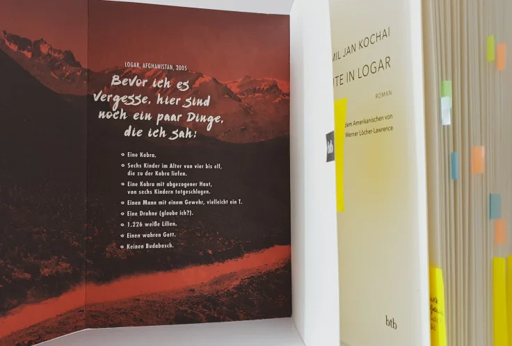

<strong>Titel: </strong>99 Nächte in Logar

<strong>Autor: </strong>Jamil Jan Kochai

<strong>Verlag: </strong>btb

<strong>Erschienen: </strong>Februar 2021

<strong>Seitenanzahl: </strong>320

<strong>ISBN: </strong>978-3-442-77045-8

<strong>Bewertung: </strong> 🌕🌕🌕🌑🌑

___

Danke an Random House Bloggerportal und btb Verlag für die freundliche Bereitstellung dieses Rezensionsexemplars! [Nach Portugal](https://lorenaciutacu.com/2021/02/12/buchrezenzion-die-mauern-von-porto-von-mario-lima/) bin ich in diesem Monat nach Afghanistan gereist, durch das Debütroman von Jamil Jan Kochai. Der Autor wurde in einem afghanischen Flüchtlingscamp in Pakistan geboren und wuchs in den USA auf -- Erfahrungen, die dieses Buch inspiriert haben.

Klappentext
-----------

Logar, Afghanistan, im Jahr 2005: Der 12-jährige Marwand kehrt mit seiner Familie für einen Sommer aus den USA in seine Heimat zurück. Doch wie "Heimat" fühlt sich das Dorf ohne McDonald's, dafür mit merkwürdigen Bräuchen und noch merkwürdigerer Sprache, überhaupt nicht an. Und dann beißt ihm gleich am ersten Tag Budabasch, der dreibeinige Wachhund des Dorfes, eine Fingerspitze ab und verschwindet in den Weiten des Hindukuschs. Für Marwand und seine Freunde beginnt eine abenteuerliche Jagd durch ein kriegsversehrtes Land. Eine wilde und märchenhafte Suche in 99 Nächten nach dem eigenen Platz zwischen den Kulturen.

Meinung
-------

Rund um Marwands Abenteuer werden verschiedene **Themen** behandelt: Erwachsenwerden, Herkunft, Familienbeziehungen, Interkulturalität und nicht zuletzt [den Krieg](https://de.wikipedia.org/wiki/Krieg_in_Afghanistan_seit_2001#Sturz_der_Talibanregierung). Es ist der Krieg, wofür Afghanistan meist bekannt ist und was es tief geprägt hat, aber Kochai zeigt auch eine andere Facette dieses Landes.

> [...] da die meisten alten Afghanen von so vielen Nationen, Glaubensrichtungen und Organisationen, mit so unterschiedlich fortgeschrittenen Waffen [...], dass sie mit einem furchterregender Genauigkeit sagen konnten, wie sich der Ton und die Zerstörungskraft von Autobomben, Raketen und Granaten unterschieden.
>
> *S. 169*

Zwischen Bomben, staubigen Straßen, amerikanischen Soldaten und Talibanen, das Leben geht weiter: Kinder spielen und lachen, Menschen verlieben sich und heiraten, sie träumen und tanzen. Das dynamische Alltagsleben wird mit Marwands Augen gesehen. Es ist bewegend, die Welt aus der Perspektive eines 12-Jährigen zu betrachten, in der Realität und Fantasie sich im magischen Realismus vermischen und die politische Dimension des Krieges mit kindlicher Naivität wahrgenommen wird.

Mir hat besonders die Darstellung der **kulturellen Auseinandersetzung** zwischen Afghanistan und den USA, mit der Marwand konfrontiert wird: auf einer Seite als Outsider in der amerikanischen Schule, wo die Kinder

> [...] deinen Namen nicht aussprechen konnten und ihn deswegen änderten, [...] deine Herkunft mit der anderer Leute verwechselten und nicht hinhörten, wenn du sie verbessertest, [...] dachten, Bin Laden wäre dein Opa. [...] sie fragen mich, wo sich mein Opa versteckt, damit sie hin und ihn umbringen können.
>
> *S. 32*

und auf der anderen Seite als amerikanisierter Gast in seiner afghanischen Entourage, in der er mit Liebe aber auch einer gewissen Distanz behandelt wird:

> Trotzdem gab es keine Strafe für mich, den Gast aus Amerika.
>
> *S. 120*

Aus allen großen und kleinen Geschichten in diesem Abenteuer, ist eine besonders wichtig, nämlich die des Onkels Watak, der unter mysteriösen Umständen gestorben ist. Erst am Ende des Buches wird seine Geschichte enthüllt -- auf Pashto. Die Entscheidung des Autors, diesen Text nicht übersetzen zu lassen, wirkt als eine Strategie für die aktive Beteiligung der LeserInnen an der Erzählung. Die Idee an sich gefällt mir, aber in diesem Fall fand ich sie einfach frustrierend, weil sie die Leselust und Schlüsselinformationen wegnimmt, denn es ist nicht so einfach eine qualitative Pashto-Deutsch/Englisch Übersetzung hinzukriegen, besonders für LeserInnen, die begrenzte **Übersetzungsmöglichkeiten** haben. Ich habe die fünf Seiten mit Google Translate auf meinem Handy übersetzt, aber wie erwartet war der resultierende Text nicht besonders sinnvoll.

Der **Schreibstil** hat leider die Ideen überschattet: Rahmen- und Verzweigserzählungen à la *Tausendundeine Nacht*, Zeitsprünge, Gedankenströme in langen Sätzen (bis zu 27 Zeilen!), und Pashto Wörter, die nicht im Glossar definiert sind, zahlrreiche Familienmitglieder und Freunde, die abwechselnd mit der vollen und kurzer Name oder mit der Verwandschaft genannt werden. All das erschwert die Lektüre und macht es zunehmend schwierig, den Überblick zu behalten.

Das Schlimmste für mich war aber die **Tierquälerei**. Budabasch hat ja Marwands Finger abgebissen -- aus meiner Sicht, *too little too late*, denn Marwand hatte den Hund (und andere Tiere!) über die Jahre gequält, mit explizit beschriebenen Methoden. Ja, der Junge hat sadistische Tendenzen, die leider nicht untersucht werden und keine tiefe Bedeutung scheinen zu haben.

Empfehlung
----------

Im Allgemeinen ist *99 Nächte in Logar* ein bewegender Roman von einem vielversprechenden Autor. Wenn du *coming-of-age*-Geschichten magst, dich für interkulturelle Erlebnisse interessierst, eine andere Seite Afghanistans sehen willst, und ein gutes Namengedächtnis hast, dann empfehle ich dir dieses Buch zu lesen.

