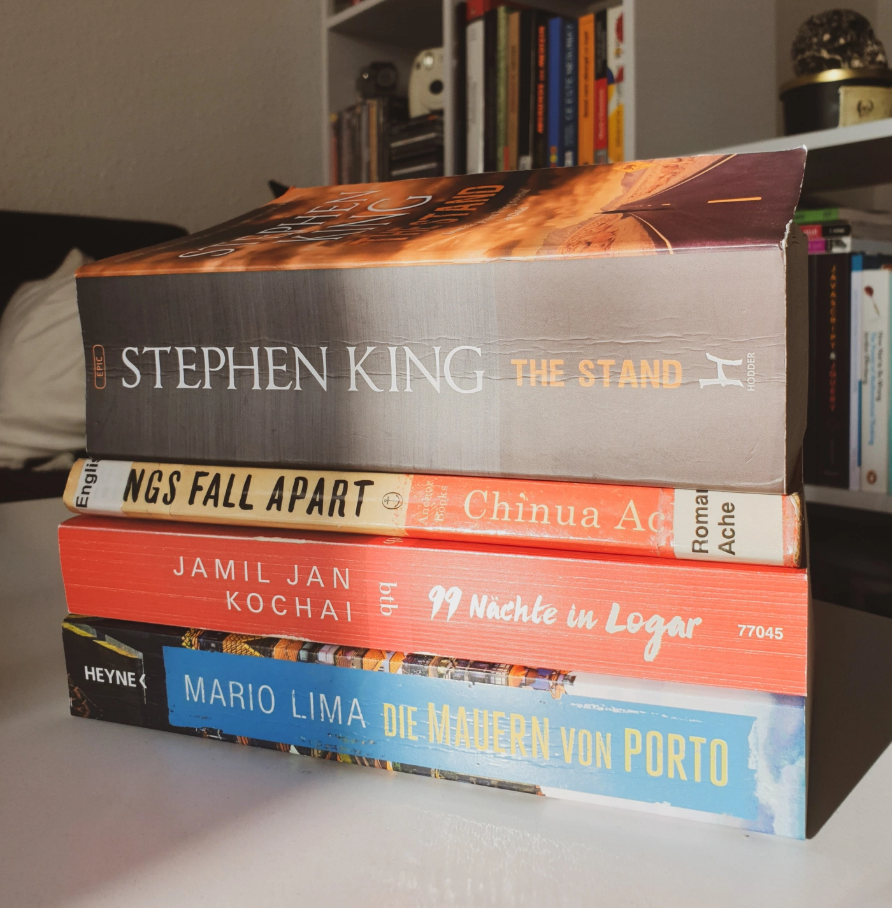

February was a busy month for me and I feel like time flew by so fast! Nevertheless, I managed to read **7 books**. This might not seem like a lot compared to [14 books I read in January](), but that's because one of the books had over 1300 pages, and February was a more active month (good for a change). But most importantly, I've read better books overall, and started and ended the month with five-star reads! Here are my thoughts on each of them:

FICTION
-------

### *The Stand* by Stephen King
🌕🌕🌕🌕🌕 After an escaped bio-engineered superflu virus wipes out 99% of the world population in a matter of weeks, the few survivors wander through America guided by visions, flocking to one of the two newly-formed congregations: the Dark side in the East attracts technically skilled people and is led by Randal Flagg through fear, aiming at destruction; the Light side in the West attracts socially conscious people and is led by Mother Abagail through faith, aiming at rebuilding. The imminent clash between these two sides is at the core of this masterpiece. But it begs a more complex analysis.
On a macro-level, I interpret this dichotomy also as a clash between dictatorship vs. democracy, advanced vs. poor societies, large vs. small peoples. On a micro-level, an inner conflict is given within each survivor, testing their faith and trust. The story abounds in biblical allegories and pop culture references of the 1980s-90s, but is also a sociological study about how people (re)organise themselves. I liked that among the survivors there were people with mental and physical disabilities (who turned out to be my favourite characters!); unfortunately they’re not often envisioned in literary post-apocalyptical scenarios. Typical King, there are some disturbing scenes depicting sexual violence, alcoholism, and suicide – beware if you are sensitive to these issues.
At 1325 pages, this is the longest book I’ve ever read, but also one of the most memorable! Though some parts seem too long and irrelevant (especially Book I), I agree with King that “neither of these bits are strictly essential to the plot, but in another way thay make the plot – they are great and magical bits of storytelling.” (p. xii) I totally recommend this book, though reading it in Corona times can really spike your anxiety, as the description of the superflu symptoms and consequences seem so realistic…

### *Die Mauern von Porto* by Mario Lima
🌕🌕🌕🌕🌑 When a fire at an uninhabited house reveals two immured skeletons, Detective Fonseca and his team set to investigate a decade-old murder. The case plays is a dynamic and authentic atmosphere, with short scenes depicting the beautiful scenery, culinary specialties, daily life and struggles of the inhabitants of Bairro da Sé, the manner of speaking and values of the people. I liked that each character involved in the investigation is presented with a background story and personal life that influence their decisions. Apart from the thrilling search for the murderer, the book also includes some serious themes like family violence, the drug scene in Porto, colonial history of Portugal and Angola, and corruption in the justice system. A part that stuck with me was the four-page debate on the [statute of limitations](https://en.wikipedia.org/wiki/Statute_of_limitations) for murder, which brings arguments from both sides.\
[`Deutsche Rezension`]()

### *99 Nights in Logar* by Jamil Jan Kochai
🌕🌕🌕🌑🌑 In 2005, 12-year-old Marwand returns from the USA to his hometown Logar in Afghanistan and is welcomed warmly by all his friends and extended family - except for Budabash, the terrifying and loyal dog of the family, who bites off Marwand's finger, then disappears into the night. From this moment on, Marwand sets on a lyrical adventure to find Budabash, roaming the dusty streets of Logar among bombing threats, American soldiers and talibans, and infusing the world around him with magical realism. Kochai depicts beautifully how in this land torn by war, life still goes on: children play and laugh, people fall in love and get married, they dream and talk and believe. It's a moving ode the Afghan culture and oral tradition. However, the writing style tends to impede the reading experience: there are many branching and frame stories at different points in time (*1001 Nights* vibes) and long sentences representing Marwand's stream of thought. After the first 100 pages, I didn't find it that engaging anymore. But what disturbed me most of all are the sadistic tendencies of Marwand to inflict pain on animals (warning: graphical scenes!), a trait that wasn't examined further not seemed to play a role in his coming-of-age or personality. That being said, this is a rich debut novel from a promising author.\
[`Deutsche Rezension`]()

### *Things Fall Apart* by Chinua Achebe
🌕🌕🌕🌕🌕 In an Ibo village in 1890s Nigeria, Okonkwo rises from poverty to power in his tribe, only to soon fall from grace, due to his disregard of tribal gods, rejection of European missionaries, and ultimately his inescapable fate.
I read this book quite spontaneously at the end of the month and it turned out to be a wonderful wrap-up read! From the very first pages it became clear why this is one of the most important pieces of literature, especially African literature. Achebe creates an immersive experience in the life and culture of the Igbo people, thus showing an authentic and sympathetic image of African people, unlike the previous eurocentric writings. At the same time, he remains an observant narrator and considerate of the unfamiliar reader, explaining the meaning of the depicted customs and social structures.
Okonkwo’s story is tragic: yes, he’s misogynistic, violent, abusive, greedy, and insensitive, but I couldn’t help feel for him, knowing that his personality was shaped only by the desire to rise above his father’s condition and make a name for himself. However, he’s so blinded by his ambition that he defies the ancient values and wisdom that make up the very community he wants to prosper in. Inevitably, things fall apart. On a larger scale, the invasion of the British colonialists further fractures the Igbo community, imposing a new religion and way of life; though, not few people adhered to the European life willingly, seeing it as an escape from the suppressing roles they had in their community.

NON-FICTION
-----------

### *The Lonely City* by Olivia Laing
🌕🌕🌕🌕🌑 This book doesn't easily fit into one genre or topic. It's a beautiful combination of memoir, art history, psychological study, and socio-cultural criticism of New York City. Laing recounts a low period from her life as a newly moved New Yorker. In this time permeated by loneliness and a sense of alienation, she found comfort in researching the lives of [outsider artists](https://en.wikipedia.org/wiki/Outsider_art) that had lived in her vicinity, like Edward Hopper, Andy Warhol, David Wojnarowicz, Klaus Nomi, or Zoe Leonard. In each chapter, Laing parts from a personal account to then introduce one of the artists and increasingly create their psychological profile based on their art and traumatic personal lives, devoid of parental affection and security. I find this in general to be a limited perspective on loneliness as well as artistic expression, but in the context of this book it makes a point. Some parts resonated deeply with me and transported me back to the time I was studying Theater, Film, and Media in Vienna. Like Lang, I found a sort of comfort in art, particularly film, to such an extent that I even wrote a thesis on the topic of solitude in the film *O homem das multidões*. But I would have liked Laing to be a bit bolder and reveal more of her personal experience or how it relates to the artists' lives, instead of just distantly documenting them, though of course this is a personal decision. Overall, this is a book that leaves a mark on one's soul and that needs to be read slowly to savour the beautiful academic-diary writing.

### *Terror* by Ferdinand von Schirach
🌕🌕🌕🌕🌗 This theatre play stages a trial against a fighter pilot who shot down a plane with 164 passengers taken over by a terrorist, in order to prevent it from being crashed into a football stadium with 70,000 spectators. Should he be acquited or sentences? The verdict is given by the reader or [the audience](https://terror.theater/en). This case sparks a heated debate and raises some tricky moral and ethical questions known from the classical [trolley problem](https://en.wikipedia.org/wiki/Trolley_problem), with strong arguments from both sides. I personally couldn't decide so easily, but as Schirach pointed out, it's not so much about passing a sentence, but about realising how urging these questions are for our society.

### *Terror* by Berndt Schmidt
🌕🌕🌕🌕🌑 This anthology contains 13 essays by experts in various fields (law, theatre, philosophy) who analyse the famous play *Terror* by Ferdinand von Schirach from different perspectives. After finishing the play, I found it enlightening to read interpretations that showed me new meanings and implications I haven't considered before. Particularly interesting for me as a data scientist and AI enthusiast was the essay by Catrin Misselhorn, in which she draws an analogy between the Terror and autonomous vehicles - both facing similar challenges and heated debates.\
[`Deutsche Rezension`]()