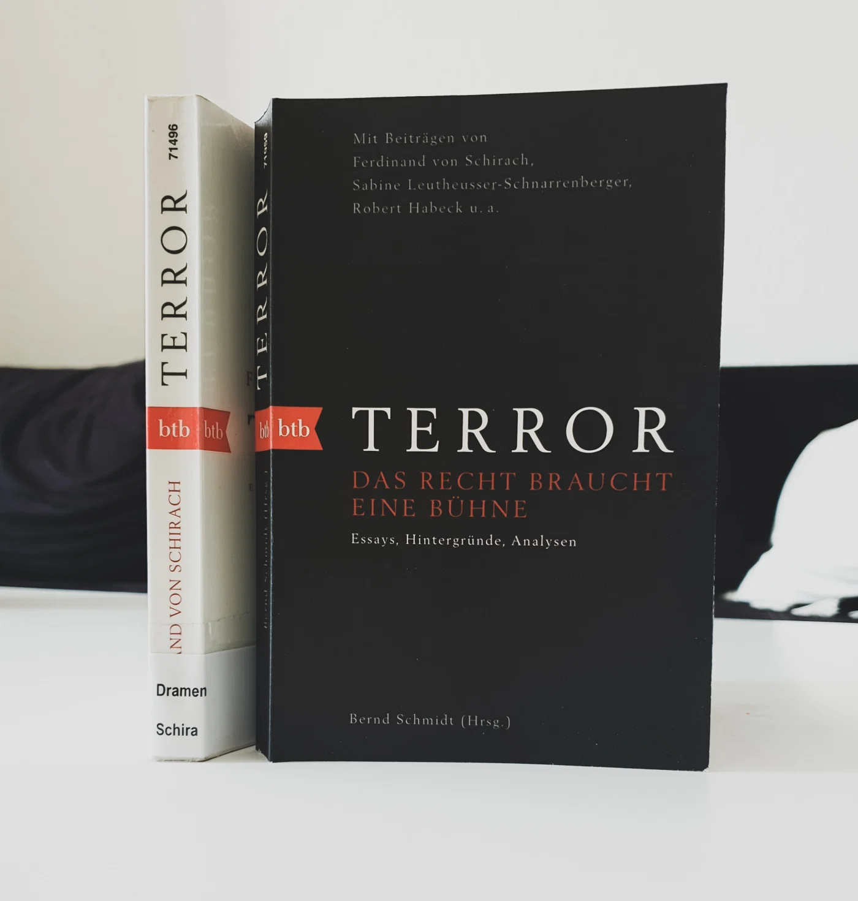

<strong>Titel: </strong>Terror. Das Recht braucht eine Bühne

<strong>Autor: </strong>Bernd Schmidt (Hrsgb.)

<strong>Verlag: </strong>btb

<strong>Erschienen: </strong>12. Oktober 2020

<strong>Seitenanzahl: </strong>192

<strong>ISBN: </strong>3442719593

<strong>Bewertung: </strong> 🌕🌕🌕🌕🌑

___

Danke an Random House Bloggerportal und btb Verlag für die freundliche Bereitstellung dieses Rezensionsexemplars! Das berühmte Theaterstück [***Terror* von Ferdinand von Schirach**](https://shop.randomhouse.de/shop/article/29758253/ferdinand_von_schirach_terror.html) hat mich nachhaltig beeindruckt. Darin handelt sich um den Prozess gegen einem Kampfpilot, der gegen den Befehl seiner Vorgesetzten ein von einem Terrorist besetzten Flugzeug mit 164 Passagiere abgeschossen hat, um um sein Crash in eiem Fußballstadion mit 70.000 Menschen zu verhindern. Ist der Pilot für den Mord der 164 Flugpassagiere schuldig oder nicht? Als ich das Buch gelesen habe, konnte ich micht nicht leicht entscheiden, ob ich ihn verurteilen oder freisprechen würde, denn der Fall stellt eine schwierige und komplexe moralische Dilemma dar. Nun war ich sehr gespannt, den Essayband Terror zu lesen und diesen Fall aus verschiedenen neuen Perspektiven zu betrachten.

Klappentext
-----------

»Terror« von Ferdinand von Schirach -- eines der erfolgreichsten Theaterstücke unserer Zeit -- behandelt einen Stoff von brisanter Aktualität: Wollen wir, dass die Würde des Menschen trotz der Terrorgefahr noch gilt? Der Fall des Kampfpiloten Lars Koch, der ein von Terroristen gekapertes Flugzeugs mit Kurs auf die vollbesetzte Allianz-Arena abschießt, ist in der Öffentlichkeit kontrovers diskutiert worden und mittlerweile Thema im Ethikunterricht. Hat der Mann sich schuldig gemacht oder nicht?

In diesem Band widmen sich namhafte Expertinnen und Experten den politischen, juristischen, ethischen und künstlerischen Fragestellungen des Stücks. Sie beleuchten Hintergründe, schildern persönliche Erfahrungen, geben Denkanstöße. Außerdem enthalten ist Ferdinand von Schirachs Rede zur Eröffnung der Salzburger Festspiele sowie ein umfangreiches Interview mit dem Autor.

Meinung
-------

Die 13 Essays der ausgewählten Autoren, Experten in ihrer Bereichen, haben mir neue Denkanstöße gegeben. Sie beleuchten den im Theaterstück debattierten Fall aus verschiedenen Blickwinkeln und bringen neue Argumente vor. Viele von diesen hatte ich vorher gar nicht erwogen (z.B. *Die Bedeutung von Terror für den Schulunterricht*) und das macht es noch schwieriger, ein Urteil zu fällen.

> Eigentlich kommt es nicht darauf an, ob wir den Piloten verurteilen oder freisprechen; es kommt darauf an, dass wir uns klar werden, wie drängend diese Fragen sind.
>
> *Ferdinand von Schirach, S. 31*

Besonders interessant für mich als Data Scientist und KI-Enthusiastin war das Essay ***Lizenz zu töten für Roboter?* von Catrin Misselhorn**, Professorin für Philosophie an der Universität Göttingen, Forscherin im Bereich KI und Maschinenethik, und Leiterin von Drittmittelprojekten zur ethischen Bewertung von Assistenzsystemen. (Spannende Arbeit!) In diesem Essay stellt sie eine Analogie zwischen dem *Terror* Fall und dem autonomen Fahren her, d.h. "inwiefern sich die offenbar verbreitete Intuition, dass der Pilot das Richtige getan hat, auch auf autonome Fahrzeuge übertragen lässt." (S. 151) Für diese Diskussion bringt sie wichtige Punkte hervor, die in der KI seit langem heftig debattiert werden, wie z.B. die Verfügbarkeit alternativer Handlungsoptionen, die Situation der Passagiere, Mensch vs. Softwareagent und Autonomierisiko. Es ist eine sehr interessante Analyse, die letztendlich zeigt, dass Terror und das autonome Fahren unvergleichbare Situationen darstellen und eine optimale Gestaltung des Zusammenwirkens von Mensch und Maschine notwendig ist.

Empfehlung
----------

Wenn du das Theaterstück *Terror* gelesen bzw. gesehen hast und dich weiter mit diesem ethischen Dilemma auseinandersetzen möchtest, empfehle ich dir diesen Essayband!