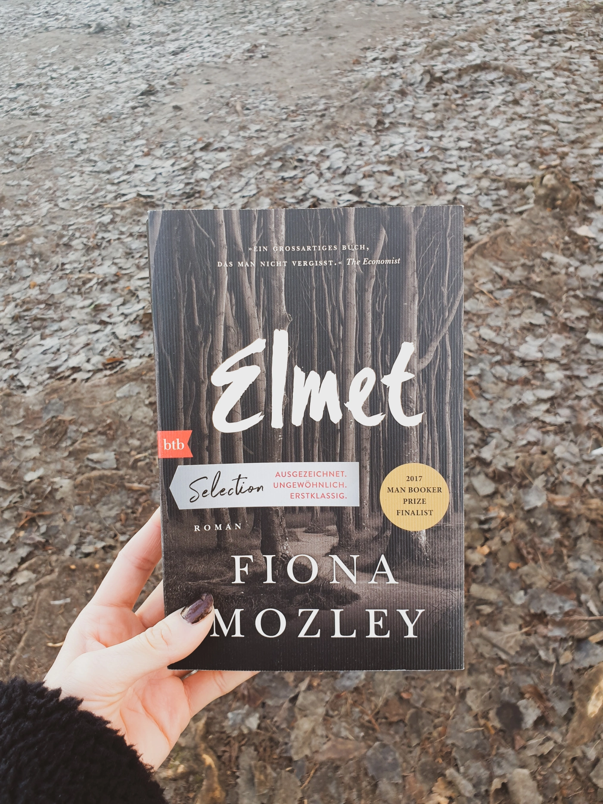

<strong>Titel:</strong>  Elmet

<strong>Autorin:</strong> Fiona Mozley

<strong>Verlag:</strong> btb

<strong>Erschienen:</strong> November 2020

<strong>Seitenanzahl:</strong> 318

<strong>ISBN:</strong> 3442770432

<strong>Bewertung:</strong> 🌕🌕🌖🌑🌑

___

Danke an [RandomHouse](https://blogger.randomhouse.de/) und btb Verlag für die Bereitstellung dieses Rezensionsexemplars. Mozleys Debütroman war ein [Man Booker Prize Finalist](https://thebookerprizes.com/books/elmet-by) (2017) und wurde als Buch des Jahres von namhaften Zeitungen gekennzeichnet. Dementsprechend hatte ich hohe Erwartungen an diesem Wunderdebüt, obwohl die Geschichte nicht besonders spannend klang.

Klappentext
-----------

John Smythe ist mit seinen Kindern Cathy und Daniel aufs Land gezogen, nach Yorkshire, in die Wälder von Elmet. Dort hegen die drei den Traum von einem anderen, friedvollen Leben. Sie wohnen in einem Häuschen, das sie eigenhändig erbaut haben, mitten in der Natur, nicht weit von der Eisenbahnlinie Edinburgh-London entfernt. Nur manchmal muss der Vater fort zu illegalen Faustkämpfen. In diesen Zeiten, in denen es immer weniger Arbeit gibt im Norden Englands, der einzige Weg, um die Familie über Wasser zu halten. Doch dann steht eines Tages ein Mann vor der Tür, der behauptet, dass alles ihm gehört -- der Wald, der Grund und Boden, das Häuschen, in dem sie leben. Ihn kümmert der Wald eigentlich nicht, er bewirtschaftet ihn nicht. Aber er pocht auf sein Recht.

Meinung
-------

Die Geschichte erinnerte mich gleich an einem meiner Lieblingsfilmen, [*Beast of the Southern Wild*](https://www.youtube.com/watch?v=rmBc9ZazMe0), in dem es sich auch um eine aufwachsende Daddy's Girl und dem Konflikt zwischen einer außenseitigen Community und der Außenwelt handelt. Das Buch gleicht aber nicht den emotionalen Endruck des Filmes.

Ehrlich gesagt, ich konnte bis zur letzten Seite nicht in die Geschichte eintauchen. Es begann sehr langsam und wurde immer düsterer und gewalttätiger, bis zu einer übertriebenen Ende im Tarantino-Stil. Der Schreibstil war ja schön, sogar poetisch, aber auch irgendwie luftig und schwankend. Es war mich nicht klar, in welche Richtung die Handlung sich entwickelt und worauf ich mich konzentrieren sollte: die aufmerksame Beschreibung des Waldes? die rechtlichen Fragen zu Landbesitz und Naturschutz? das coming-of-age und die atypischen Geschlechterrollen der zwei Geschwister? die Klassen- und Armutsproblematik? die rätselhafte Familiensituation? All diese Themen wurden entweder zu schnell oder zu oberflächlich behandelt. Ich fand die Charakteren zu flach, limitiert zu schwarz-weißen Eigenschaften, sodass ich sie nicht als realistisch oder tief wahrnehmen konnte.

Vielleicht ist Elmet einfach ein dieser Bücher, die man erst einige Zeit nach dem Lesen bewerten und schätzen kann...

Empfehlung
----------

Wenn du gut mit Ambiguität umgehst, Southern Gothic und slow-burn Familiendramas magst, empfehle ich dir *Elmet* zu lesen.
