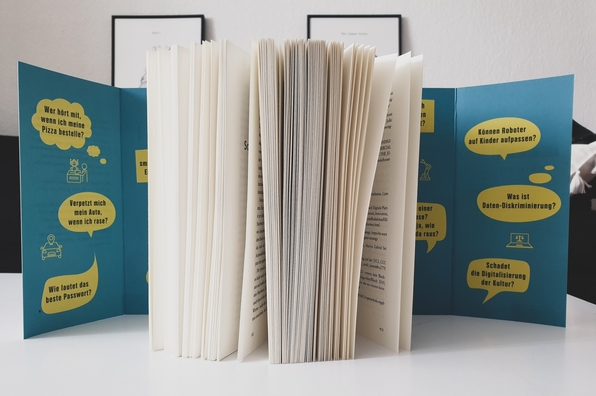

<strong>Titel: </strong>Die Zukunft ist smart. Du auch?

<strong>Autor: </strong>Holger Volland

<strong>Verlag: </strong>mosaik

<strong>Erschienen: </strong>15. März 2021

<strong>Seitenanzahl: </strong>416

<strong>Bewertung: </strong> 🌕🌕🌕🌕🌕

___

Danke an Random House Bloggerportal und mosaik Verlag für die freundliche Bereitstellung dieses Rezensionsexemplars! Ich war sehr begeistert, ein Buch zu lesen, das im direkten Zusammenhang mit meiner Arbeit und meinem (übermäßig) digitalisierten Alltag steht. Ich habe schon einige Bücher zu diesem Thema gelesen, aber die waren auf der Situation in den USA fokussiert. Deswegen war ich noch neugieriger, mal über Beispiele spezifisch für Deutschland bzw. den deutschprachigen Raum zu lernen.

## Klappentext
Viele Experten betonen, wie wichtig der Ausbau digitaler Technologie ist – für unseren Alltag, die Wirtschaft, den Kampf gegen Klimakrise, Krankheit und Hunger in der Welt. Gleichzeitig warnen andere vor digitaler Demenz, unkontrollierbarer Übermacht der Digitalkonzerne und vor einer manipulierten Menschheit im Überwachungskapitalismus. Dazwischen stehen wir: Menschen mit Facebook-Profil, die YouTube-Videos schauen oder TikTok nutzen, die mit Google Maps ihren Weg finden und mit Alexa ihre Pizza bestellen. Sind wir in der Zukunft schon angekommen, wenn wir als Laien so locker mit der digitalen Welt umgehen? Oder lassen wir uns arglos von machtgierigen Digitalkonzernen manipulieren und von unseren Geräten ausspionieren? Leben wir in einer Filterblase? Und wenn ja, wie kommen wir da wieder raus? Anhand von einfachen Fragen, wissenschaftlichen Fakten und kurzweiligen Geschichten über die digitale Zukunft erklärt Digitalexperte und Kulturvermittler Holger Volland die relevantesten Entwicklungen der digitalen Transformation und ihre Wirkung für unser ganz persönliches Leben.

## Meinung
Ich fand das Buch schon vom vielseitigen Inhalt her beeindruckend. Es beinhaltet 100 Antworten auf die wichtigsten Fragen zu unserem digitalen Alltag aus neun verschiedenen Bereichen:
* Zuhause
* Digitales Leben
* Mobilität
* Bildung und Kultur
* Recht und Unrecht
* Gesundheit
* Arbeit
* Wirtschaft
* Politik

Mit manchen Fragen habe ich mich schon in meinem Studium in Linguistik und Data Science (z.B. ***Was ist Daten-Diskriminierung?***) oder bei der Arbeit als Datenanalystin für Online-Marketing (z.B. ***Wieso bin ich ein Produkt?***) und Technische Autorin für Workflow-Automatisierung (z.B. ***Wird Künstliche Intelligenz zukünftig meinen Job übernehmen?***) beschäftigt. Andere Fragen hingegen habe ich mir noch nie gestellt (z.B. ***Wie erziehen Silicon-Valley-Gründer ihre Kinder?***, ***Weiß Instagram, ob ich depressiv bin?***).

Volland beantwortet diese Fragen auf 2-5 Seiten, veranschaulicht sie mit tagesaktuellen Beispielen (z.B. [George Floyds Tötung](https://www.georgefloydmemorialfoundation.org/), [Trumps Twitter-Sperre](https://www.dw.com/de/diskussionen-um-trumps-twitter-sperre/a-56227331), Corona-Lockdowns) und gibt auch praktische Tipps zum Schutz unserer Privatsphäre im digitalen Leben.

> Der Deal, den wir online tagtäglich eingehen, lautet also vereinfacht: Privatsphäre gegen digitale Dienstleistung.
> 
> S. 57

Besonders interessant fand ich das Kapitel **Recht und Unrecht**, in dem es mehr um ethische und moralische Fragen der Datenverarbeitung und Künstliche Intelligenz geht. Anwendungen wie Bots, Fake News oder Hacking können undenkbare Einflüsse auf die Gesellschaft haben, lassen sich aber nicht so einfach regeln, denn das World Wide Web überschreitet nationale Grenzen und Justizsystemen.

> Es gibt immer eine "eingebettete Ethik" in Künstlicher Intelligenz, weil wir Menschen das Trainingsmaterial bestimmen, von dem Algorithmen lernen. [...] Bevor wir also versuchen, Maschinen Moral beizubringen, müssen wir zuerst bei den Menschen ansetzen, die sie programmieren, trainieren und nutzen.
> 
> S. 178-180

Insgesamt habe ich viele neue Informationen aus diesem Buch eingeholt und mich noch mehr für Datenschutz sensibilisiert. Der Schreibstil ist unterhaltsam, indem Volland persönliche Erlebnisse und Humor in den Antworten einbezieht und technische Details in vereinfachter Form erklärt. Die 100 Antworten kratzen aber nur an der Oberfläche. Womöglich hätte ich es besser finden, wenigere Fragen aufzunehmen, dafür aber ausführlichere Antworten anzubieten.

## Empfehlung
Wenn du dich für Digitalisierung und Datenschutz im Alltag interessierst, dann empfehle ich dir *Die Zukunft ist smart* zu lesen!

