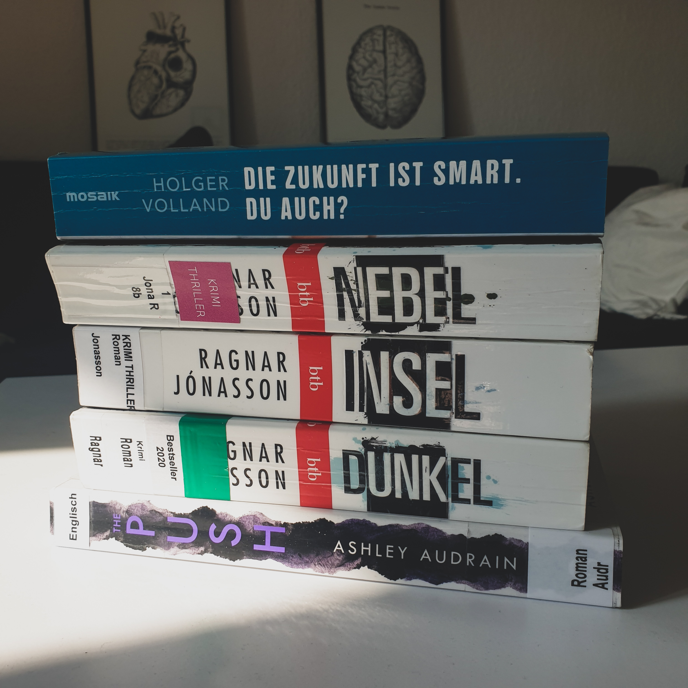

Here's to another month of reading good books! In March I read **5 books** (4 fiction and 1 non-fiction), which is slightly less than in [February]() and a lot less than in [January](). At the same time, my reading list keeps on growing - there are just so many good books our there! Overall, this month was quite dark in terms of literary choices, with four crime-thrillers and one data privacy & digitalization warning. Without further ado, here are my thoughts on the five books I read this month.

## FICTION

### *The Push* by Ashley Audrain
🌕🌕🌕🌕🌕 When Blythe gets pregnant with her first child, Violet, she expects an idyllic life and the kind of mother-daughter relationship that she never had. But soon after birth, something seems to be wrong with Violet, or with Blythe. The [*We need to talk about Kevin*](https://www.goodreads.com/book/show/80660.We_Need_to_Talk_About_Kevin?ac=1&from_search=true&qid=2l2tO7ep3A&rank=1) kind of wrong, when motherhood turns out to be a nightmare or a curse. The story touches of many sensitive and divisive topics, such as [nature vs. nurture](https://en.wikipedia.org/wiki/Nature_versus_nurture), women who choose to not have children, [intergenerational trauma](https://en.wikipedia.org/wiki/Transgenerational_trauma), mental health issues and family dynamics. The dark and psychologically intense scenes gave me the chills and were at times overwhelming to read, yet I could hardly put the book down.

### *The Darkness (Hidden Iceland #1)* by Ragnar Jónasson
🌕🌕🌕🌑🌑 The detective Hulda Hermannsdóttir rushes to solve a last cold case in the couple of days before retiring. This book is praised as "one of the best 100 thrillers since 1945" by The Times. I find that to be a big overstatement... Not to say that the book is bad, it's just not spectacular. But I have to say, I think my perception of the book might have to do with the German version that I read being a pivot translation, meaning that the German book was translated from an English translation of the original Icelandic book. Inevitably, things get lost in translation and this affects the writing style and ambience. However, I see two somewhat original aspects about this book. First, the protagonist is a 64-year-old woman who besides investigating a murder, reflects on her past decades in the police boys-club, her traumatic family life, and the unexciting life ahead. It's a refreshing perspective, from the typical grumpy middle-aged men or young overly-ambitious young women that usually star in crime thrillers. Second, the plot is told backwards in a trilogy, meaning that The Darkness is the first volume that relates the most recent case of Hulda and the following two volumes recount events from the past. 

### *The Island (Hidden Iceland #2)* by Ragnar Jónasson
🌕🌕🌕🌑🌑 A young woman is mysteriously murdered in a remote cabin; ten years later, her four best friends spend a weekend at the cabin to commemorate her, but one of them dies in an apparent accident. Inspector Hulda sets on to investigate this unbelievable coincidence and unearth some dark friendship secrets. Though this story had a more predictable plot twist at the end than the first volume, I found it overall more entertaining and atmospheric, mainly because the crime scene was set in a remote cabin on a glacial cliff.

### *The Mist (Hidden Iceland #3)* by Ragnar Jónasson
🌕🌕🌕🌕🌑 On Christmas Eve, amidst a snowstorm, a man arrives up at an isolated farm house in the east of Iceland and is offered shelter by the old couple of owners. Days later, when two corpses are found at the farm house, detective Hulda sets out to discover the murderer and the connection with another case, all while dealing with a traumatic event in her personal life. Of the three books in the trilogy, I like this one best, thoug it's quite hard to pinpoint the reason. I think it's a combination of more mysterious cases, the exploration of mental health issues, and insights into the minds of the characters. 

## NON-FICTION
### *Die Zukunft ist smart. Du auch?* by Holger Volland
🌕🌕🌕🌕🌕 This book answers 100 questions about digitalization in different areas of everyday life, from health and law to transportation and work. It's a great ressource for educating yourself on media literacy, data privacy, and the social implications of AI and digitalization. The author illustrates the technical information with current real-life events and discusses some situations specific to the German-speaking area. For now at least, this book is unfortunately only available in German.
[`Deutsche Rezension`]()
