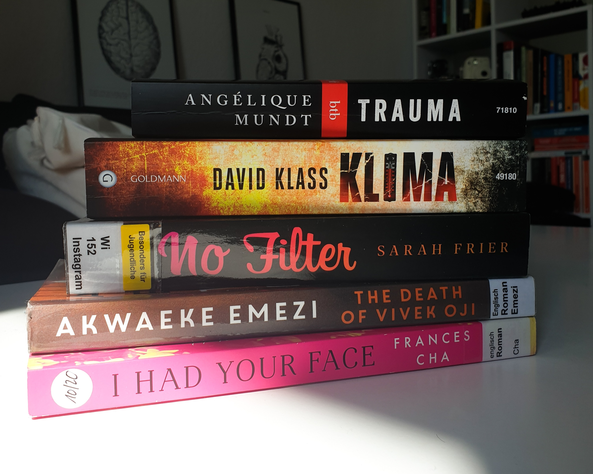

Here's to another month of reading good books! In April I read **6 books** (4 fiction and 2 non-fiction) amounting to **1930 pages** and a **3.6 average rating**. Without further ado, here are my thoughts on the five books I read this month.

## FICTION

### *Out Of Time* by David Klass
🌕🌕🌕🌑🌑 A conflicted young FBI analyst tries to outsmart a self-styled "eco-terrorist" who bombs seemingly random locations across the USA. If this sounds like a typical Hollywood action thriller–it is indeed. The story in itself is quite engaging, especially in the beginning, and it raises some important questions about climate change, but fails to deliver substantial morals or entertainment.
[`Deutsche Rezension`]()

### *The Death Of Vivek Oji* by Akwaeke Emezi
🌕🌕🌕🌕🌕  One afternoon, a mother finds her son's body wrapped in akwete material at her doorstep. Shocked, she begins to insistently question his friends to find out what happened, while they are trying to protect her from the truth. Vivek's life is related from the perspectives of their friends and cousin, who have loved and known them best, from childhood up to college. The memories they recount of them reveal a deeply melancholic and charming personality, whose secretly evolving deviant lifestyle (for Nigeria) has left a mark on everyone around them. Apart from the moving story, Emezi's writing is stunning and charged with emotional intensity. This is a book I will not forget easily.

### *If I Had Your Face* by Frances Cha
🌕🌕🌕🌕🌑Four young women whose lives intertwine navigate daily life in South Korea, charged with rigid gender roles, increasingly unattainable beauty standards, and career limitations, and social expectations of women. This is one of the most original stories I've read recently. I was particularly surprised to learn about the wide use of plastic surgery for pretty much any tiny body part, to such an extent that it is regarded as a rite of passage. "I would live your life so much better if I had your face." is the quote that sums up best this book. The only thing that seemed a bit off was Wonna's story–it seems like her character was included only to thematise more issues (conceiving, childcare, and parental leave), but her story didn't merge well with the others.

### *Trauma* by Angélique Mundt
🌕🌕🌑🌑🌑 Leila wakes up confined in a psychiatry room, suspected of a murder she dreamed about, from a night she can't (or doesn't want to) recall. The story sounds thrilling, but the writing ruined it. Leila's immature personality is insufferable whether under trauma or normal conditions, the numerous questions she asks herself in her head are more noise than relevant to the plot, and the depiction of staff and patients at the psychiatric ward seems taken out of an old feelgood movie. 
[`Deutsche Rezension`]()

## NON-FICTION
### *Never Split The Difference* by Chris Voss
🌕🌕🌕🌑🌑  The author is a former international hostage negotiator for the FBI who seems to have thought that putting his self-boasting attitude on paper is the key to success. In this book, he shares nine principles (tactics and strategies) about how to negotiate and persuade people, exemplified with situations from his personal and professional life. I found most of the techniques useful, while some seemed unrealistic and far-fetched. Regardless the content, what spoiled my reading experience was his bette-than-anyone attitude and sprinkled salesy messages, which made me not take him seriously at times.

### *No Filter* by Sarah Frier
🌕🌕🌕🌕🌕 This book tells the thoroughly documented story of Instagram: from idealised concept to the predatory acquisition by Facebook and the evolving toxic relationship between the two companies, until the inevitable departure of the original founders. I finished this book with more knowledge about startup culture and funding, more antipathy towards Zuckerberg, and less motivation to use Instagram, knowing the new interests behind it and the role it assumes in the users' lives. Particularly surprising were the approaches of the two companies to managing hate speech online and their views on privacy. I recommend this book to anyone who has an Facebook/Instagram account!