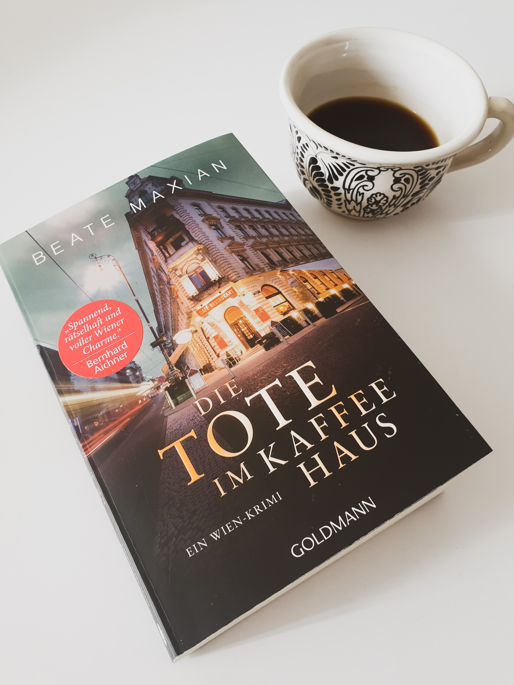
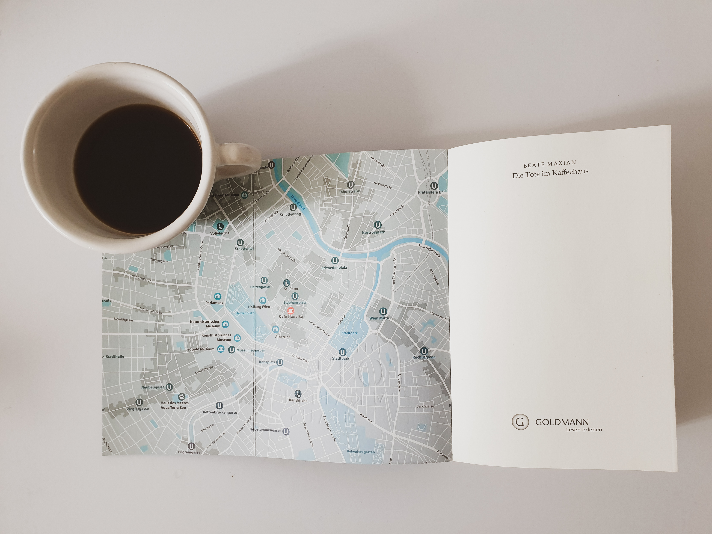

<strong>Titel: </strong>Die Tote im Kaffeehaus

<strong>Autorin: </strong>Beate Maxian

<strong>Verlag: </strong>Goldmann

<strong>Erschienen: </strong>19. April 2021

<strong>Seitenanzahl: </strong>416

<strong>Bewertung: </strong> 🌕🌕🌕🌑🌑

___

Danke an Random House Bloggerportal und btb Verlag für die freundliche Bereitstellung dieses Rezensionsexemplars. Ich habe dieses Buch ausgewählt, weil es drei meiner Lieblingsdinge thematisiert: Krimis, Kaffee und Wien, mein zweites Zuhause. Die Kombination der letzten zwei ist etwas ganz Besonderes, denn seit 2011 gehört die [Wiener Kaffeehauskultur zum UNESCO Weltkulturerbe](https://www.unesco.at/kultur/immaterielles-kulturerbe/oesterreichisches-verzeichnis/detail/article/wiener-kaffeehauskultur). Beate Maxian hat über 20 Bücher geschrieben, größtenteils Kriminalromane, die sogar mit Literaturpreisen ausgezeichnet wurden. *Die Tote im Kaffeehaus* ist das 11. Buch in der [Sarah-Pauli-Reihe](https://www.maxian.at/kriminalromane.php), die die namensgebende Journalistin bei der Recherche von Kriminalfällen in Wien verfolgt.

## Klappentext
Wien, wenige Tage vor dem berühmten Kaffeesiederball in der Hofburg: Für ihre erste große Ausgabe als neue Chefredakteurin des Wiener Boten trifft Sarah Pauli Marianne Böhm, Grande Dame der Kaffeehausdynastie Böhm, zu einem exklusiven Interview. Dann der Schock: Mitten im Gespräch sackt die alte Dame leblos in sich zusammen. Ist die Frau bloß an Altersschwäche gestorben? Sarah ist argwöhnisch, denn kurz vor ihrem Tod vertraute Böhm ihr eine rätselhafte Botschaft an. Die Journalistin beginnt zu recherchieren und stößt in der feinen Wiener Kaffeehausgesellschaft schon bald auf Geheimnisse, für die jemand über Leichen geht…

## Meinung
Was mir von Anfang an gefallen hat ist die einbezogene Klappkarte Wiens (wie in [*Die Mauern von Porto*]()), die zur visuellen Verfolgung der Charakteren durch die Stadt beiträgt. Was mir am meisten gefallen hat war die Atmosphäre, besonders die Beschreibung der Straßen und Kaffeehäuser, unterstützt von historischen Fakten. Zu diesem Effekt hat auch der Wienerische Dialekt einiger Charakteren beigetragen, der dem Umfeld ein Maß Authentizität verliehen hat.

Als Krimi fand ich die Geschichte nicht besonders spannend, vor allem weil die Handlung ziemlich überschaubar war. Das liegt zum Teil an den  Charakteren, die typische Rolle spielen (z.B.  Vernünftige, Unwissende, Bellender Hund der nicht beißt, unglaubhauft Gutgemeinte) und sich im Laufe der Zeit nicht entwickeln bzw. ändern.

Ein zentraler Punkt der Geschichte ist die Symbolik, veranschaulicht durch Lesen im Kaffeesatz, Deutung von Unternehmenslogos und Talismane. Ich persönlich interessiere mich nicht dafür, aber die Einbettung dieses Themas ist in diesem Fall gut gelungen, obwohl manche Interpretationen an den Haaren herbeigezogen waren.

Insgesamt war für mich dieses Buch ein gemütlicher Krimi mit Wiener Charme und ich würde gerne auch andere Bücher in dieser Reihe lesen, am liebsten bei einem Kleinen Schwarzer im Café Central.

## Empfehlung
Wenn du Wien bzw. Wiener Kaffeekultur liebst, dich für Kaffeezubereitung und Symbolik interessierst und Lust auf ein gemütlicher und atmosphärischer Krimi hast, dann empfehle ich dir *Die Tote im kaffeehaus*.

