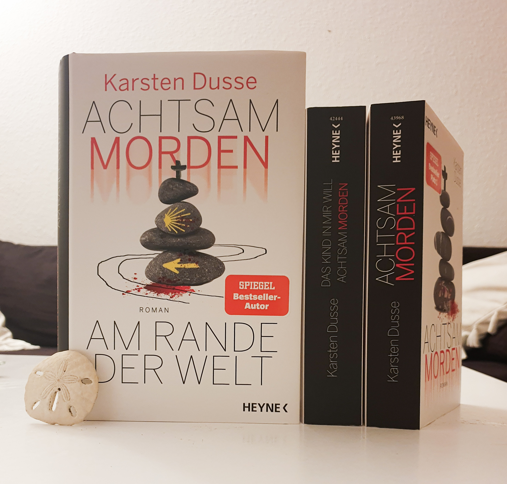

<strong>Titel: </strong>Achtsam morden am Rande der Welt

<strong>Autor: </strong>Karsten Dusse

<strong>Verlag: </strong>Heyne

<strong>Erschienen: </strong>26. April 2021

<strong>Seitenanzahl: </strong>384

<strong>Bewertung: </strong> 🌕🌕🌕🌕🌑

___

Danke an Random House Bloggerportal und Heyne Verlag für die freundliche Bereitstellung dieses Rezensionsexemplars. Ich habe dieses Buch wie kein anderes in diesem Jahr erwartet, nachdem ich die ersten zwei Teile (*Achtsam morden* und *Das Kind in mir will achtsam morden*) in zwei Tagen [Anfang Januar]() fertig gelesen habe. Karsten Dusse ist ein deutscher Rechtsanwalt, Fernseh- und Buchautor – eine Kombination Beschäftigungen, die großartig die dreiteilige Serie *Achtsam morden*, die über den Weg eines Strafvereidigers zur Achtsamkeit und Leichtigkeit des Mordens erzählt, inspirieren.

## Klappentext
Um der Midlifecrisis zu entgehen, begibt sich Björn Diemel auf Anraten seines Therapeuten auf Pilgerreise. Schnell stellt sich als Erkenntnis auf dem Jakobsweg heraus, dass Björns Leben die Mitte bereits längst überschritten haben könnte: Ein unbekannter Mitpilger versucht, ihn zu töten.
Während bei den scheiternden Anschlägen auf ihn ein Pilger nach dem anderen seinen Lebensweg verlässt, versucht Björn ganz achtsam, sich seiner Haut zu wehren. Seine Pilger-Fragen nach Leben, Tod und Erfüllung bekommen plötzlich eine sehr praxisnahe Relevanz.

## Meinung
Im ersten Teil hat der Protagonist sich zum ersten Mal mit dem Thema Achtsamkeit vertraut gemacht, im zweiten Teil hat er sein inneres Kind entdeckt, und nun im dritten Teil hat er die Bedeutung des Pilgerns auf eigener Erfahrung gelernt. 

> Pilger sind Menschen, die sich für das mehrfache Jahresgehalt eine pakistanischen Textilarbeiters die von diesem hergestellten, atmungsaktive Schuhe, Gore-Tex-Hosen und Trekking-Rucksäcke kaufen und damit dann auf dem Rücken der Dritten Welt die Luxusprobleme der Ersten Welt wegwandern. 
>
> S. 81

Mit diesem Vorurteil und leichtem, untrendigem Gepäck macht sich Björn auf dem Weg, was mich an den Film [*Ich bin dann mal weg*](https://www.youtube.com/watch?v=yaO5YuoRQjE) erinnerte. Die Highlights hierbei waren die Beschreibungen der Bräuche auf den Jakobsweg (z.B. ein Brief an sich selbst schreiben und ihn nach Santiago de Compostela verschicken, um ihn dann am Endziel nochmal zu lesen), der getroffenen Touristen und der kleinen Städten als Zwischenstationen, die dem Buch lokales Kolorit verleihen.

Wenn die ersten zwei Bücher gepackt mit Action-Szenen, bissigen Dialogen und individuellen Figuren, ist dieser dritte Teil deutlich weniger dynamisch. Die Ereignisse werden auf langsames Tempo erzählt und die Dialoge sind größtenteils durch Introspektionen ersetzt. Das ist kein Manko aus meiner Sicht, es hat mir tatsächlich gefallen, mehr Einblick in Björns Gedanken und zusätzliche inspirierende Zitate über Leben und Tod zu haben.

> Der Sinn des Lebens besteht darin, das Leben jeden Tag aufs Neue zu genießen. Der Tod spielt an einem einzigen Tag im Leben eine Rolle. Am letzten.
> 
> S. 370

Die anderen Charakteren haben nicht so einen starken, glänzenden Eindruck gemacht. Besonders der doppelzüngige Heiko und der schattige Chinese schienen mir so skizziert, als sollten sie einfach Björns Konfrontationsphantasien unterstützen, anstatt einen eigenen Kopf zu haben (und gebrauchen). Auch das Ende war ziemlich enttäuschend. Ohne zu viel zu verraten, sage ich nur, dass action-rom-coms nicht mein Ding sind.

## Empfehlung
Wenn du den Jakobsweg laufen möchtest und Krimis mit dunklem Humor magst, dann empfehle ich dir *Achtsam morden am Rande der Welt* zu lesen.
