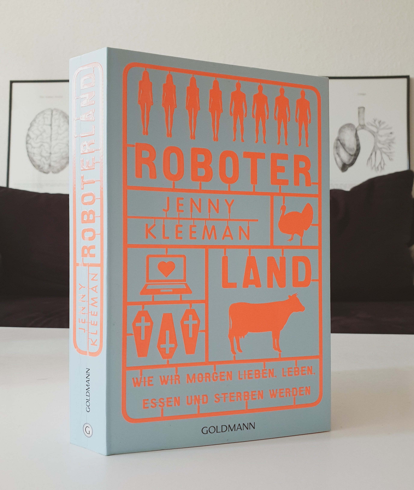

<strong>Titel: </strong>Roboterland

<strong>Autorin: </strong>Jenny Kleeman

<strong>Verlag: </strong>Goldmann

<strong>Erschienen: </strong>10. Mai 2021

<strong>Seitenanzahl: </strong>416

<strong>Bewertung: </strong> 🌕🌕🌕🌑🌑

___

Danke an Random House Bloggerportal und Goldmann Verlag für die freundliche Bereitstellung dieses Rezensionsexemplars. Der Buchumschlag macht schon auf den ersten Blick einen starken Eindruck, mit dem originellen Design einer neon-orangen Schablonne mit Menschen-, Tieren-, Sargen- und Laptop-Stücken, die die im Titel erwähnten Theme darstellen. Daher war ich sehr neugierig zu lesen, was die britische Journalistin und Dokumentarfilmerin Jenny Kleeman über diesen Themen ans Licht gebracht hat.

## Klappentext
Willkommen in Roboterland? In ihrem eindrucksvollen Debüt nimmt uns die britische Journalistin und Dokumentarfilmerin Jenny Kleeman mit auf eine faszinierende Reise in die Welt von morgen – die schon heute entsteht. Die technische Entwicklung wird bald alle Bereiche unseres Lebens komplett verändern: wie wir geboren werden, essen, Sex haben und sterben. Kleeman trifft die Entwickler von Sexrobotern, von Organen und Fleisch aus dem 3D-Drucker und von künstlichen Gebärmüttern. Hautnah beobachtet sie, wie High-Tech-Erfindungen unseren Alltag erobern. Was macht diese radikale Veränderung mit uns? Werden wir in Roboterland noch menschlich sein? Eine hochspannende Live-Reportage aus den Labors unserer Zukunft, in denen die Grenzen des uns Bekannten radikal verschoben werden.

## Meinung
***Teil I: Wie wir lieben werden*** betrifft technologische Entwicklung im Bereich Sex-Tech, nämlich Sexroboter. Ich finde dieses Thema sehr spannend hinsichtlich ihrer ethischen und gesselschaftlichen Dimension. Diese Fragen und sogar das inbegriffene Datenschutz Problem wurden Entwicklern, Verkäufern und Anwendern von Sexrobotern gestellt. Ihre Argumente und Ideen für Anwendungsgebiete von Sexrobotern wurden leider missachtet oder in der falschen Richtung übertrieben von Kleeman, die sich von Anfang an gegen Sexrobotern positioniert und ihre Befragten offensichtlich als Spinner betrachtet. Ihre Auffassung ist, dass  Sexroboter Frauen (und Kinder) zu Objekten reduzieren und gewaltsames Verhalten gegen sie rechtfertigen bzw. billigen. Auf andere Argumente reagiert sie engstirnig, entsetzt oder naiv (z.B. sie findet es abstoßend, Robotergenitalien nach Anwendung in einem Desinfektionsgerät zu legen, oder sie betrachtet Sexroboter als Sklaven). Den Wert der technischen Ausstattung, des detaillierten Designs und eindrucksvollen Arbeit, die in diesen Robotern steckt, erkennt sie nicht mal (an). 

***Teil II: Wie wir essen werden*** behandelt die Produktion von *Clean Meat*, d.h. pflanzliches Fleisch, als Alternative zum gesundheits- und umweltschädlichen Tierfleisch. Dieser Teil war für mich persönlich interessanter, denn ich ernähre mich seit 2012 vegetarisch bzw. 2014 vegan und bin neugierig, wie eine "vegane Zukunft" aussehen kann. Dafür interviewt Kleeman (überzeugte Fleischesserin) Produzenten von *Clean Meat* und erhält eine Kostprobe davon. Obwohl sie nicht grundlegend davon überzeugt ist, betrachtet sie diese Industrie ein bisschen objektiver, erkennt die Probleme der Fleischindustrie und das Bedürfnis für eine Alternative.

***Teil III: Wie wir uns fortpflanzen werden*** erkundet die Zukunft der Ektogenese, d.h. die Zeugung und Reifung eines Säugetierembryos in einem künstlichen Uterus. Die Auswirkungen dieses Verfahrens werden aus den Perspektiven von WissenschaftlerInnen, Leihmüttern, Drogensüchtigen, homosexuellen Paaren, Transsexuellen und Frauenhassern betrachtet. Ich fand die Informationen und Berichte in diesem Teil schockierend und höchst heikel, weil dadurch die Rechte und Rolle von Frauen, sowie die gesellschaftliche Struktur wesentlich verändert werden. Hierbei hätte ich es besser gefunden, auch der finanzielle Aspekt zu besprechen, nämlich dass die wohlhabende Personen bzw. Länder zuerst Zugang zur Ektogenese (wie zu Leihmütter) haben und welche Folgen diese Ungleichheit hat.

***Teil IV: Wie wir sterben werden*** hat wieder ein Bezug zu meiner persönlicher Erfahrung. Ich habe für einigen Monaten als Datenanalystin in einem digitalen Bestattungsunternehmen, der darauf spezialisiert, Bestattungen für Angehörige oder sich selbst (als Vorsorge) online zu planen. In dieser Rolle bzw. Branche habe ich viel über das Geschäft mit dem Tod gelernt und dachte ich hatte schon eine Ahnung, worum es in diesem Teil geht. Kleeman berichtet hier aber über ein besonders Tabu-Gebiet: das Geschäft mit dem Suizid. Die angesprochenen Vereine und Designer, die den Menschen die Möglichkeit eines friedlichen (wenn auch teures) Selbstmordes mithilfe von [futuristischen Maschinen](https://www.exitinternational.net/sarco/) versprechen, bringen die [Debatte über die Sterbehilfe](https://www.bundestag.de/dokumente/textarchiv/sterbehilfe-529962) auf ganz neuem Niveau.

Im Allgemeinen fand ich Kleemans Berichterstattung unprofessionell: sie bringt mehr Vorurteile als Neugier, stellt mehr Trugschlüsse als kritische Fragen und herabschaut auf ihre Interviewpartner. Es ist daher nicht überraschend, dass viele der Befragten ihre Fragen ungeduldig, oberflächlich oder gar nicht mehr beantworten. Schade, denn die angesprochenen Themen sind sehr spannend und wichtig für eine öffentliche Diskussion.

## Empfehlung
Wenn du über technologische Entwicklungen im Geschäft mit dem Sex, Fleisch, Schwangerschaft und Tod aus einer ethischen, rechtlichen und gesellschaftlichen Perspektive erfahren willst, nicht leicht beeinflussbar bist und kritisch denken kannst, dan empfehle ich dir *Roboterland* zu lesen.

