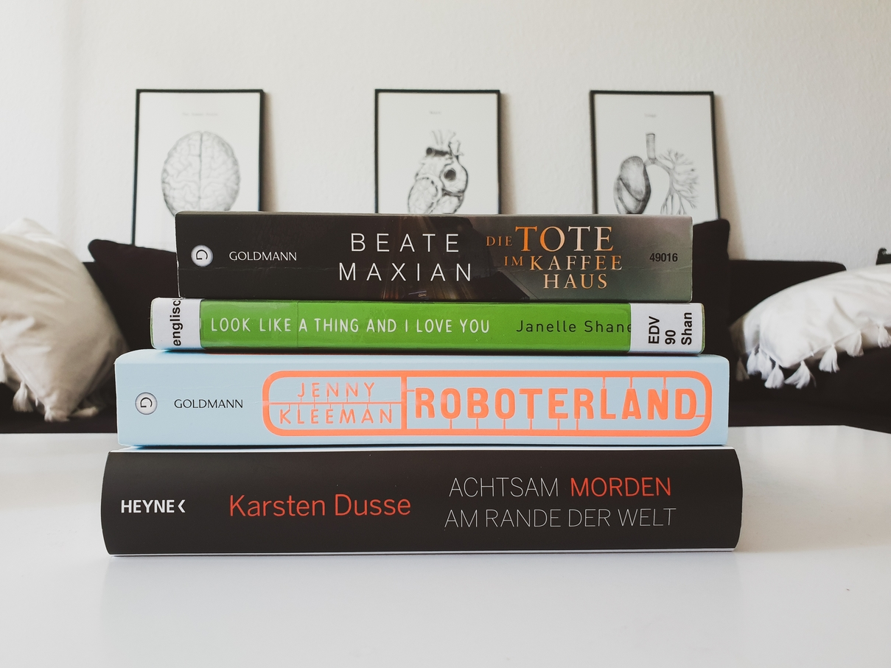

Here's to another month of reading good books! In May I read **5 books** (2 fiction and 3 non-fiction) amounting to **1846 pages** and a **3.8 average rating**.

To be honest, I slid into a reading slump this month. If it weren't for the ARCs from Bloggerportal that I needed to review (marked here with `Deutsche Rezension`), I would've probably read even less. I actually also started reading two books that didn't make to this wrap-up list: ***Homegoing* by Yaa Gyasi** and ***The girl with the louding voice* by Abi Daré**. I know, I know, they're highly rated and a must-read, but I just couldn't get into the plot of any of them, they were slow, dealt with some dark/heavy topics, and were written in an unengaging way (at least the first few pages). Maybe I'll pick them up again in a couple of months.

Till then, here are my thoughts on the five books I finished this month.

## FICTION

### *Die Tote im Kaffeehaus* by Beate Maxian
🌕🌕🌕🌑🌑 Journalist Sarah Pauli meets the grande-dame of the coffeehouse dynasty Böhm in Vienna for an interview, but madame dies of a heart attack right as she was preparing to disclose a secret to Sarah, who then sets out to find out for herself and investigate whether Frau Böhm was in fact murdered. It's a cozy murder mystery with Viennese charm, as the action takes places in famous coffeehouses, classic ballrooms, and on the city centre's streets. Similarly to [*Mexican Gothic*](), the atmosphere overweighs the plot. Best enjoyed with a hot mocca.\
[`Deutsche Rezension`]()

### *Achtsam morden am Rande der Welt* by Karsten Dusse
🌕🌕🌕🌕🌑 In this third volume, Björn dives deeper into mindfulness therapy and takes a break from his responsibilities as an underground lawyer to walk the Way of St. James. Along the way, he finds himself and a few dead bodies... I loved the [first two volumes]() and this one didn't disappoint, giving me a good dose of dark humour, suspense, and meditation.
[`Deutsche Rezension`]()

## NON-FICTION
### *Factfulness* by Hans Rosling
🌕🌕🌕🌕🌑 If you have the impression that the world is divided into "us" vs. "them", the quality of life is not improving, and the world population is terrifyingly increasing ad infinitum–you need to chill and read this book. Hans Rosling reveals 10 instincts that distort our perspective of the world, observed during his experience as a medical doctor, professor of international health, and public educator. When I first read this book two years ago, it drastically changed the way I perceive and think about the world. I also included it in my recommendations of [data science books](), since it teaches you how to think with data. This month I re-read it for my book club at work and it was a much needed refresher for going through this Covid time. 

### *You look like a thing and I love you* by Janelle Shane
🌕🌕🌕🌕🌕 I never thought AI could be considered *cute*, but then I read this book and was swept off my feet! Janelle Shane not only explains AI concepts and the latest research in a clear and entertaining way, but also illustrates them with hand-drawn sketches of tiny robots and black boxes. Fun fact: the book title is a pick-up line generated by an AI trained on this task, and I don't know about you, but they are more charming that many I've heard from people.

### *Sex robots and vegan meat* by Jenny Kleeman
🌕🌕🌕🌑🌑 This books deals with the technological advances in sex robots, ectogenesis, clean meat, and assisted suicide, based on interviews with scientists, entrepreneurs, and clients in the respective industries. The topics are really thought-provoking and worth discussing publicly–if only they were handled by a more professional, open-minded, and respectful journalist. Yes, it's not me, it's not science–it's you, Jenny.
[`Deutsche Rezension`]() 