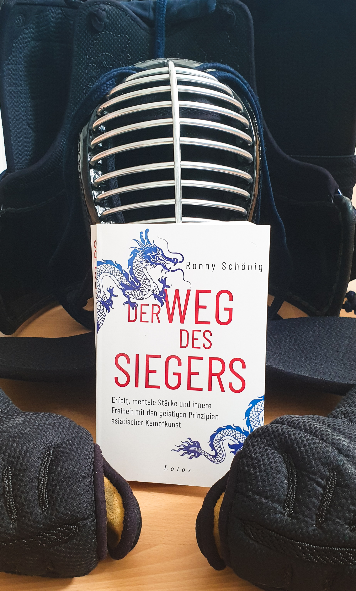

<strong>Titel: </strong>Der Weg des Siegers

<strong>Autor: </strong>Ronny Schönig

<strong>Verlag: </strong>Lotos

<strong>Erschienen: </strong>17. Mai 2021

<strong>Seitenanzahl: </strong>304

<strong>Bewertung: </strong> 🌕🌕🌕🌕🌖

___

Danke an Random House Bloggerportal und Lotos Verlag für die freundliche Bereitstellung dieses Rezensionsexemplars. Der Titel hat mich sofort angezogen, denn ich praktiziere selbst Kampfkunst und interessiere mich besonders für die Philosophie dahinter. 

Nach einigen Jahren regelmäßiger Yoga- und Meditationspraxis, wünschte ich mir eine dynamischere Aktivität, in der Philosophie bzw. mentales Training auch ein wichtiger Bestandteil sein sollten. So habe ich 2018 fast gleichzeitig mit Karate (Shotokan) und Kendo angefangen. 

Diese Sportarten haben mein Leben wesentlich geändert, indem sie mein Wettkampfgeist gefördert, mein Selbstvertrauen aufgebaut, und meine Entscheidungsfähigkeit verstärkt haben. Diese Kompetenzen verfeinere ich immer noch ständig im Training, in Graduierungsprüfungen, Wettkämpfen, und [Kangeiko](https://www.japanese-wiki-corpus.org/culture/Kangeiko.html) (wenn auch nur online heutzutage, coronabedingt).

Ronny Schönigs Buch ist ein wertvoller Begleiter auf diesem Weg und ich werde einige Kapitel und Übungen bestimmt wieder lesen, um mich darauf mental vorzubereiten. 

## Klappentext
Geistige Stärke, nachhaltiger Erfolg und tiefe Zufriedenheit sind eine Frage der inneren Haltung – und diese kann man verändern! Wie das gelingt, wird wohl nirgendwo so klar dargelegt wie in den mentalen Prinzipien der asiatischen Kampfkünste. Ronny Schönig, praktizierender Buddhist und ehemaliger Nationaltrainer in Kick- und Thaiboxen, übersetzt diese Erfolgsstrategien der Shaolin-Mönche, Samurai & Co. für den westlichen Alltag. Im Zentrum steht dabei die bewusste Lenkung der eigenen Lebensenergie: Mit ihr wird es möglich, Stress, Angst und Orientierungslosigkeit zu überwinden, in die ureigene Kraft zu finden und die Herausforderungen des Lebens zu meistern – auch ohne ständig gegen sich selbst oder andere kämpfen zu müssen.

## Meinung
Das Buch hält, was es verspricht: in 13 Kapiteln werden Strategien, Tipps, und Übungen zur Überwindung verschiedenen Schwierigkeiten (z.B. Orientierungslosigkeit, Wandel, Angst) und Vorbereitung auf Erfolg. Zudem gibt es einen Anhang mit Ernährungstipps, Körperübungen, und Meditationen für Sieger.

Der Autor basiert diese Empfehlungen auf seine persönliche langjährige Erfahrung und erzählt freimütig über seine (Miss)Erfolge, Mentoren, und spirituelle Praxis, die er um die Welt verfeinert hat. Ich fand seine Geschichte sehr inspirierend und sein Schreibstil irgendwie beruhigend aber dennoch aufregend. 

> In der asiatischen Kampfkunst geht es in erster Linie darum, sich selbst zu besiegen - und dann erst mit diesem Wissen um die eigene Stärke den Gegner auf ein höheres Level zu heben. 
> 
> S. 155

Die angegebenen Übungen und Lektionen sind nicht ausschließlich für Sportler, sondern können auf verschiedenen Lebenssituationen angewendet werden. Wer aber ein typisches Ratgeberbuch mit schnellen Lösungen und kleinen "life hacks" erwartet, ist hier falsch. Asiatische Kampfkunst ist eine Lebensweise an sich, die die Verinnerlichung von Werten wie Mitgefühl, Aufrichtigkeit, und Verantwortung erfordert, sowie ein hohes Maß an Disziplin und Belastbarkeit. Der Weg des Siegers ist nicht schnell und einfach.

## Empfehlung
Wenn du (Kampf)SportlerIn bist oder dich für asiatische Kampfkunst interessiert, mit mentalem Training und Meditation anfangen möchtest, oder deine körperliche und geistige Disziplin verfeinern willst, dann empfehle ich dir *Der Weg des Siegers* zu lesen!