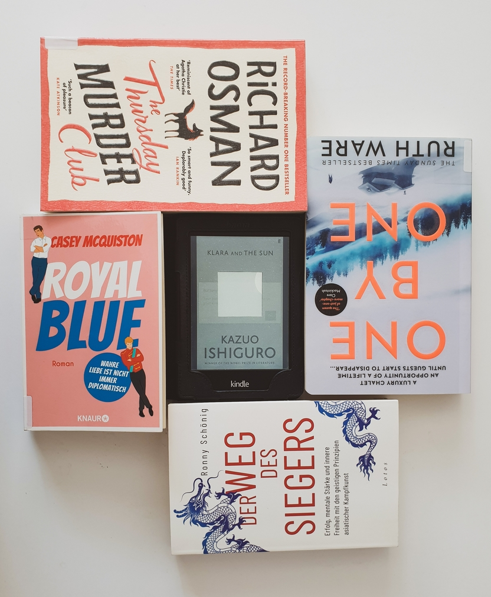

What a disappointing reading month June was! I read **5 books** (4 fiction and 1 non-fiction) amounting to **1,715 pages** and a **2.7 average rating**, with ratings between 1 and 3. 

I haven't read such weak books, and so many in a row, since... never! I don't know how I managed to got my hands on them this month, I only hope the next months will be better. For one, I should probably stop following bookstagram or booktube recommendations. But hey, even though I didn't enjoy most books I read this month, at least I'll try to roast review them and let *you* decide whether you'll add them to or cross them from your list.

# FICTION
## *The Thursday Murder Club* by Richard Osman
🌕🌕🌕🌑🌑 A group of pensioners from a luxurious retirement home in Kent meet every Thursday to discuss unsolved murders, until one day a property developer is murdered at their doorstep, giving them a first real crime to solve...
The blurb sounded intriguing and fun, since the main characters are seniors and not the usual young fit investigators. The story is told from the perspectives of several characters (one too many, I'd say), who all had a well-defined  personality, way of talking and thinking. They were witty and gave me an ocassional laugh. But that was about it. The unraveling of the case too slow-paced and the suspense of catching the killer turned halfway through the book into a drag. At 100 pages shorter, I think this book would've been much more engaging.

## *One by One* by Ruth Ware
🌕🌕🌕🌑🌑 Nine team members of a tech startup go on a weeklog corporate retreat in the French Alps, but when an avalanche leaves them stranded in the chalet, they start to disappear one by one...
This was solid entertainment and mystery for the first third or so, not least because of the spot-on depiction of startup culture and lingo. However, I didn't enjoy how the author slaloms between the characters, raises expectations about the plot and characters, but the ending is predictable and cheesy. Despite the hints to some characters family histories, they don't have any depth and don't connect to the present situation. This left me thinking: is it après-ski time yet?

## *Klara and the Sun* by Kazuo Ishiguro
🌕🌕🌑🌑🌑 Klara, an Artificial Friend with outstanding observational qualities, watches the world from her place in the store, until one day she is finally acquired by a wealthy family with a young daughter Josie, bringing her closer to learning about what it means to be human. 
We chose tho read this book for my office book club, based on the intriguing topic dealing with AI and the renown of Ishiguro as an outstanding writer and Nobel Prize winner. However, it turned out to be a major disappointment. To me the book seemed like a draft that got published before it was thought through. The story is told in very broad brushstrokes, sprinkled with several heavy topics (AI, consciousness, social inequality, genetic editing, favoritism) that are not explained or explored. Sure, many of these can be interpreted as metaphors for the human condition, religion, racism – but I would've preferred the author to pinpoint some intended meaning instead of giving the readers a blank canvas to interpret as they please. 
In the book club, we had an interesting discussion about whether Klara is more human than the people around her. I argue that no, her (re)actions are robotic: she follows one goal only (take care of Josie) and wants to achieve it not matter what; she doesn't get frustrated or angry; she doesn't break down and reveal secrets; she doesn't get *happy*; all her (re)actions and interactions with other people are dependent of Josie, whether they would benefit her.

## *Red, White & Royal Blue* by Casey McQuiston
🌕🌑🌑🌑🌑 America's First Son and the Prince of Wales go from enemies to lovers, in the background of the first woman President's reelection campaign. 
What sounded like an empowering LGBTQ+ read and witty political critique turned out to be an utter waste of time and brain cells. Maybe I'm too old or cynical for this kind of stories, but I couldn't oversee the blatant stereotypes and misconceptions about the British culture, and most annoyingly the strict good-vs-evil division of Democrats vs Republicans, pushing for one-sided idolatry. As for the "steamy" scenes, they mostly made me roll my eyes and skip the parts. It's incredible how McQuiston managed to fantasize about this story in over 400 pages. I only kept on reading because I was bed-ridden for three days with pain after wisdom teeth surgery and needed a distraction that wasn't noisy or intense, could be easily paused anytime, and didn't involve concentration effort – this book did it for me.

# NON-FICTION

## *Der Weg des Siegers* by Ronny Schönig
🌕🌕🌕🌕🌕 In this book, practicing Buddhist and former national coach for Kick- and Thai boxing gives shares tips on what it takes to develop a winner mentality, derived from his inspiring personal experience. It includes meditation exercises, cognitive behavioral therapy, mental training, confidence-boosting affirmations, and even diet recipes – all helpful tips that I'll definitely put into practice to level up my game in kendo training and work, and (re)gain inner balance. \
[`Deutsche Rezension`]()