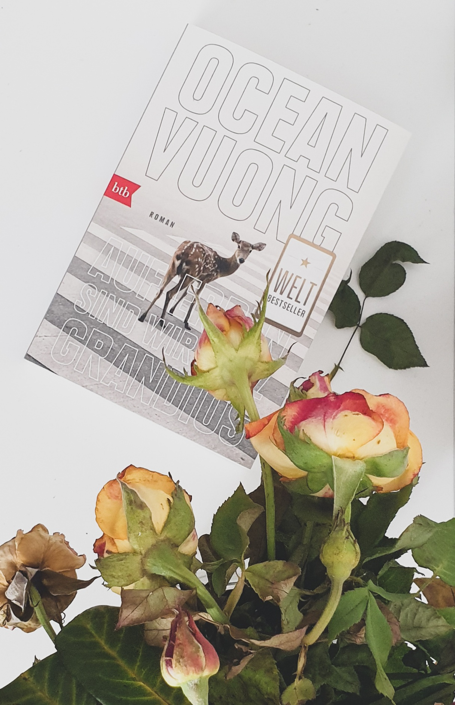

<strong>Titel: </strong>Auf Erden sind wir kurz grandios

<strong>Autor: </strong>Ocean Vuong

<strong>Verlag: </strong>btb

<strong>Erschienen: </strong>Juli 2021

<strong>Seitenanzahl: </strong>272

<strong>Bewertung: </strong>🌕🌕🌕🌑🌑 

___

Danke an Random House Bloggerportal und btb Verlag für die freundliche Bereitstellung dieses Rezensionsexemplars. 

## Klappentext
Ein Roman, der die amerikanische Identität neu definiert. Und der Brief eines Sohnes an die vietnamesische Mutter, die ihn nie lesen wird: Die Tochter eines amerikanischen Soldaten und eines vietnamesischen Bauernmädchens ist Analphabetin, kann kaum Englisch und arbeitet in einem Nagelstudio. Sie ist das Produkt eines vergessenen Krieges. Der Sohn, ein schmächtiger Außenseiter, erzählt – von der Krankheit der Großmutter, den geschundenen Händen der prügelnden Mutter und seiner tragischen ersten Liebe zu einem amerikanischen Jungen. Ocean Vuong schreibt mit traumhafter Klarheit von einem Leben, in dem Gewalt und Zartheit aufeinanderprallen.

## Meinung
Von den ersten Zeilen wird eines klar: Vuong ist ein Poet, und sein Schreibstil macht das ganze Buch. Jeder Satz ist durchdacht, poliert, verschönert; jedes Erlebnis und Gefühl wird wie ein klassisches Gemälde präsentiert; die Personen, ob Familie oder Freunde, werden in einem gleichzeitig sakralen/profanen Licht erscheinen lassen.

Damit meine ich tatsächlich, dass das Buch mehr Schein als Sein bietet. Vuongs Schreibstil kam mir als übermäßig prätentiös vor, zumindest für eine Autobiographie.

Er beschreibt ergreifende Momente, wie die Aufprallung vietnamesischer und amerikanischer Kultur, das Alltagsleben im Nagelsalon und die Machtverhältnisse zwischen den vietnamesischen Mitarbeiterinnen und amerikanischen Kunden, die Schikanierungen wegen seiner Migrationshintergrund, aber auch die erste Liebe.

Allerdings wird die emotionale und persönliche Dimension dieser Erlebnissen von den ganzen Stilmittel überschattet. Diese wirken manchmal sogar wie ein Abwehrmechanismus gegen der grauen, rauen, ordinären Realität.

## Empfehlung
Wenn du Autobiographien und Familiengeschichten magst, die Migration und kulturelle Konflikte thematisieren und auf poetischer Weise darstellen, dann empfehle ich dir *Auf Erden sind wir kurz grandios* zu lesen.