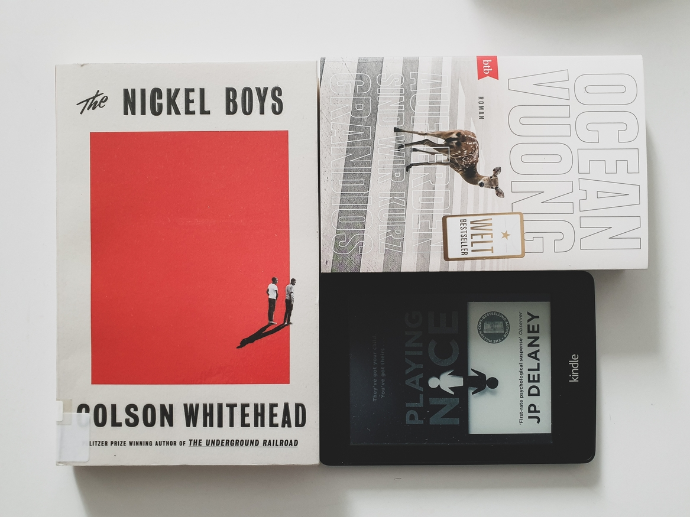

This month I managed to read (only) **3 books** (2 fiction, 1 non-fiction), amounting to **884 pages** and an **average rating of 3**.

# FICTION
## *Playing Nice* by J.P. Delaney
🌕🌕🌕🌑🌑 A couple's pleasant little life is turned upside down by the revelation that their son was switched at birth. Though they try to "play nice" with the other family to keep their two-year olds safe, the dark personalities and buried secrets of both families begin to endanger all the members...  
This story serves to thematize topics such as psychopathology, the cumbersome childcare/family law and social services, while also taking a critical look at the NHS administration and parenting roles. It was an entertaining read, but sometimes the decision of the parents made little common sense and the ending was quite far-fetched. Overall, I think this story would make a better TV series than book.

## *The Nickel Boys* by Colston Whitehead
🌕🌕🌕🌑🌑 Two teenagers, Elwood and Turner, befriend at the Nickel Academy, a segregated reform school that claims to turn its inmates into honourable men for the society, but by nightmarish measures that are brought to light decades later.  
At the core of the book is the clash between the opposing world views of the two friends: following Dr. Martin Luther King's words "Throw us in jail, and we will still love you."  vs. emulating the cruelty and cinicism of their oppressors as a way of survival. These views are put to the test by the cruel treatment the boys endure at the house and the consequences of their escape attempts. Though I consider it an important (and dark) read, as it touches on social inequality, violent racism, and PTSD; I think the story could have been structured better and even extended a bit, to explore these issues more deeply.

# NON-FICTION

## *On Earth We're Briefly Gorgeous* by Ocean Vuong
🌕🌕🌕🌑🌑 This book is written as a letter from a son to a mother who cannot read, confessing his memories and feelings of shame, anger, appreciation from childhood to young adulthood, as the family moves from Vietnam to the USA, experiences by language and cultural clashes, more or less violent racism, rejection and love. Like [*The Nickel Boys*](#the-nickel-boys-by-colston-whitehead), this is no doubt a life worth putting into words, both for personal catharsis and challenging once more the treatment of immigrants. But Vuong, lik ethe poet that he is, focuses too much (for my taste) on style, in the detriment of substance, and I found this to weaken the story itself.  
[`Deutsche Rezension`]()
