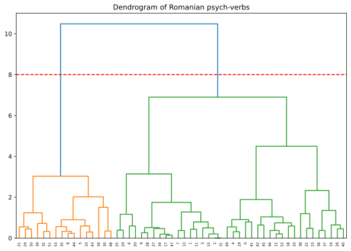
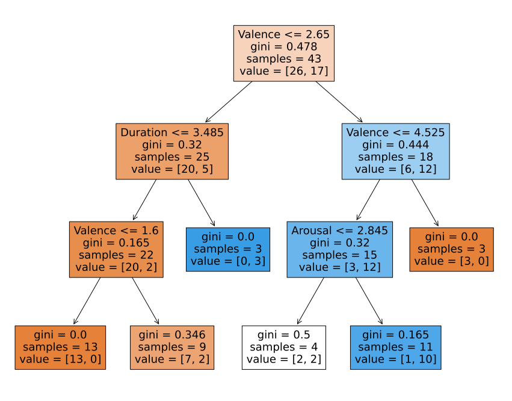
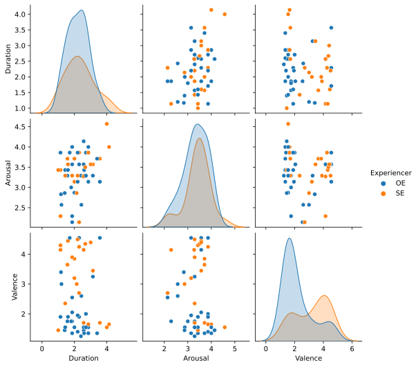

I've been interested in emotions ever since I've become aware of them. Maybe because I was unsure how to process and interpret them, in both myself and others. How do people express emotions and why do they do it so differently? Is *being scared* the same as *fearing*? Can I really understand or experience *sirva vigad* if the word doesn't exist in my native language?

My solution to deal with this personal struggle was to read and research about emotions. I know I know, you can't learn everything from books, especially not human feelings and interactions, but nevertheless I've discovered some fascinated learnings about emotions.

This is why for my Master thesis project I chose to research verbs of emotion, more specifically what are the semantic characteristics of Romanian verbs of emotion.

This project was conducted during my Master's degree in Linguistics at Humboldt-Universität zu Berlin and was also inspired by the research of [Prof. Elisabeth Verhoeven](https://www2.hu-berlin.de/experiencer/alternation/en/index.html) and [Hartshorne et al.](https://www.researchgate.net/publication/308761372_Psych_verbs_the_linking_problem_and_the_acquisition_of_language) on psych-verbs in different languages.

Since 2018 when I started working on this project, I've had the chance to present some preliminary findings at the [5th Linguistik Meetup in Potsdam]() and apply newly-learned [machine learning models](https://github.com/lorenanda/psych-verbs) for analyzing the data. 

In this blog post, I want to share with you the fascinating topic of psych-verbs, how I designed my research experiment, how I analyzed the collected data, and most importantly what I found out about Romanian psych-verbs. 

## A brief theory of psych-verbs 

**Psych-verbs** (also psychological verbs or experiencer verbs/predicates) express the mental state or emotion of an experiencer. The experiencer role refers to a participant that undergoes an event affecting consciousness. The experiencer can appear in one of two positions: as subject (**subject experiencer - SE**) or as object (**object experiencer - OE**). Take for example two illustrative sentences:

|*Jack scares Wendy.*|*Wendy fears Jack.*|
|--------------------|-------------------|
|Wendy is the OE of an action (emotion) inflicted by Jack upon her.|Wendy is the SE of an emotion that arises within her in response to Jack being perceived as a threat.|
 

## Why of research psych-verbs?
Even though the two verbs express the same emotion of fear, they have different syntactic structures, depending on the experiencer form. 

This structure appears to be unsystematic across languages, so there are no clear rules for which verbs are either OE, SE, or both. For this reason, psych-verbs pose a linguistic challenge in explaining the link between syntax and semantics. 

At the point of writing (early 2019), theoretical and experimental research has limited to popular languages (e.g., English, German, Japanese) and there are no experimental studies on Romanian psych-verbs. This is unfortunate, because native speakers' intuition can provide insights into a language. 

Therefore, my aim was to fill this research gap by conducting an experiment that reveals the semantic properties of psych-verbs in my native language, Romanian.

## How I researched Romanian psych-verbs
To research how people perceive psych-verbs, I designed an experiment, carried it on native Romanian speakers, and analyzed the resulted data.

### Designing the research experiment
I composed a list of 54 Romanian verbs from six emotion categories: anger, disgust, fear, happiness, sadness, and surprise. Some of these verbs are used as examples in the literature explaining the structure of psych-verbs. Each verb had to be rated from 1 (least) to 5 (most) on four criteria: 
- **valence**: whether the verb expresses a negative or a positive emotion
- **arousal**: how intense is the emotion expressed by the verb)
- **duration**: how long is the emotion expressed by the verb likely to last
- **cause**: whether the emotion expressed by the verb is perceived to be caused by external or internal factors

### Getting participants
For this experiment, I selected participants through word of mouth. They were handed in the verb list in paper-form or sent via email and they completed it in one sitting. The verb list was randomized for each participant, so that the order of the verbs could not influence the ratings. 

In total, I had 30 participants:
- all native speakers of Romanian
- 17 females, 6 males (self-identified)
- 32 years old on average

### Analyzing the data
After collecting responses from each participant, I went into the deep work: analyzing the data. I did all data analysis in Python with libraries such as pandas, seaborn, and scikit-learn. If you're interested in seeing the detailed data analysis, check out this [Jupyther Notebook](https://github.com/lorenanda/psych-verbs/blob/master/psych-verbs.ipynb).

First, I ran a descriptive analysis, where looked at the distribution of values by experiencer, emotion domain, rating feature, and verb. 

Second, I used K-Means clustering to identify clusters of verbs based on their ratings. The question here was whether some emotion verbs are closer (i.e. more similar) based on their values, rather than on the emotion category they belong to.

I also generated a dendogram to illustrate hierarchical clustering, or what is the distance between verbs based on their duration, arousal, and valence values.

Third, I attempted to classify psych-vers by using KNN, logistic regression, decision trees, and random forest classifiers.

## Findings on Romanian psych-verbs
- While OE and SE verbs have similar Duration and Arousal values, they differ significantly in terms of Valence. OE verbs have low Valence (mean 2.18, median 1.75), whereas SE verbs have positive Valence (mean 3.19, median 3.55). This means that emotions that are caused by external factors are perceived as negative, whereas emotions that arise within the experiencer are rather positive.

- The emotions that last longest express Happiness in SE form, and the shortes ones express Fear in SE form.
- The verbs with extreme Arousal levels express Happiness but also Sadness, in both OE and SE form. The most intense emotions, both positive and negative, belong to the Happiness and Sadness domains.

- The most positive emotions express Surprise in OE form, while the most negative ones express Fear and Anger also in OE form.
- Panic is to Surprise as Satisfaction is to Suffering. 
- Boring someone and being bored feel the same.

## What's next?

### Limitations
Though this experiment revealed new findings, this subject can be explored further. The main limitation of this study is the small sample size of participants. Moreover, it would be interesting to explore how verb ratings differ by gender or age of the speakers.

### Applications of psych-verbs
Initially, my main interest was to explore the linguistic structure of psych-verbs, but while working on the data analysis and reading research on emotions, I realized the findings of my study could be used for natural language processing (NLP) tasks, such as sentiment analysis and emotion recognition. For example, detecting signs of depression or anxiety in texts (e.g., forums, clinical notes).

---
