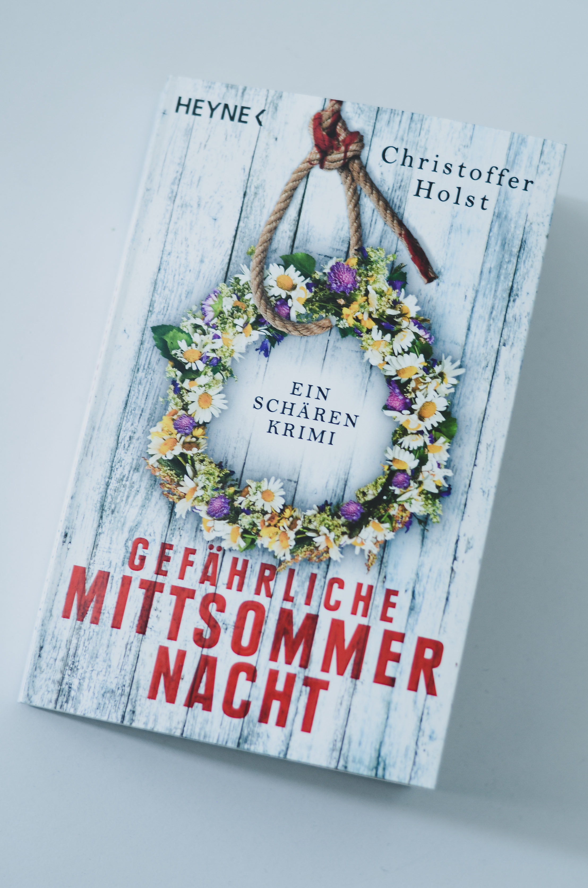
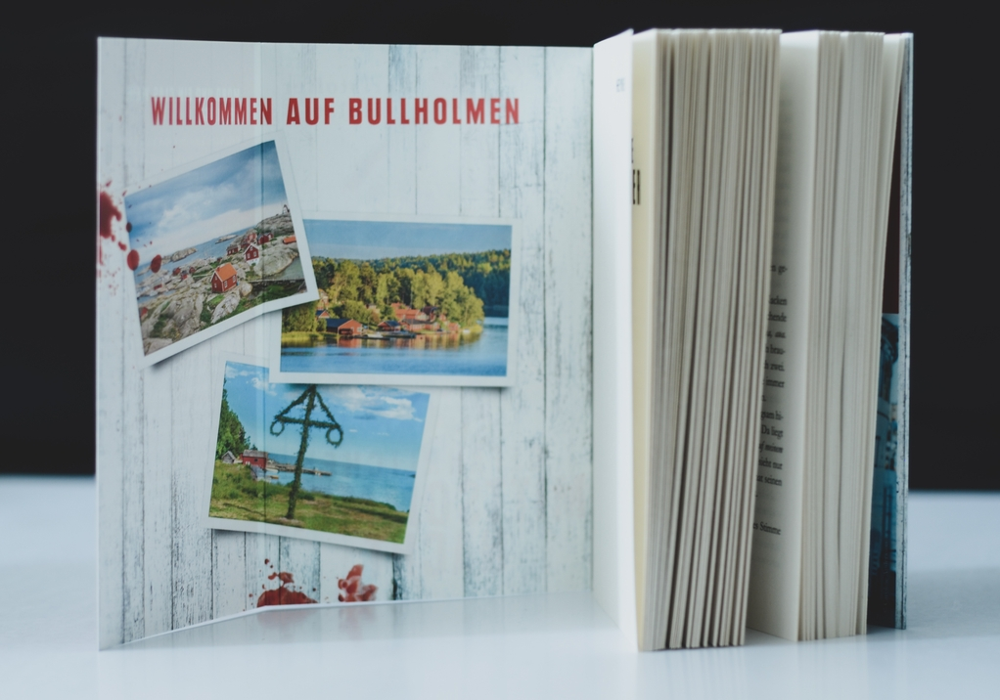

<figure><figcaption align = "center"><i>Gefährliche Mittsommernacht von Christoffer Holst</i></figcaption></figure>

<strong>Titel: </strong>Gefährliche Mittsommernacht

<strong>Autor: </strong>Christoffer Holst

<strong>Verlag: </strong>Heyne

<strong>Erschienen: </strong>May 2021

<strong>Seitenanzahl: </strong>320

<strong>Bewertung: </strong>🌕🌕🌑🌑🌑 

___

Danke an Random House Bloggerportal und Heyne Verlag für die freundliche Bereitstellung dieses Rezensionsexemplars. 

## Klappentext
Endlich entspannen und ihren Liebeskummer vergessen, denkt Journalistin Cilla Storm, als sie auf Bullholmen ankommt. Und wo sollte das besser gehen als auf einer idyllischen Schäreninsel, die nach den leckeren Zimtschnecken benannt ist? Doch als ein junges Mädchen am Morgen nach dem Mittsommerfest tot im Meer treibt, ist es vorbei mit der Urlaubsstimmung. Denn Cilla war die Letzte, die das Mädchen lebend gesehen hat. Dass ausgerechnet der attraktive Sohn ihrer Nachbarin die Ermittlungen leitet, macht die Sache auch nicht leichter. Dann erschüttert ein zweiter Mord die beschauliche Insel.

## Meinung
Der Klappentext hat mich mit einer spannenden Geschichte und einen atmosphärischen Tatort an einem Feiertag gelockt. Ich habe ein dunkles Krimi/Thriller à la [MIDSOMMAR](https://www.youtube.com/watch?v=1Vnghdsjmd0) erwartet. Leider habe ich nur ein paar Fragmente davon bekommen.

Der Autor beschreibt sich selbst als "unverbesslicher Romantiker", der gern "ein Glas Chardonnay genießt oder romantische Komödien guckt" und findet, "dass das Leben mehr wie ein Film oder ein Buch sein sollte". (Wir könnten bestimmt nicht befreundet sein.) Sein Lebensstil bzw. Lebensvorstellung dringt sein Schreiben durch, auch wenn es um eine Mordermittlung geht. Vielleicht kann diese Genre-Kombination irgendwie klappen, aber in *Gefährliche Mittsommernacht* ist es ihm nicht so gut gelungen. 

> Ein schöner Sommerabend ist wie ein Chardonnay aus dem Eichenfass. Mild, weich und mit einer süßen Fruchtnote.
> 
> S. 17

Insgesamt fand ich, dass das Buch zu viel auf die romantische Entwicklung zwischen Cilla und Adam fokussiert ist und viel zu wenig die Landschaft, die Atmosphäre, die Trauma mancher Figuren, die Mythen und Bedeutung des Mittsommernachts erkundet. Zum Beispiel, wäre es nicht für die Bilder von Bullholmen auf dem Innendeckel, hätte ich aus dem Text nicht verstanden was so "idyllisch" an diesem Insel ist. Ohne diese Elemente bleibt es ein generisches, vergessliches Buch.

Was die Figuren betrifft, hat mich keine beeindruckt. Sie scheinen skizziert nach vorgefertigten Schablonen für rom-com-dramas: die leichtsinige 20-Jährige mitten in einer Midlife-Krise; der heiße und emotional unerreichbare Typ; die überneugieriege Mutter; die schöne, reiche, anscheinend perfekte Familie mit einer geheimnisvollen Vergangenheit. Die Protagonistin war mir besonder unsympathisch. Ich habe so oft meine Augen verdreht an ihrer klischeehaften Gedanken, die wie aus *Sex and the City* oder einem Pinterest board ausgezogen waren.

Zum Mordermittlung bleibt mir nicht viel zu sagen. Eine langsame und nicht besonders kluge Ermittlung, lauwarme Spannung. Neben der Enthüllung des Täters, gibt es noch eine Enthüllung einer anderen Figur, die meiner Meinung nach überschaubar, unnötig und irrelavant war. Der Krimi-Teil ist also unterdurchscnittlich und unbeeindruckend.

## Empfehlung
Wenn du ein leichtes Buch als Zug-/Flugbegleiter brauchst und *Sex and the City* vibes mags bzw. erträgst, dann empfehle ich dir *Gefährliche Mitsommernacht* zu lesen.

<figure><figcaption align = "center"><i>Gefährliche Mittsommernacht von Christoffer Holst</i></figcaption></figure>