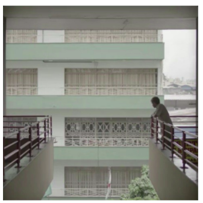
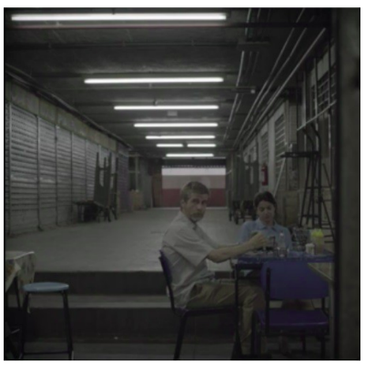
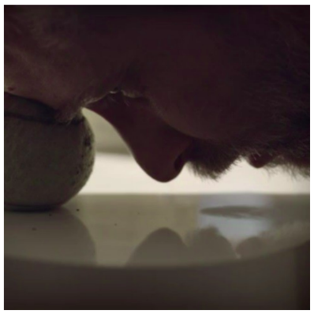
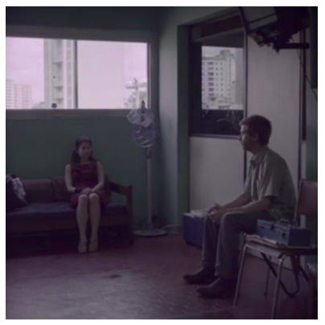
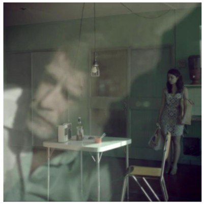
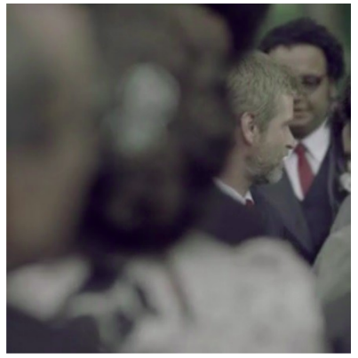

> We are all so much together, but we are all dying of loneliness.
>  
> (Albert Schweitzer)

In a felt previous life, I've studied Theater, Film, and Media Studies at the University of Vienna. One of my favourite classes was a seminar on film analysis, where I learned to *observe* films and interpret the meaning of composition, colour, sound, and cinematographical techniques. For my first-stage Bachelor thesis, I decided to analyse the depiction of loneliness in the film *O Homem das Multidões* (en: *The Man of the Crowd*). 

In this post, I want to share you with you my film analysis and how emotions can be be illustrated with technical camera choices. If you're interested in the detailed, more academic analysis, you can read my 28-page paper [here](https://drive.google.com/file/d/1ZR_UlcBCMUSncjCA2R5VZI-9GI_TU-_L/view?usp=sharing).

    
<strong>Table of contents</strong>

    <a href= "#loneliness-in-film">Loneliness in film</a> 
    <a href= "#introducing-the-man-of-the-crowd">Introducing <i>The Man of the Crowd</i></a> 
    <a href= "#film-analysis">Film analysis</a> 
    &nbsp;&nbsp;&nbsp;<a href= "#format">Format</a> 
    &nbsp;&nbsp;&nbsp;<a href= "#framing">Framing</a> 
    &nbsp;&nbsp;&nbsp;<a href= "#affect-images">Affect images</a> 
    &nbsp;&nbsp;&nbsp;<a href= "#length-of-takes">Length of takes</a> 
    &nbsp;&nbsp;&nbsp;<a href= "#reflections">Reflections</a> 
    &nbsp;&nbsp;&nbsp;<a href= "#over-the-shoulder-shots">Over-the-shoulder shots</a> 
    <a href= "#the-man-of-the-crowd-in-numbers"><i>The Man of the Crowd</i> in number</a> 
    <a href= "#conclusion">Conclusion</a> 
    <a href= "#references">References</a>

## Loneliness in film
The themes of urban loneliness and isolation have been explored in many films throughout the years. Despite the different ages, locations, nationalities and styles of the directors and protagonists, their common denominator is the inner and outer world of the characters: the protagonists reside in big cities with large populations, they are part of a crowd in their daily activities, and still they find themselves emotionally alone. In expressing their feelings, they resort to verbal or body language. 

But can emotions be transmitted in other ways, without verbalising them? In the absence of these two forms of language on the side of the characters, how could the viewers empathize with them? This is the case in the Brazilian film ***The Man of the Crowd* (2013) by Marcelo Gomes and Cao Guimarães**. 

## Introducing *The Man of the Crowd*
This fiction film is part of *The Trilogy on Solitude* initiated by Cao Guimarães in 2004 with *The Soul of the Bone*, followed by *Drifter* in 2006. 

The recurring themes of loneliness and social alienation pervade *The Man of the Crowd*, inspired by Edgar Allan Poe's homonymous short story, about a man's need to be part of a crowd, but without relating to the people. The two directors loosely adapted this story for the screen and set the drama of solitude in the modern urban society.

The film was entirely shot in Belo Horizonte, Minas Gerais in Brazil and was screened in the Panorama section of the 64th Berlin International Film Festival.

*The Man of the Crowd* follows two coworkers, Juvenal and Margo, leading solitary lives in the heart of the Brazilian metropolis Belo Horizonte. But their inanimated existences are shaken from the moment Margo initiates contact by asking Juvenal to be witness at her civil ceremony. This marks the beginning of a clumsy, yet emotional interaction of two lonely people. It is noteworthy that at no point in the narrative do the two protagonists verbally express their feeling of loneliness, to themselves or to each other.

<iframe width="560" height="315" src="https://www.youtube.com/embed/0sSCcB6aO98" title="YouTube video player" frameborder="0" allow="accelerometer; autoplay; clipboard-write; encrypted-media; gyroscope; picture-in-picture" allowfullscreen></iframe>

Translating the physical and emotional loneliness into a cinematic experience sets a creative challenge. Nevertheless, this can be achieved with specific cinematographical techniques. My aim was to show how a combination of various cinematographical techniques can express certain emotions. I chose the film *The Man of the Crowd* because from the moment I saw it, I was immediatly captivated by each frame and I think its aesthetics make it a reference for exploring cinematographicla loneliness.

## Film analysis
In my view, the aesthetics is what renders this film unique. In my analysis, I focused on six techniques that depict the most vivid emotion in the film–solitude:

<a href= "#format">Format</a> 
<a href= "#framing">Framing</a> 
<a href= "#affect-images">Affect images</a> 
<a href= "#length-of-takes">Length of takes</a> 
<a href= "#reflections">Reflections</a> 
<a href= "#over-the-shoulder-shots">Over-the-shoulder shots</a> 

### Format
One of the most significant and immediately recognizable formal features of *The Man of the Crowd* is the aspect ratio: the square format of 3x3, with rounded corners, which reminds of the cinemascope films. This aspect ratio allows minimum space for multiple characters. It creates a claustrophobic effect of a closed, limited universe, in which the characters have little freedom to move, like lions in a cage, walking to and fro but never really able to go past the (self-)imposed borders. Furthermore, the square can also be transposed into the four walls of a room, which is the space where both protagonists spend almost their entire time.

### Framing 
"The way in which a person is framed in that shot has a specific meaning, (for example, if the camera holds a person in the frame but that person is at one extreme or other of the frame, this could suggest a sense of imprisonment)" [[3](#references)]. This echnique is widely used in *The Man of the Crowd*. In several scenes, the two protagonists are either framed in a narrow space in the overall image, or in one of the lower corners of the image. The sense of "imprisonment" or limitation is achieved through two framing methods:

- **Narrow framing**, where the people are squashed between other elements in the frame.

<figure><figcaption><i>On one hand, the heavy structure (the opposite balcony and the building in the background) presses Juvenal to the margins. On the other hand, the fact that the sky is only visible above his balcony may suggest the possibility of an escape from this tight space, an eliberation.</i></figcaption></figure>

- **Framing in corners**, where people are pushed to the corner of the frame.

<figure><figcaption><i>In this case, the composition could mean 1) that they share the sensation of imprisonment or of being at the margins of the environment, or that 2) this feeling persists even when they are together or in the company of other people.</i></figcaption></figure>

### Affect images 
A scene is composed of three types image: action, perception and affect image [[1](#references)]. The latter represents the emotions of the characters, typically by taking close shots of their facial expressions or body language [[2](#references)]. There are 24 affect images in *The Man of the Crowd*, making it the dominant type of image in the film.

<figure><figcaption><i>"I am tired", Juvenal says twice in this scene. However, even without expressing it, exhaustion is obvious from his facial expression and can easily be read on his face, thanks to the proximity of the camera.</i></figcaption></figure>

The fact that the film is rich in close shots means that the accent is put on emotion, on "inner", not "outer" action.

### Length of takes 
The length of takes is relevant for understanding the film, since it sets the rhythm of the action. Short takes are achieved through more cuts and are employed for dynamic actions, to set a fast pace. In contrast, a long take is a continuous shot which lasts longer than the usual pace of films.

Digital films have an average shot length of 4.75 seconds [[4](#references)]. In *The Man of the Crowd*, the average shot length is 28.43 seconds. This significant difference indicates various effects on the viewers. "Long takes tend to slow down the pace of a scene, while short takes quicken pace and intensity" [[4](#references)].

What makes the length of takes relevant for the analysis of portrayal of loneliness is not necessarily the duration of the scenes, but the actions they represent, or rather the lack thereof. Throughout the film nothing really „happens“, in the sense of dynamic actions or dialogues. The tension accumulates in silence, the characters act unhurriedly and the the story progresses at a slow pace. 

The long takes can be divided in two categories: action images and affect images:

- **Long action scenes**, which show dynamic movements and last more than 20 seconds. The longest take in *The Man of the Crowd* lasts 321 seconds and shows the two protagonists in Juvenal's apartment, both  visibly uncomfortable and unable to engage even in small talk.

<figure><figcaption><i>The longest scene in the film showing Margo and Juvenal together, with the camera panning up and down the room suggesting nervous pacing and tension.</i></figcaption></figure>

- **Long affect scenes**, which show Margo and/or Juvenal sitting or standing for more than 10 seconds. They are most of the time straight-faced and seem to be in a lethargic or contemplative state. The length of takes reflects and emphasizes their mood. These scenes are a kind of video portraits displayed with the aim of giving time to the viewers to get in the atmosphere of the film characters.

### Reflections 
Perhaps the most original technique used in this film is the cinematographic use of reflections from windows and filming through windows. In this way, one shot displays both the character (his/her emotions/reactions/actions) and the environment/context in the background. This technique serves primarily a practical function, in that it allows to englobe a wide visual field, despite the restraint frame. Nevertheless, the technique of reflections can be understood on a metaphorical level, and I proposed three interpretations of reflections as keys to understanding/deciphering the minds and souls of the two protagonists:

- Windows, glasses and mirrors serve as **fragile objects**.
- The window serves as a **protective wall** from the outside world. 
- The reflection suggests **two levels of reality**: on one hand, the outer world, the people, the crowd; on the other hand, the inner world of the protagonists. 

<figure><figcaption><i>The reflection in the window brings together and at the same time separates Margo and Juvenal. The reflection represents the invisible, protective wall that the two characters try to keep between them and the rest of the world.</i></figcaption></figure>

### Over-the-shoulder shots 
As a technique of framing, an over-the-shoulder shot is a shot of a person or an object taken from the perspective (or camera angle) of the shoulder of another person. In extreme over-the-shoulder shots, the shoulder and head (or the bust) of one person takes up the majority of the frame, leaving a narrow space for the image of the person/object that the camera is pointing at, so that the person/object is enclosed or crammed at the margins of the frame. Figuratively, this way of framing evokes imprisonment, constraint, limitation, or stiffness.

<figure><figcaption><i>Juvenal is an outsider at Margo's wedding, when the guests around him embrace and kiss each other, while he is standing alone. At times, the guests block the view completely, giving the impression that Juvenal is being walked over or ignored by the other people.</i></figcaption></figure>

## *The Man of the Crowd* in numbers
For this film analysis, I went the extra mile and manually measured, counted, and analysed every single shot in the film. Check out the Appendix in the paper for the materials. Here's what I found:

<figure><figcaption><i>Timeline of the film The Man of the Crowd</i></figcaption></figure>

- The film compounds a total number of 163 scenes.
- Only 26 scenes do not show the two protagonists, but either other persons or environment.
- Margo and Juvenal appear together in 14 scenes.
- Juvenal appears in 94 scenes, whereas Margo appears in 57 scenes.
- There are 24 affect images/close shots, of which 13 of Juvenal and 9 of Margo.
- There are two particularly long scenes, counting 321, respectively 248 seconds, and other three scenes of over 100 seconds.
- The longest scene is at the mid of the film, whereas the second longest scene is at the very end. Moreover, it it noticeable that the 3 scenes of over 100 seconds are in the second half of the film, so after the 321-seconds scene.
- On the chart the two longest scenes are visible and look like an interruption in the rhythm of the film. Only by taking a look at the chart, it is noticeable that two major events take place at the marked points, which disturb considerably the otherwise constant rhythm of the film.

## Conclusion 
I've absolutely loved writing this paper and analysing how emotions such as loneliness, solitude and anxiety are visually expressed through cinematographical techniques. I've found that even the most complex and subtle feelings can be expressed using exclusively visual means, like the six techniques I've presented above. This proves that the language of cinema is at least as expressive as the verbal language, if not even more. 

I consider *The man of the Crowd* a reference for visual language: it manages to portay emotions, as well as abstract concepts (time, waiting, emptiness, soul) and concretize them on screen. The conglomeration of formal aspects, skillfully employed by Guimarães and Gomes, together with the artistic team, is what renders this film unique.

---
## References
1. Deleuze, Gilles (1989): Kino 1, Das Bewegungs-Bild. Frankfurt: Frankfurt a.M.
2. Faulstich, Werner (2008): Grundkurs Filmanalyse. Stuttgart: UTB Stuttgart.
3. Monaco, James (2009): How to read a film: movies, media and beyond. Oxford: Oxford Univ. Press.
4. Pramaggiore, Maria; Wallis, Tom (2005): Film: A Critical Introduction. London: Laurence King Publishing.