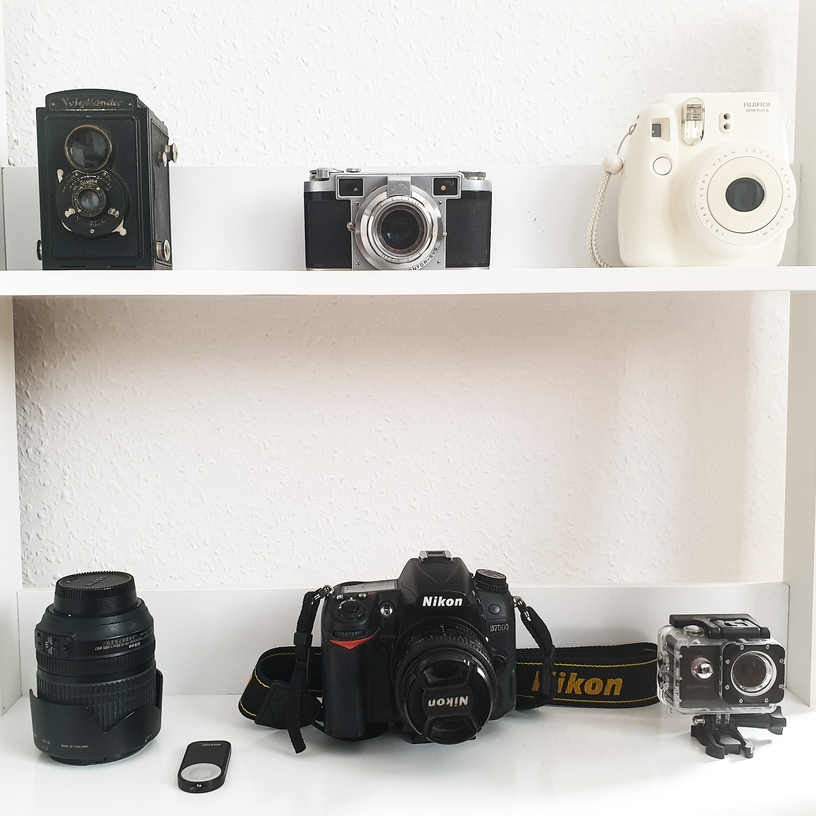

## A triggering realization
A few weeks ago I checked the shutter count on my DSLR camera, a Nikon D7000 that I got for my birthday 9 years ago. The shutter count represents the total number of times the camera's shutter has been clicked, so basically how many photos you've taken with the camera. DSLR cameras have a lifetime of 150,000 to 300,000 shutters, depending on the model (entry-level to professional). Now imagine my surprise when I read my **shutter count: 12,366**. This means that I've used around 7% of my camera's shooting capacity. Over 9 years. What does that say about me (and the world)?

Had I given up on photography? Yes and no. Photography has been a constant hobby of mine since 2008. I used to carry a camera with me almost everywhere, taking photos of my friends, on the streets, at home, on holidays, and eventually even putting on [exhibitions](../work/#photography). As much as I enjoyed it, I admit it was sometimes cumbersome to carry a chunky camera with me. Once I got to university and time became a constraint as well, my Nikon began to gather dust on a shelf. No, I hadn't given up photography entirely – I had just slowly transitioned to a more comfortable device: **the smartphone**.

## The rise and fall of photo cameras
<figure><figcaption><em>Worldwide shipments of photo cameras between 1951-2020</em></figcaption></figure>

The smartphone offered the hobby photographer a lightweight, portable camera. In the early 2010s, the smartphone cameras weren't even close to the quality of digital cameras, but they were still good enough for taking quick snapshots. Moreover (and perhaps most notably), smartphone cameras were paired with Internet, instant messaging, and the new Instagram hype, making editing and sharing photos effortless.

Nowadays, some smartphones are qualified competitors to DSLRs and Instagram has become a culture of its own, where filters and presets can instantly turn a sloppy snapshot into a "photograph". Unsurprisingly, after reaching a [peak of over 121 million in 2010, shipments of digital still cameras have decreased to less than nine million units](https://www.statista.com/topics/3884/cameras/), to the profit of smartphones – just like digital cameras had brought about the demise of analog photography.

<figure><figcaption><em>Worldwide digital camera shipments between 2010-2019</em></figcaption></figure>

Replacing a DSLR with a smartphone is not only replacing a camera, it's also changing the approach to photography.

## Framing instant gratification

In the early days, taking a photo involved staying still for hours (that's why people in early photos never smile), waiting for the film to be developed, or at least transferring images to a computer before sharing them. It meant tweaking the camera's settings and even [deciding from the beginning between color or black-and-white](https://unitednationsofphotography.com/2021/06/17/the-black-and-white-debate/). These preparatory steps and decisions infuse the photographer's work with patience, organization, excitement, and visualization – beyond the emotions related to the subjects being shot.

With a smartphone, photography has become a more relaxed and spontaneous experience, but also a superficial one. Unconstrained by the exposure time, number of film positions, or manual settings, we've become used to blindly taking easily discardable snapshots.

This is part of a broader phenomenon: **the instant gratification economy**.

> The instant gratification economy means using a computer or smartphone to obtain any and all information, play a game, chat with friends, watch a movie or order merchandise any time of the day or night. Also called the "on-demand economy."
> 
> <a href="https://encyclopedia2.thefreedictionary.com/instant+gratification+economy">source</a>

We want to see results *now* and share what we are doing *in this moment*. But if we can have everything at our fingertips right away, how do we decide what is worth having, sharing, and waiting for? We become hoarders, instead of collectors, not least of memories.

It's said that an image is worth a thousand words, but it seems to me that we've forgotten how to use language to express our experiences and feelings until their visual representation is produced.

## A case for mindful photography
In the age of instant gratification, FOMO, self-staging, and information overload, I think we should strive to be more **mindful** of the photos we take – taking a film approach to digital photography. Before clicking the shutter, ask yourself: Why am I taking this photo? What do I want to capture? Is this a fleeting moment? How am I feeling and how does the scene in front of my camera make me feel? Do I want to capture this moment? How should I frame this scene? You might learn to appreciate [the things you can see only when you slow down](https://www.penguin.co.uk/books/304/304680/the-things-you-can-see-only-when-you-slow-down/9780241340660.html#:~:text=Hugely%20popular%20in%20Korea%2C%20Haemin,world%20slows%20down%20with%20you.).

<figure><figcaption></figcaption></figure>
