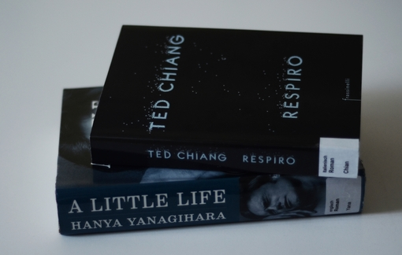

This month I read **4 fiction books** of **1602 pages** and a **3.4 average rating**. Two of them were some of the most depressing books I've read in a long while, one was one of the most enlightening, and another one was just a boring book. Quite a mix, so here are my thoughts on each of them:

## FICTION
## *Exhalation* by Ted Chiang
🌕🌕🌕🌕🌕 This is a collection of nine short stories that explore some of the oldest and deepest questions of humanity: What makes us human? Is there free will? Can social robots replace human nurture? Are our choices deterministic? Is the cosmos more insightful to research than the earth beneath our feet? What is the nature of the Universe? Chiang tackles these questions with ingenuous storytelling and elegant writin. Every single story drew me into its macro- or microcosm and left me in a meditative state. This books ranks in my favorite books of all time.

### *Gefährliche Mittsommernacht* by Christoffer Holst
🌕🌕🌑🌑🌑 20-something boulevard journalist Cilla goes on a soul-searching holiday to Bullholmen, a seemingly idyllic Norwegian island, until a series of murders among a group of teenage girls sets Cilla and the local charming policeman on an investigative adventure.  
From the blurb, I was expecting something like [*Midsommar*](https://www.youtube.com/watch?v=1Vnghdsjmd0). Instead, the criminal investigation and thriller elements are cut short, in favor of *Sex and the City*-like scenes and the clumsy pursue of a relationship between Cilla and Adam. An easy and forgettable read.  
[`Deutsche Rezension`]()

### *Human Acts* by Han Kang
🌕🌕🌕🌕🌑 Victims of the [Gwangju Uprising](https://en.wikipedia.org/wiki/Gwangju_Uprising) and their relatives observe and recount the unfolding of the massacre and reflect on how this attrocious event changed their lives in those days and decades later. It's a harrowing account of this tragic part of South Korea's history, that give voice to the innocent civilians caught in the uprising, while also highlighting the absurdity of war and the repercussions it has on the survivors, as individuals and as a society.

### *A Little Life* by Hanya Yanagihara
🌕🌕🌕🌑🌑 This story follows the lives of four friends (Jude, Willem, Malcolm, and JB) from college to late adulthood, with Jude serving as their center of gravity, while carrying within him a traumatic past. It's his unprocessed/unexpressed trauma that pervades every page and influences the dynamics of the group.  
My thhought after I finished reading this book were: Why does this book even exist? And why is it heralded as a masterpiece and recommended by critics and readers? And especially, why doesn't it come with a loud and clear trigger warning? Yanagihara seemingly goes into deeply dark corners of humanity, depicting physical and psychological abuse in graphical scenes. But to what end? The book doesn't delve into the psychology of these experiences, doesn't open a real discussion about PTSD, the role of therapy, or any other issues alluded to.  The abusers are flat and stereotypical, we never learn anything about their lives, reasons, psyche. Instead, they're only portrayed as monsters in episodic scenes and only through Jude's memory. For these reasons, I found the use of trauma and depression in this story as a voyeuristic device and a vulgar selling point.
The friendship between the four men is (supposed to be) the driving force of the novel, but I couldn't connect to any of the characters. They seemed unbelievable and, most annoyingly, too immature, unresponsible, or self-centered to serve as a lesson in friendship. As for the protagonist Jude, what compassion I felt for him in the beginning turned into annoyance bordering dislike, due to his self-loathing stubborness in getting help and thus destroying himself and the people around him.  
Admittedly, Yanagihara's writing is beautiful, but exercising it on 700 pages of sad boy drama just didn't get to me.