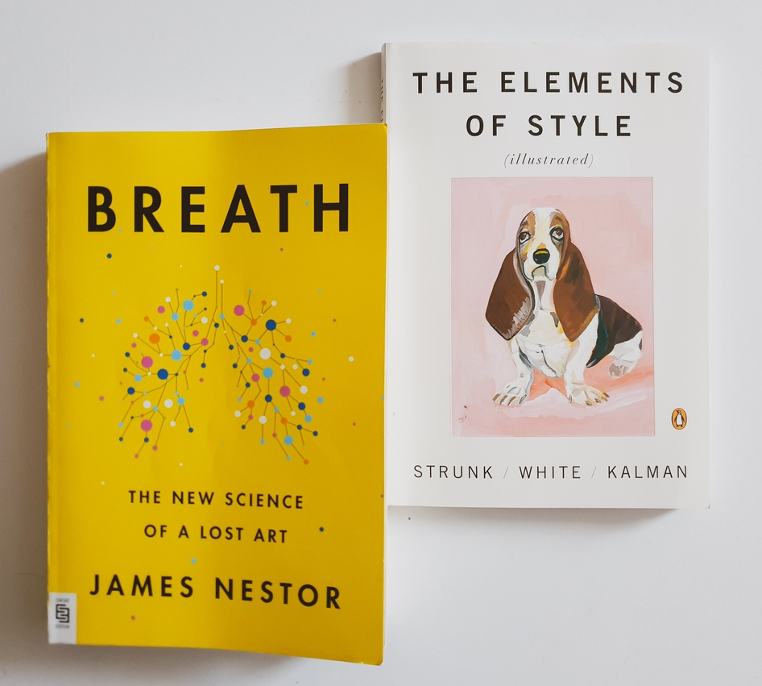

## *Breath: The New Science of a Lost Art* by James Nestor
🌕🌕🌗🌑🌑 Journalist James Nestor travels the world to learn and experiment how to breathe properly. From his readings and talks with pulmonauts (people who use breathing techniques for self-improvement), yogis, and athletes, Nestor makes the case that the way we breathe influences our life quality, and different breathing techniques can cure pretty much anything, from snoring and crooked teeth to scoliosis and depression. But before you rush to inhale carbon dioxide or taping your mouth at night (two hacks suggested in the book), keep this in mind: 1) the author is a journalist with no medical qualification or experience; 2) the bibliography consists mainly of news or blog articles and a few cherry-picked research studies; 3) the "evidence" is based on personal experience and (undocumented) Eastern traditions rather than on scientific research, providing a one-sided and superficial perspective. Overall, *Breath* is a somewhat engaging read, but don't take it too seriously.

## *The Elements of Style* by William Strunk Jr. & E.B. White
🌕🌕🌕🌕🌑 Now on its fourth edition since its publication in 1999, this is *the* style guide referenced by (aspiring) writers of English. It includes rules for spelling, punctuation, and composition–explained in a simple and sometimes humorous manner. Though many of the style and language uses are still valid today, some are outdated or changed. As I see it, strictly following Strunk & White's prescriptivist guidelines can make your writing sound inauthentic, so keep in mind the world, language, and readers of the present. 