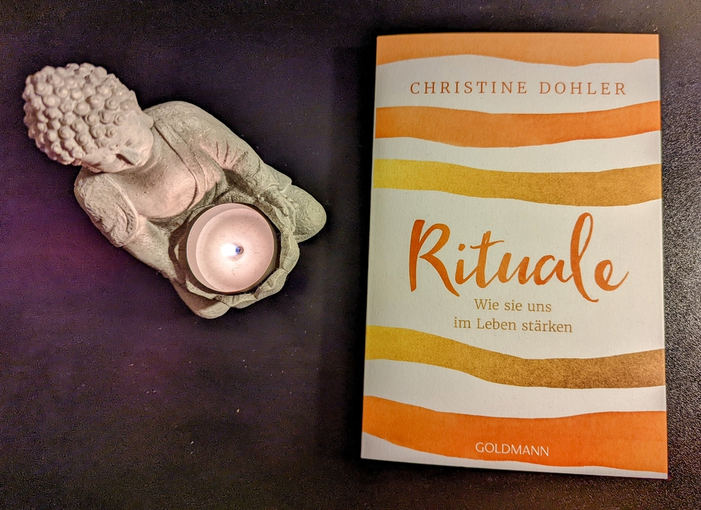

<figure></figure>

<strong>Titel: </strong>Rituale. Wie sie unser Leben stärken

<strong>Autor: </strong>Christine Dohler

<strong>Verlag: </strong>Goldmann

<strong>Erschienen: </strong>September 2021

<strong>Seitenanzahl: </strong>224

<strong>Bewertung: </strong>🌕🌕🌑🌑🌑 

___

Danke an Random House Bloggerportal und Goldmann Verlag für die freundliche Bereitstellung dieses Rezensionsexemplars. Auf der Suche nach Bücher über Achtsamkeit und Meditation, habe ich Christine Dohlers Buch gefunden. Die Autorin ist studierte Journalistin, ausgebildeter systemischer Coach und Meditationstrainerin.

## Klappentext
Rituale sind so alt wie die Menschheit und begleiten uns auch heute noch täglich. Sie stärken uns und geben Halt – gerade in einer Zeit, in der sich das Leben immer mehr beschleunigt und viele Menschen sich von den klassischen Weltreligionen lösen. Denn Rituale geben Orientierung und Sicherheit. Sie stillen unser Bedürfnis nach Gemeinschaft, Zugehörigkeit und Ruhe. Christine Dohler hat auf der ganzen Welt an den unterschiedlichsten Ritualen teilgenommen und zeigt, weshalb uns eine Morgenroutine gut in den Tag starten lässt, wie wir mit kleinen Ritualen auch an einem stressigen Arbeitstag das innere Gefühl von Zufriedenheit bewahren und welch lebensverändernde Power in Kakao steckt. So können wir die Kraft der Rituale für uns nutzen und sie zu einem Teil unseres Lebens machen.

## Meinung
Das Buch ist als "Sachbuch / Ratgeber" kategorisiert; ich finde "Tagebuch" passender. 
Aber fangen wir vorne an, mit der Definition eines Rituals:
> Rituale sind symbolische Handlungen nach einem bestimmten Ablauf, die man allein oder als Zeremonie in Gruppen ausführt.\
> (S. 16)

Darüberhinaus definiert Dohler ein Ritual danach, mit welchem Bewusstsein und welcher inneren Haltung sowie Absicht es durchgeführt wird. Daher kann jede alltägliche Routine zum Ritual werden, zum Beispiel die morgendliche Kaffeezubereitung, der Sonntagsspaziergang, oder das wöchentliche Schaumbad. (Klingt schon wie ein Pinterest board.) "Der Erfolgsritual" gibt es nicht; wichtig ist, dass der Ritual Spaß macht und nicht nur ein weiterer Termin im Kalender ist. 

In den folgenden Kapiteln präsentiert die Autorin verschiedene Rituale: Alltags- und Arbeitsrituale, Einschlaf- und Abendrituale, sowie besondere Rituale, wie Natur-, Cacao-, Fest-, und Liebesrituale. Hier habe ich etwa tiefsinnige Erkenntnisse erwartet, allerdings habe ich nur einen oberflächlichen und subjektiven Einblick im Scheinleben der Autorin erhalten. Wenn sie nicht über ihre Erlebnisse beim Weltreisen erzählt (von Ayahuasca-Trips zu Wasserrituale in Bali), dann nennt sie FreundInnen, YouTuberinnen, oder Facebook-Gruppen als Beweis für die "Kraft von Ritualen"––nicht besonders sachlich, geschweige denn lebensstärkend.

Der Schreibstil und Inhalt liest wie ein Mischmasch aus Blogbeiträgen, Tagebucheinträgen, Brunch-Klatsch, und Marketingmaterial. Im Allgemeinen, zu esoterisch und "duftend" für meinen Geschmack.

## Empfehlung
Wenn du Ideen für einen "außergewöhnlichen" Wellness-Retreat brauchst oder einen 220-seitigen *#blessed* Instagram-Feed lesen möchtest, dann empfehle ich dir *Rituale*.