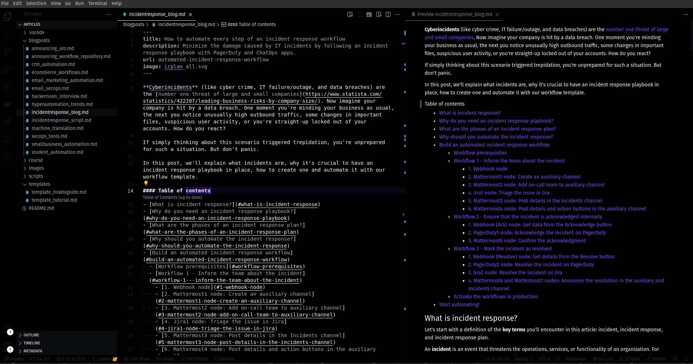
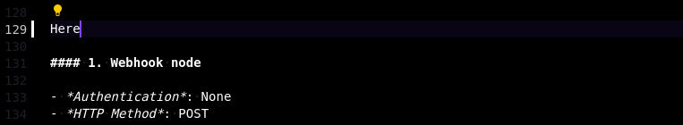
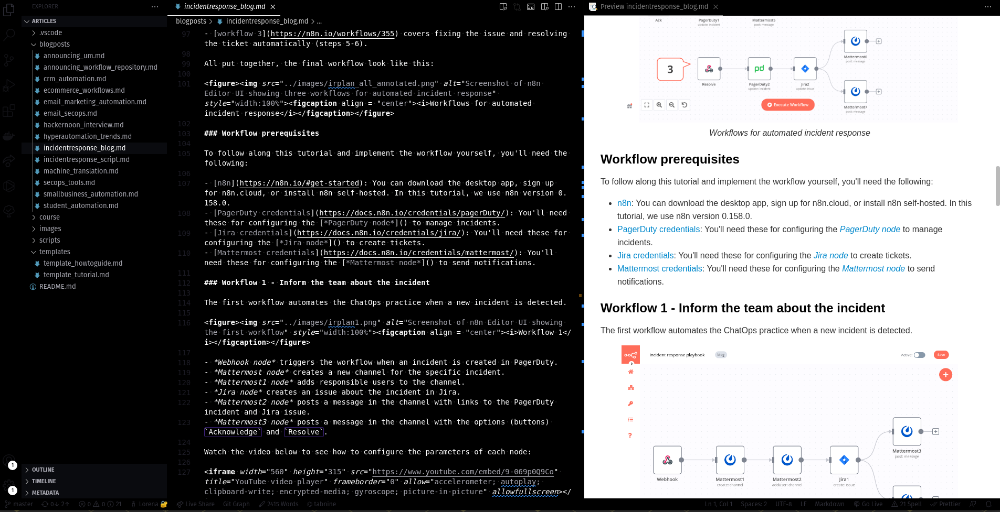
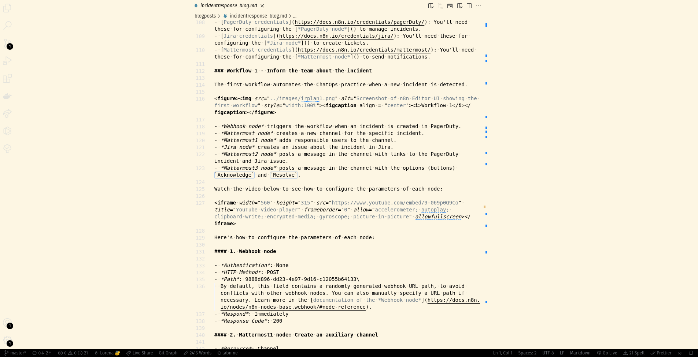

I write in Markdown pretty much every day, either personal blog posts or docs at my day job as a Technical Writer. In the past year, I've customized my writing workspace in Visual Studio Code to make writing more efficient and pleasant. In this post, I'll share with you my VSCode setup, including theme, extensions, and settings.

## Theme
I use [**i - A Minimal Theme**](https://marketplace.visualstudio.com/items?itemName=ctrlplusb.i-minimal-theme). As the name says, it's a minimalistic, distraction-free theme, with no bold colors or playful fonts. The theme comes in three palettes: Light, Solarised, and Night. I alternate between Solarised and Night, depending on my mood and time of day when I'm writing.

  

## Extensions

I tuned up my VSCode with the following writer-dedicated extensions:

- [**Code Spell Checker**](https://marketplace.visualstudio.com/items?itemName=streetsidesoftware.code-spell-checker) to catch typos.
- [**Vale**](https://marketplace.visualstudio.com/items?itemName=errata-ai.vale-server) to check that my writing follows the Microsoft Style Guide.
- [**Word Count**](https://marketplace.visualstudio.com/items?itemName=ms-vscode.wordcount) to show me how many words I write. This is particularly useful for SEO-based blog posts, where I need to hit a certain amount of words. (To automate more SEO checks, I built an [n8n workflow](https://www.youtube.com/watch?v=CwivuZ8YP3s&t=87s) and am working on a Python script, but that's a topic for another blog post.)

  

- [Tabnine AI Autocomplete](https://marketplace.visualstudio.com/items?itemName=TabNine.tabnine-vscode) to suggest me autocompletions. It saves me quite a lot of typing time and, though not world-dominatingly intelligent, it can make good suggestions.

  

- [**Markdown All in One**](https://marketplace.visualstudio.com/items?itemName=yzhang.markdown-all-in-one) to easily format my text (e.g. checkboxes, lists, table of contents).
- [**Markdown Preview Enhanced**](https://marketplace.visualstudio.com/items?itemName=shd101wyy.markdown-preview-enhanced) to preview the rendered text and export docs as PDF.

  

## Settings

Apart from the theme and extensions, I use these VSCode settings for a more clean, zen look:

- **Centered layout**: *View > Appearance > Centered Layout :check:*
- **Zen mode**: *View > Appearance > Zen Mode :check:*
- **Word wrap**: *View > Word Wrap* or *Alt+Z*
- **Hidden side bar**: *View > Appearance > Show Side Bar :uncheck:*
- **Hidden minimap**: *View > Show Minimap :uncheck:*

  

That's it: my VSCode setup for technical writing. I'm pretty sure it will change and evolve in the future, but for now this works just fine. If you fellow tech writers have any ideas or suggestions of how I could improve it, please let me know.
