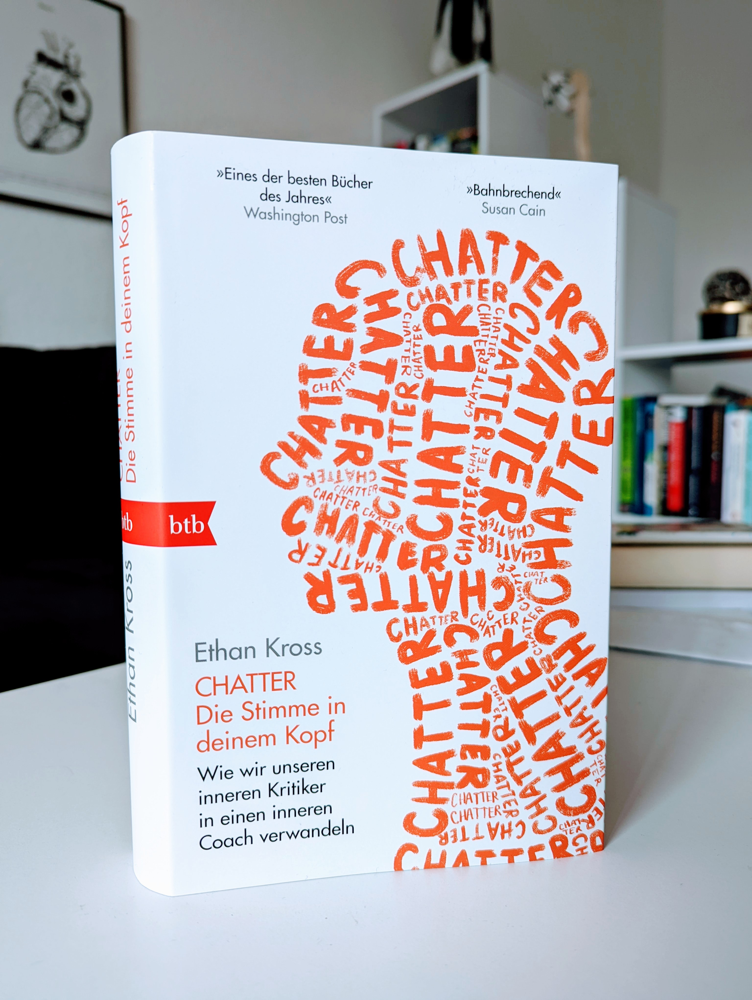

<figure></figure>

<strong>Titel: </strong>Chatter. Die Stimme in deinem Kopf

<strong>Autor: </strong>Ethan Kross

<strong>Verlag: </strong>btb

<strong>Erschienen: </strong>Februar 2022

<strong>Seitenanzahl: </strong>304

<strong>Bewertung: </strong>🌕🌕🌕🌗🌑 

___

Danke an Random House Bloggerportal und btb Verlag für die freundliche Bereitstellung dieses Rezensionsexemplars. 

## Klappentext
Der renommierte Psychologe Ethan Kross verschränkt für sein international vielbeachtetes Buch seine eigenen bahnbrechenden Forschungsergebnisse aus Verhaltens- und Hirnforschung mit zahlreichen Fallstudien aus der Praxis. Er erklärt uns, wie diese stummen Gespräche unser Leben, unsere Arbeit und unsere Beziehungen prägen. Er warnt davor, dass negative und desorientierende Selbstgespräche unsere Gesundheit belasten, unsere Stimmung negativ beeinflussen, unsere sozialen Verbindungen ins Wanken bringen und sogar dazu führen können, dass wir psychisch zusammenbrechen. Aber die gute Nachricht ist: Wir sind bereits mit allen Werkzeugen ausgestattet, die wir brauchen, um unsere innere Stimme zu unseren Gunsten nutzen zu können.

## Meinung
#storytime: Gerade als ich angefangen habe, das Buch zu lesen, kam ein dazu passender Song in meiner Spotify-Playlist:

<iframe width="560" height="315" src="https://www.youtube.com/embed/YitAyAFo7_w" title="YouTube video player" frameborder="0" allow="accelerometer; autoplay; clipboard-write; encrypted-media; gyroscope; picture-in-picture" allowfullscreen></iframe>

Also, zu diesem Soundtrack habe ich über die Stimme in unserem Kopf gelernt: warum wir mit uns selbst reden, wie wir bessere Gesprächspartner für uns selbst werden könne, was ist die Zauberkraft unserer Gedanken, und wie distanzierte Selbstbetrachtung und beruhigen oder motivieren kann.

Das ist ein gut recherchiertes Buch und der Autor hat einen journalistischen narrativen Schreibstil, was die Leküre eines pop-wissenschaftlichen Buches erleichtert. Allerdings war es für mich ab un zu einfach zu erzählerisch, ich hätte mir mehr Fakten und weniger Stilmittel gewünscht.

Der letzte Kapitel "Die Werkzeuge" setzt die ganze Theorie in die Praxis: über 14 Seiten werden praktische kurze Übungen für Selbsbetrachtung, Achstsamkeit und Reflexion vorgestellt.

"Bahnbrechend" oder lebensverändernd finde ich dieses Buch nicht, aber eine interessante Lektüre ist es auf jeden Fall.

## Empfehlung
Wenn du dich für psychologie- und neurowissenschaftsbasierte Ratgeber interessierst, dann ist *Chatter* eine Lesezeit wert.