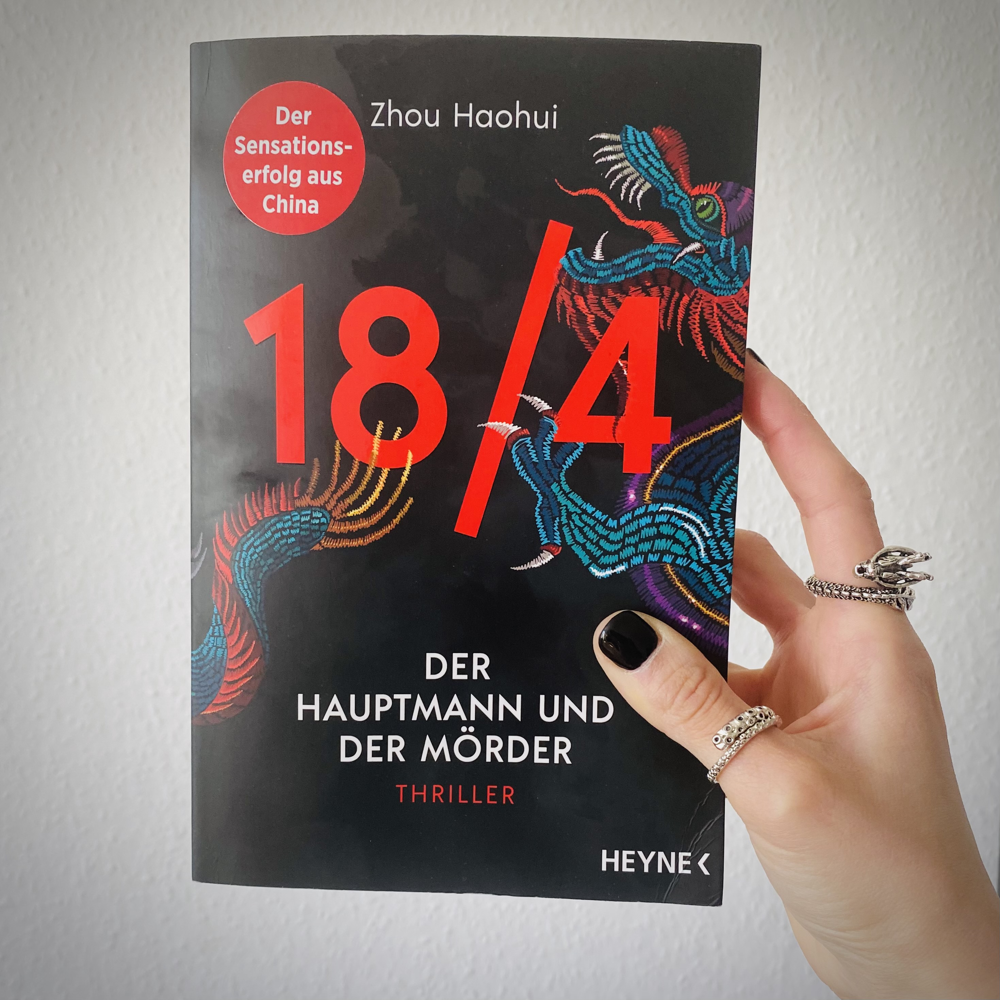

<figure></figure>

<strong>Titel: </strong>18/4 - Der Hauptmann und der Mörder

<strong>Autor: </strong>Zhou Haohui

<strong>Verlag: </strong>Heyne

<strong>Erschienen: </strong>Januar 2022

<strong>Seitenanzahl: </strong>400

<strong>Bewertung: </strong>🌕🌕🌕🌕🌑 

___

Danke an Random House Bloggerportal und Heyne Verlag für die freundliche Bereitstellung dieses Rezensionsexemplars. 

## Klappentext
In der chinesischen Millionenstadt Chengdu treibt ein kaltblütiger Killer sein Unwesen, der vor 18 Jahren die Polizei schon einmal zum Narren gehalten hat. Er nennt sich selbst Eumenides und tötet Menschen, deren Verbrechen von der Polizei nicht geahndet wurden. Mittels Todesanzeigen kündigt er an, wen er ermordet, wann er zuschlägt und warum das Opfer sterben muss. Damit verhöhnt er die zu seiner Verhaftung einberufene Sondereinsatzgruppe 18/4 und den brillanten Hauptmann Pei Tao. Bei jedem Mord ist Eumenides ihnen einen Schritt voraus. Zu spät erkennt Pei Tao, dass auch seine Geheimnisse und Vergehen vor dem Killer nicht sicher sind. Ein tödliches Katz-und-Maus-Spiel beginnt...

## Meinung
Es hat eine Weile gedauert, bis ich in die Geschichte eintauchen konnte. Das lag an den vielen Charakteren mit ungewohnten Namen, Zeitsprüngen in der Erzählung, und schnellen Aktionsszenen und Dialogen – all das machte es schwierig, den roten Faden zu verfolgen. Aber nach ein paar Kapiteln wurde es klarer (und spannender), wie die Persönlichkeit jedes Charakters sich entfaltet und welche Leiche sie im Keller haben.

Das Buch bietet aber mehr als ein echtes Thriller mit Se7en vibes. Es werden Themen wie Klassenunterschiede, Geschlechtsrollen (besonders in Führungspositionen), Machtverhältnisse, sowie ethische Verantwortung und Handlung angesprochen. Dadurch werden auch Einblicke in die chinesische Kultur und Alltagsleben vermittelt, was für LeserInnen außerhalb dieses Kulturraums besonders interessant ist.

Ich bin schon gespannt auf die folgenden Teilen in der *18/4* Trilogie!