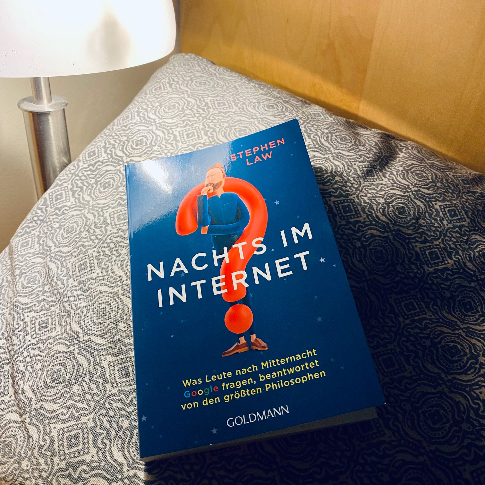

<figure></figure>

<strong>Titel: </strong>Nachts im Internet

<strong>Autor: </strong>Stephen Law

<strong>Verlag: </strong>Goldmann

<strong>Erschienen: </strong>April 2022

<strong>Seitenanzahl: </strong>240

<strong>Bewertung: </strong>🌕🌕🌗🌑🌑 

___

Danke an Random House Bloggerportal und Goldmann Verlag für die freundliche Bereitstellung dieses Rezensionsexemplars. 

## Klappentext

Jeden Tag suchen Millionen von Menschen bei Google Antworten – auf die kleinen, alltäglichen und auf die großen Fragen des Lebens. Besonders nachts werden bei Google die wichtigen und oft dramatischen Fragen gestellt: Werde ich manipuliert? Hat das Leben einen Sinn? Habe ich »die Eine« gefunden? Der Philosoph Stephen Law nimmt diese existenziellen Fragen ernst, die im Netz recherchiert werden, und nutzt die Weisheit von Platon, Kant, Kierkegaard und anderen großen Denkern, um unsere Sorgen und Unsicherheiten zu bewältigen. Ganz egal, was einen mitten in der Nacht in tiefste Verzweiflung treibt, dieses Buch klärt auch die brennendsten Fragen.

## Meinung

Wer hat sich nicht einmal gefragt: "Komme ich in die Hölle?", "Wann fängt mein Leben endlich an?", "Wäre ewiges Leben wünschenswert?", "Warum hat mein Toast ein Gesicht?", "Habe ich einen freien Willen?". Mir kommen solche Gedanken meist um [4 Uhr morgens](https://www.ted.com/talks/rives_the_museum_of_four_in_the_morning?language=en){:target="_blank"} und, wie viele digital natives, frage ich den nächstliegenden zugängliche und vorurteilsfreie (wenn auch nicht ganz vertauliche) Freund/Therapeut -- Google.

Die algorithmisch bestimmten Suchergebnisse zu diesen Fragen sind überwiegend zurückfließendes Marketing Content, das ich erst nach Cookies-Ablehnung, Popups-Schließung, Kontoerstellung, und ein paar Werbungen lesen kann. Mit so vielen Ablenkungen vergesse ich inzwischen meine existentielle Fragen 🙃 

Wenn du, wie ich, genüg davon hast und eher nach alte Weisheiten suchst, dann ist dieses Buch ein guter Startpunkt. Aber ausführliche philosophische Diskussionen gibt's hier auch nicht.

Insgesamt 45 Fragen wie die oben gelistet werden auf jeweils 2-5 Seiten angesprochen. (Das Format ist ähnlich zum Buch [*Die Zukunft is smart*](/buchrezension-die-zukunft-ist-smart/).) Da die Antworten zu diesen großen Fragen so kurz sind, sind sie (sehr) einseitig und oberflächlich. Daher dienen diese Aufsätze eher als Denkanstöße statt Lösungsansätze für existentielle Krisen.

Zum Beispiel, die Antwort auf die Frage "Warum habe ich keine Freunde?" bezieht sich auf die Sozialisierungsmöglichkeiten und empfehlt, mehr rauszugehen und Aktivitäten zu unternehmen, um Kontakte und Freundschaften zu knüpfen. (Auf die [Stanford Encyclopedia of Philosophy](https://plato.stanford.edu/entries/friendship/) wird man schlauer.)

Außerdem ist mir nicht klar, wer die Zielgruppe für dieses Buch ist. Manche Fragen thematisieren triviale Gedanken oder werden wie für Kinder erklärt, andere hingegen gehen auf heikle Themen ein.

Am Ende des Tages würde ich es trotzdem empfehlen, zu diesem/einem Buch zu greifen, anstatt zu scrollen.