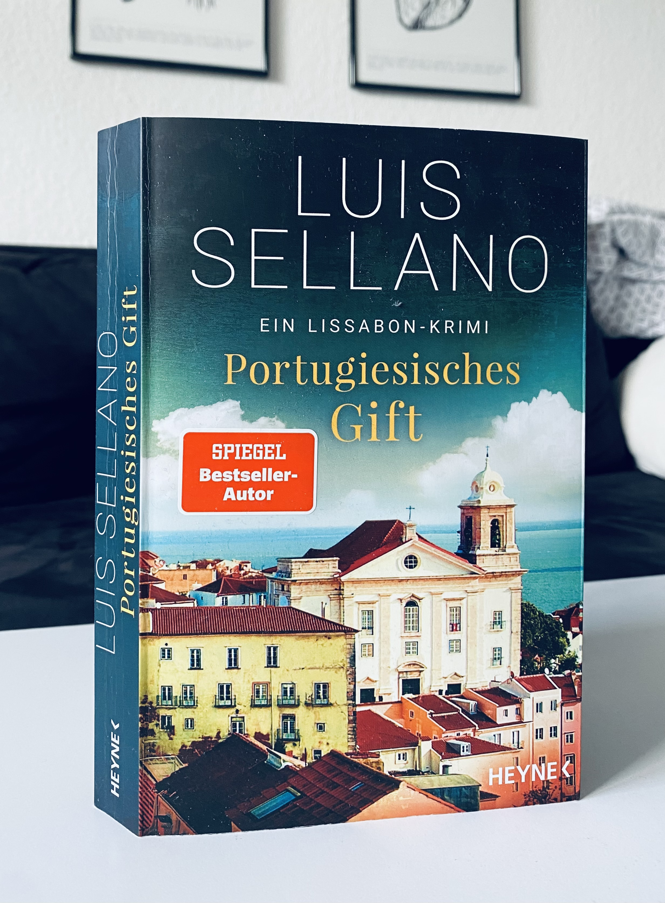

<figure></figure>

<strong>Titel: </strong>Portugiesisches Gift

<strong>Autor: </strong>Luis Sellano

<strong>Verlag: </strong>Heyne

<strong>Erschienen: </strong>April 2022

<strong>Seitenanzahl: </strong>304

<strong>Bewertung: </strong>🌕🌕🌗🌑🌑 

___

Danke an Random House Bloggerportal und Heyne Verlag für die freundliche Bereitstellung dieses Rezensionsexemplars. 

## Klappentext

Ein Sommertag in Lissabon. Die Menschen flanieren durch die Altstadt, das Wasser des Tejo glitzert in der Sonne. Kriminalkommissarin Helena Gomes ist in düsterer Stimmung. Sie ermittelt im Fall eines Jungen, der an einem allergischen Schock gestorben ist. Auf den ersten Blick sieht alles nach einem Unfall aus - doch die Eltern des Jungen beschuldigen sich gegenseitig. Welches dunkle Geheimnis verbirgt die Familie? Gemeinsam mit ihrem Freund, dem detektivisch begabten Antiquar Henrik Falkner, begibt sich Helen auf die Suche nach Antworten.

## Meinung

Dieses Buch ist Teil 7 der [Serie von Lissabon-Krimis](https://www.penguinrandomhouse.de/UEBERSICHT-ZU-LUIS-SELLANO-BEI-RANDOM-HOUSE/s1044.rhd#1044-subserie-5004487), und meine Einleitung ins Werk dieses Autors. Ich habe etwas Ähnliches wie [Mario Limas *Die Mauern von Porto*](/buchrezension-diemauernvonporto/) erwartet: schöne Stadt- und Landschaftsbeschreibungen, spannende Verfolgungen und Krimi-Rätsel, sowie auch Diskussionspunkte wie Mordverjährung. So was liest man auch in *Portugiesische Gift*, nur langweiliger, weniger überzeugend, und in etwa 100 Seiten mehr als notwendig.

Die Geschichte wirkt eher wie eine Seifenoper als ein Krimi, mit Liebesaffären, Geheimnissen, und Familiendramen. Das beinhaltent auch Themen wie Suizig, Kindergewalt und -misbrauch, auf denen aber nicht nah genug eingagagen wird, um Wert zu legen.

Es gibt eigentlich drei Geschichten: zwei aus Helena Gomes bzw. Henrik Falkners Vergangenheit und eine vom Mordfall des Junges in der Gegenwart. Die Erzählung wechselt von einer zur anderen in fast jedem Kapitel, so dass es verwirrend und unübersichtlich wird.

Außerdem wirken die Figuren unsympathisch oder ganz ausdrucksloss. Deshalb konnte ich mich leider nicht in die Geschichte versetzen und die Ermittlung bis zur Falllösung hat mich kalt gelassen.

<figure></figure>