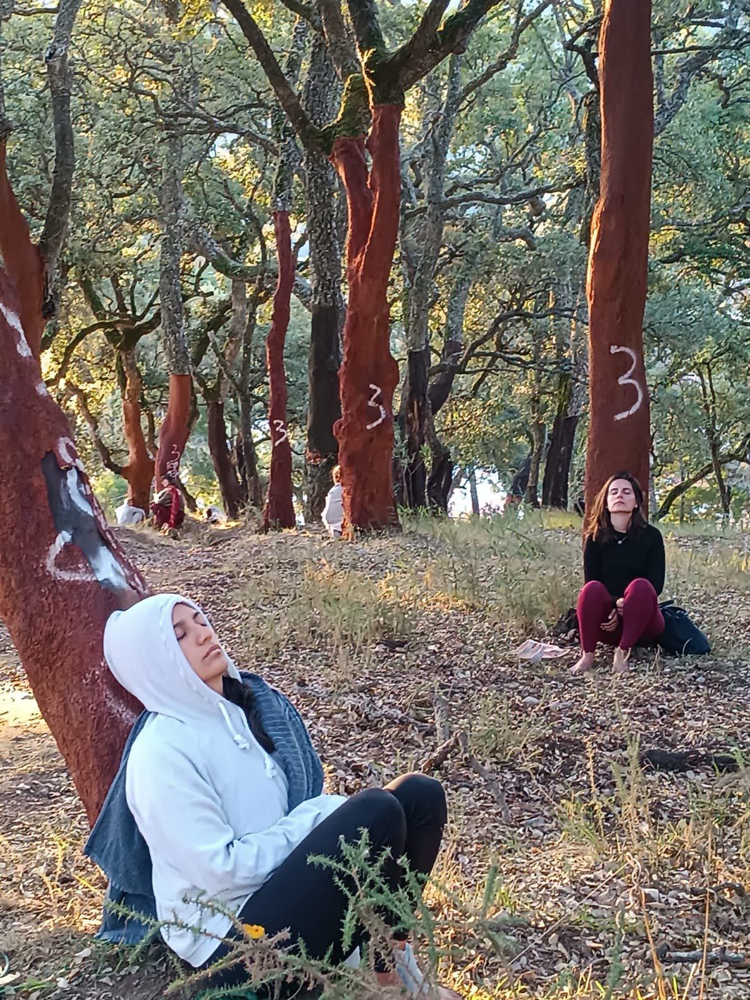
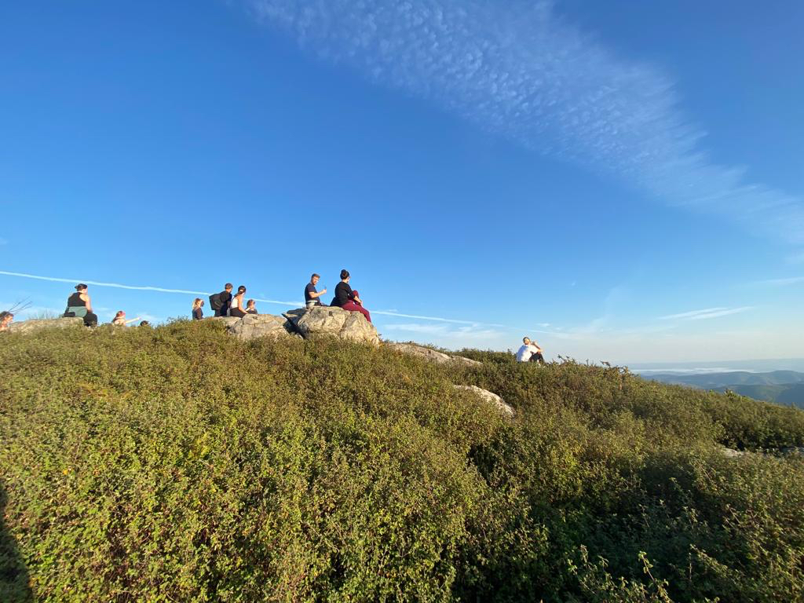
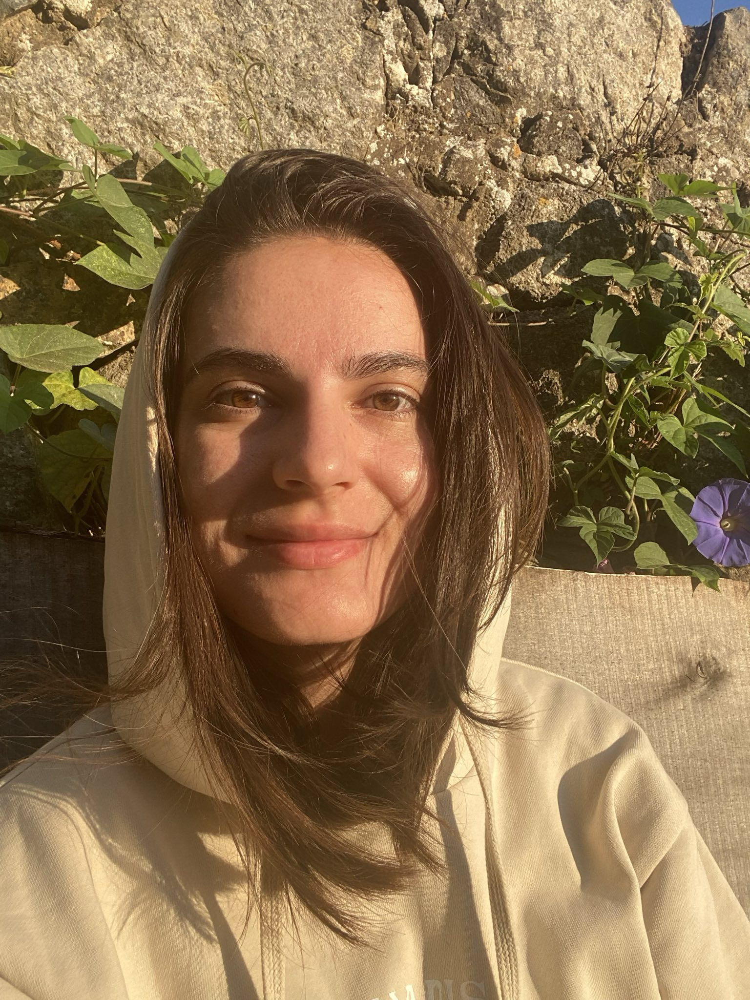
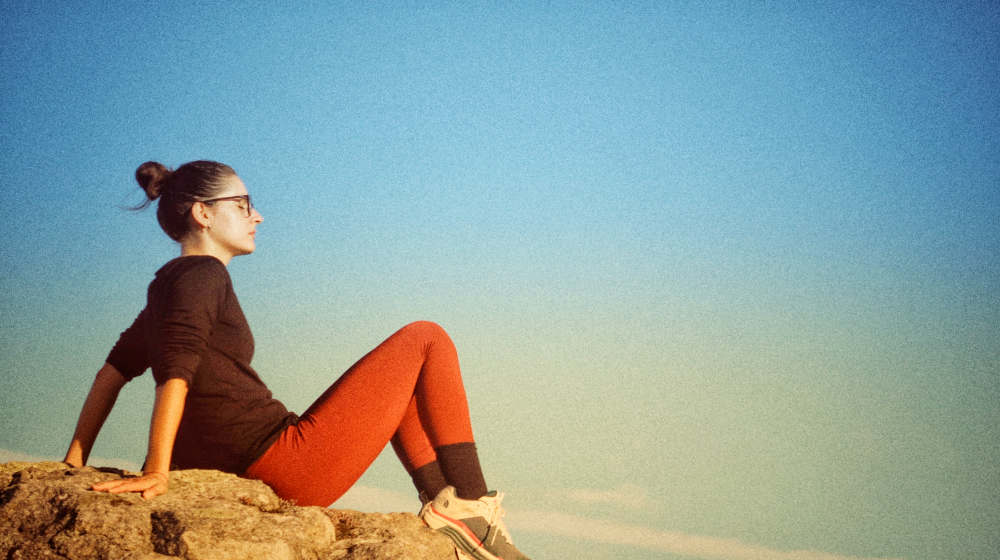
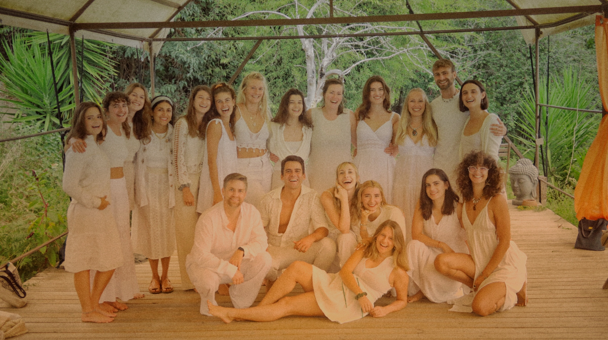
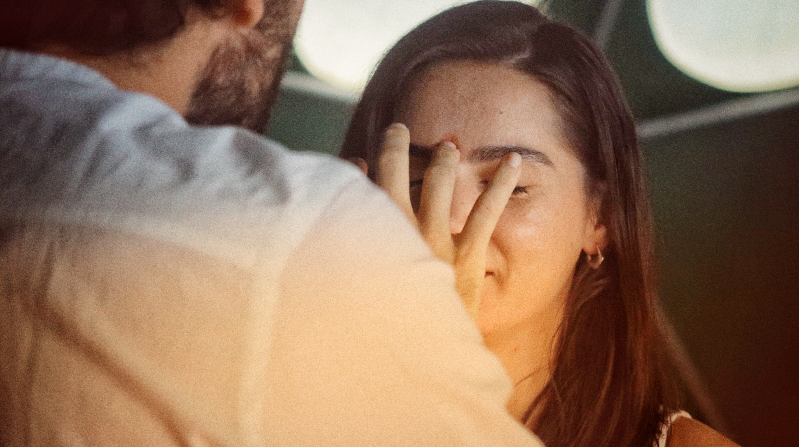

In 2013 I attended my first yoga class. In 2023 I taught my first class.

For the past decade I've been on a soul-searching spiritual journey through different yoga, meditation, and transcendental experiences. Earlier this month I took the leap to become a yoga teacher, and completed a 200h yoga teacher training in Hatha/Vinyasa at <a href="https://www.lacasashambala.com/" target="_blank">La Casa Shambala</a> in <a href="https://maps.app.goo.gl/P6oNmqayWqXcQhbX6" target="_blank">Monchique, Portugal</a>.

It was an incredible experience that went well beyond learning asanas.
It involved challenging my body, mind, and soul; going days in sweat and tears of joy and sorrow; connecting with nature and bonding with people from around the world.

  

    
  

  

    
  

  

    
  

For almost three weeks my daily schedule looked like this:

- 06:00-07:00 - Wake up, journal, neti pot
- 07:00-08:00 - Pranayama
- 08:00-09:30 - Hatha/Vinyasa yoga
- 09:30-10:30 - Breakfast
- 10:30-11:30 - Asana workshop
- 11:30-14:00 - Yoga theory/history/anatomy
- 14:00-15:00 - Lunch
- 15:00-16:00 - Self-study
- 16:00-16:30 - Yoga nidra
- 16:30-18:30 - Asana lab
- 18:30-20:00 - Yin yoga
- 20:00-21:00 - Dinner
- 21:00-22:00 - Journal, bedtime

  

    
  

  

    
  

  

    
  

We spent the time off the mat resting in/by the pool, hiking in silence, enjoying delicious vegan meals together (including a surprise apple pie for my birthday!), dancing to 90s songs, and exploring the town.

  

    
  

  

    
  

  

    
  

For the "exam" at the end of the training I had to create and teach a 50-minute yoga class to 10 peeps.
I chose to do a Hatha class focused on balance, because that's what resonated most with me during this time.
This is still one of my favorite flows to both teach and practice by myself.

1. Opening meditation
2. Warm-up
   - Child pose (*Balasana*)
   - Cat-Cow (*Marjariasana-Bitilasana*) with lifted opposite arm-leg
   - Revolved downward-facing dog (*Parivritta Adho Mukha Shvanasana*)
3. Sun salutations
   - *Surya Namaskar A* x2
   - *Surya Namaskar B* x2
4. Standing poses
   - Warrior 2 (*Virabhadrasana B*)
   - Extended side angle (*Utthita Parsvakonasana*)
5. Balancing poses
   - Tree (*Vrksasana*)
   - Extended hand to big toe (*Utthita Hasta Pashangustasana*)
   - Warrior 3 (*Virabhadrasana C*)
   - Half moon (*Ardha Chandrasana*)
   - Dancer (*Natarajasana*)
   - Eagle (*Garudasana*)
6. Core & Arm balances
   - Boat (*Navasana*)
   - Garland (*Malasana*) / Crow (*Bakasana*)
   - Upward plank (*Purvottanasana*)
   - Side plank (*Vasishthasana*)
7. Back bends
   - Locust (*Salabhasana*) / Bow (*Dhanurasana*)
   - Bridge (*Setu Bandhasana*) / Wheel (*Urdhva Dhanurasana*)
8. Forward bends
   - Butterfly (*Baddhakonasana*)
   - Seated forward bend (*Pascimottasana*)
9. Inversions
   - Shoulder stand (*Salamba Sarvangasana*) / Plow (*Halasana*)
   - Fish (*Matsyasana*)
10. Cool-down
   - Happy baby (*Ananda Balasana*)
   - Supine spinal twist (*Supta Matsyendrasana*)
   - Corpse (*Savasana*)
11. Closing meditation & Pranayama (*Nadhi Shodana*)

  

    
  

  

    
  

  

    
  

What's next? Lots of things! For a start, I'm offering [online yoga classes](../yoga.html)