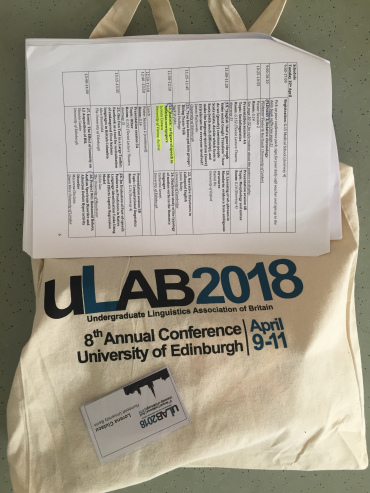

I've just come back, tired but inspired, from the **[ULAB Conference](http://lingstudents.co.uk/ulab2018/)**** in Edinburgh**, where for three days I've learned about research projects on various linguistics topics of students from Britain mainly.

## Programme

The [programme](http://lingstudents.co.uk/wp-content/uploads/2018/03/ULAB2018_programme.pdf) included **three keynotes** (Prof. Antonella Sorace on adult bilingualism,  Prof. Frederik Kortlandt on relative chronology, and Prof. Simon King on personalised speech communication aids), **poster sessions** and** talks** on sociolinguistics, discourse analysis, computational linguistics, typology, and psycholinguistics. Oh! and of course, there were social events: a walk to Arthur's seat, ceilidh, dinner, city tour, pub quiz... So I had the chance to meet many amazing people who inspired me to pursue research and also have fun along the way 🙂 Hopefully again at the next ULAB'19 hosted by the University of London at Queen Mary!

## My talk

On the second day, I gave a **talk** on the use of the word **'autistic' as figure of speech in Austrian newspapers.

This was a paper that I wrote for a seminar on critical discourse analysis as an undergrad at the University of Vienna. I had noticed how often people would say that someone or something is/ seems autistic, with no relation to the condition of autism spectrum disorder. I found this word used quite often not only is speech, but also in the media. After the initial reaction "What is this even supposed to mean!?" I set out to look closer at the contexts in which this adjective in used and by what group of people. I chose the three most read Austrian newspapers from different categories:

-   *Heute* is a tabloid found free in subway/ bus stations, in which you can read about trivial topics, local or big news but in a simple language and short sentences. The majority of [readers ](http://www.media-analyse.at/table/2838)are 40-49 years old and have an apprenticeship as their highest education.
-   *Kronen Zeitung* is slightly higher quality than Heute, most readers are 50-59 years old and have also an apprenticeship as their highest education.
-   *derStandard* is a quality newspaper in which you can read mainly about (inter)national events, politics, economics, culture, opinion and analysis. Most readers are 20-29 years old and have a University degree.

I searched the online archive between 2014-2016 of each newspaper with the keyword *autistisch**, *excluded the articles that referred to ASD, and ended up with 4 articles from KZ and 19 from DS in which the word was used as figure of speech. Here are some examples (my translation from German):

-   "[Hungary's autistic refugee policy](http://www.krone.at/473701)" → isolated, independent, closed
-   "autistic health minister" → cold, isolated person
-   "It is an autistic time, because people move around in their own universe." → asocial behavior
-   "[the Shard remains a strange solitary which spikes up autistically](https://derstandard.at/1342139077111/Modern-oder-Mordor)" → tall building, solitary, outsider
-   "[there was always the impression of an autistic nation](https://derstandard.at/2000014844421/Es-geht-nicht-nur-um-Musik-Konferenz-analysierte-den-Song)" → isolated, unwelcoming
-   "[soon everyday object won't just stay autistically in the corner and wait for signal](https://derstandard.at/1392687503825/Softwarebrueder-fuer-das-geloggte-Leben)" → subordinate, dependent, isolated
-   "[to describe this novel as borderline autistic is not really wrong](http://derstandard.at/2000024799189/Salman-Rushdie-Erzaehlen-als-letztes-Mittel)" → still not sure what this is supposed to mean

After I analysed the 23 articles, I found that 'autistic' was used in various types of texts (reviews, interviews, reports), in various non-medical contexts (politics, art, music, literature, science, architecture) to illustrate asocial behavior, (self-)isolation, distance, or disinterest. Most articles were published in DS, the newspaper with the youngest readership and highest educational level, and generally by persons from the upper social class. Thus, the word 'autistic' is used as a figure of speech with a negative connotation, and to display an elevated vocabulary of the speaker. I find this usage problematic because it reduces the complex ASD to a few negative characteristics, it objectifies persons with ASD, thus communicating a superficial view of ASD which leads to marginalization and oppression, where 'autistic' becomes a synonym for 'outsider', and 'atypical'. Just something to think about...
