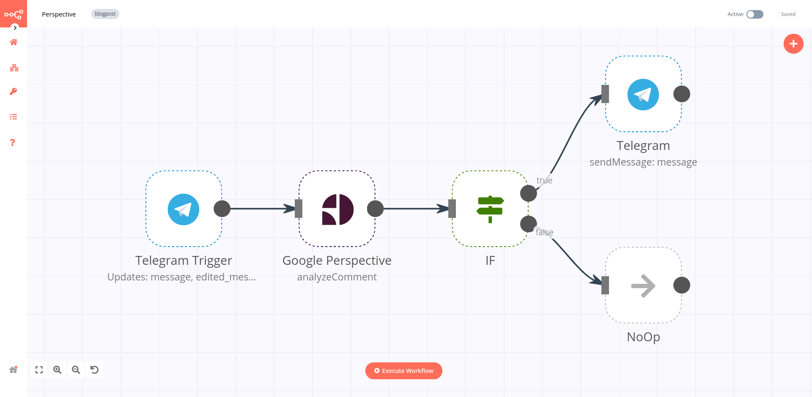
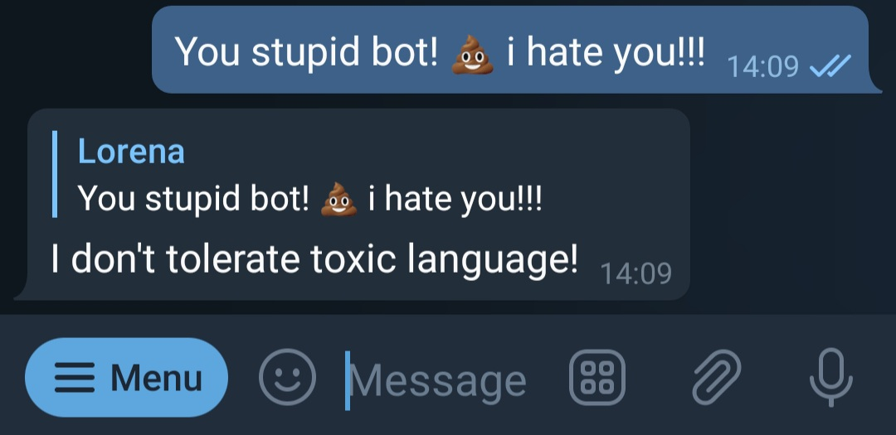

When was the last time you talked to someone online, be it friends, coworkers, or even strangers? Nowadays, you most likely do it every day.

## Toxic language online

Online communication platforms like Telegram, Reddit, or Discord have made it possible for people from all over the world to connect and share their thoughts on pretty much any topic, instantly.

This can be an enriching experience for users, but these platforms can also foster toxicity like cyberbullying, threats, and insults, forcing some users offline and silencing their voices.

## Managing toxic language with Perspective API

One solution to this problem comes from [Jigsaw](https://jigsaw.google.com/) and Google's Counter Abuse Technology team, who developed [*Perspective API*](https://www.perspectiveapi.com/): a free API that uses machine learning to identify toxic language in English, Spanish, French, German, Portuguese, Italian, and Russian. Toxic language is defined here as"a rude, disrespectful, or unreasonable comment that is likely to make someone leave a discussion".

In practice, Perspective scores a phrase based on the perceived impact the text may have in a conversation. The phrase can be analyzed on different attributes: flirtation, identity attack, insult, profanity, sexually explicit, threat, and (severe) toxicity. Keep in mind though that machine learning models can only be as good as the data they're trained on. This means that they may misclassify as toxic some innocent comments (and vice versa), so the flagged comments should be reviewed by a human eye.

Perspective API has been implemented by [several major publishers and platforms](https://www.perspectiveapi.com/case-studies/) like Reddit, The New York Times, and DISQUS, helping them moderate online comments. At n8n, we communicate with our 16,000+ community members in the [Discourse forum](https://community.n8n.io/), on [Discord](https://discord.gg/vWwMVThRta), [Twitter](https://twitter.com/n8n_io), and even via [Telegram for Spanish speakers](https://t.me/comunidadn8n). We value open, [inclusive](https://n8n.io/workflows/982), and respectful communication and want to ensure that everyone has a positive experience in the n8n community -- and beyond.

To this end, we used the Perspective API to build the [***Google Perspective node***](https://docs.n8n.io/nodes/n8n-nodes-base.googlePerspective/)*,* which allows you to integrate toxic language detection in your workflows.

## Workflow for detecting toxic language in Telegram messages
To give you an idea of how you can use the *Google Perspective node*, we created [a workflow](https://n8n.io/workflows/1216) that detects toxic language in messages sent in a Telegram chat and replies with a warning message.

-   ***Telegram Trigger node*** starts the workflow when a new message is sent in a Telegram chat.
-   ***Google Perspective node*** analyzes the text of the message and returns a probability value between 0 and 1 of how likely it is that the content is toxic.
-   ***IF node*** filters messages with a toxic probability value above 0.7.
-   ***Telegram node*** sends a message in the chat with the text "I don't tolerate toxic language" if the probability value is above 0.7.
-   ***NoOp node*** takes no action if the probability value is below 0.7. This node is optional and serves only to show that the workflow can be extended in this direction.

Now let's see how to configure each node step by step. If you haven't built an n8n workflow yet, you might want to take a look at our [quickstart guide](https://docs.n8n.io/quickstart/) or take the [beginner's course](https://docs.n8n.io/courses/level-one/). This will help you understand the configuration of the nodes used in this workflow.

### 1\. Get new messages from Telegram

First of all, you need to create a Telegram bot and get credentials. Start a chat with [Botfather](https://telegram.me/BotFather) in your Telegram account and follow the instructions to create your bot and get credentials. Make sure you add your newly created bot to the channel you want to monitor.

Then, open the *Telegram Trigger node* and add your *Credentials Name* and *Access Token* in *Telegram API*.

In the *Updates* field select: *message, edited_message, channel_post,* and *edited_channel_post*. These update options will trigger the workflow when a text message is posted.

To test if the bot works well so far, execute the *Trigger node* and send a message to the Telegram channel. We tested this workflow with the message "You're a stupid bot! I hate you!" (we swear it's just for testing purposes, we actually think bots are pretty cool and smart). The *Telegram Trigger node* should output the following result:

### 2\. Analyze the toxicity of the message

In the second step, the incoming message from Telegram has to be analyzed with Perspective. In the *Google Perspective node* configure the following parameters:

-   *Operation*: Analyze Content\
    This operation analyzes the incoming text message.
-   *Text*:  `{{$json["message"]["text"]}}` 
    This expression selects the incoming Telegram message to be analyzed.

In the section *Attributes to Analyze* you can add one or more attributes supported by Perspective that you want to be detected in the incoming message. If you don't add any attribute, all will be returned by default. For this example, the node is configured to detect profanities and identity attacks in the text, so two attributes are added with the properties:

-   *Attribute Name:* Profanity
-   *Score Threshold*: 0.00\
    This value sets the score above which to return results. The score is a value between 0 and 1 representing the probability that the text is toxic; it doesn't reflect the intensity (how toxic the text is). For example, if you set the *Score Threshold* at 0.5, then only messages that are 50% likely to be toxic are returned. If no value is set, at zero all scores are returned. You can read more [in this article](https://medium.com/jigsaw/what-do-perspectives-scores-mean-113b37788a5d) about what the scores mean.

In the section *Options*, you can select the *Language* of the text input. This option is useful if you want to monitor only a specific language. If unspecified, the node will auto-detect the language. In our example, we select the *Language* English.

Now if you execute the *Google Perspective node*, the output should look like this:

### 3\. Filter toxic messages

In the third step, the toxic messages with a probability higher that 0.7 have to be filtered out. For this, you need to set up an *IF node* with the following parameters:

-   *Value 1:*  `{{$json["attributeScores"]["PROFANITY"]["summaryScore"]["value"]}}`  \
    This expression selects the score value of the respective attribute.
-   ***Operation:* Larger**
-   *Value 2*: 0.7\
    This is the value we want to compare the score with.

If you execute the IF node now, it outputs the following results:

The message "You're a stupid bot! I hate you!" scored 0.92 for profanity and 0.62 for identity attack, which means it has downright strong toxic language on these attributes.

### 4\. Send a warning message to Telegram

The final step is taking action against the toxic message. A mild action would be to just reply to the message in the Telegram channel warning the user that "We don't tolerate toxic language here!". To do this, configure the *Telegram node* with the following parameters:

-   *Resource*: Message
-   *Operation*: Send Message
-   *Chat ID*:  `{{$node["Telegram Trigger"].json["message"]["chat"]["id"]}}` 
-   *Text*: I don't tolerate toxic language!
-   *Add Field > Reply to Message ID*:  `{{$node["Telegram Trigger"].json["message"]["message_id"]}}` 

Now the bully will be publicly admonished in Telegram (once again, sorry, bot, you're really cool):

## What's next?

In this post, you've learned about the challenge and importance of monitoring toxic language in online communities and how you can build a no-code Telegram bot for this purpose. The use case in this tutorial is fairly simplistic, but this kind of toxic language detector can be implemented in various platforms at scale.

For example, you could tweak this workflow and connect the *Google Perspective node* to Discord, Discourse, or DISQUS to detect toxic language in online communities and forums, or even to Gmail to filter out toxic emails. You can take different actions to toxic messages, for example forwarding them to a moderator, storing them in a database, flagging or banning the user depending on their message scores.

> This post was originally published on the [n8n blog](https://n8n.io/blog/create-a-toxic-language-detector-for-telegram/).