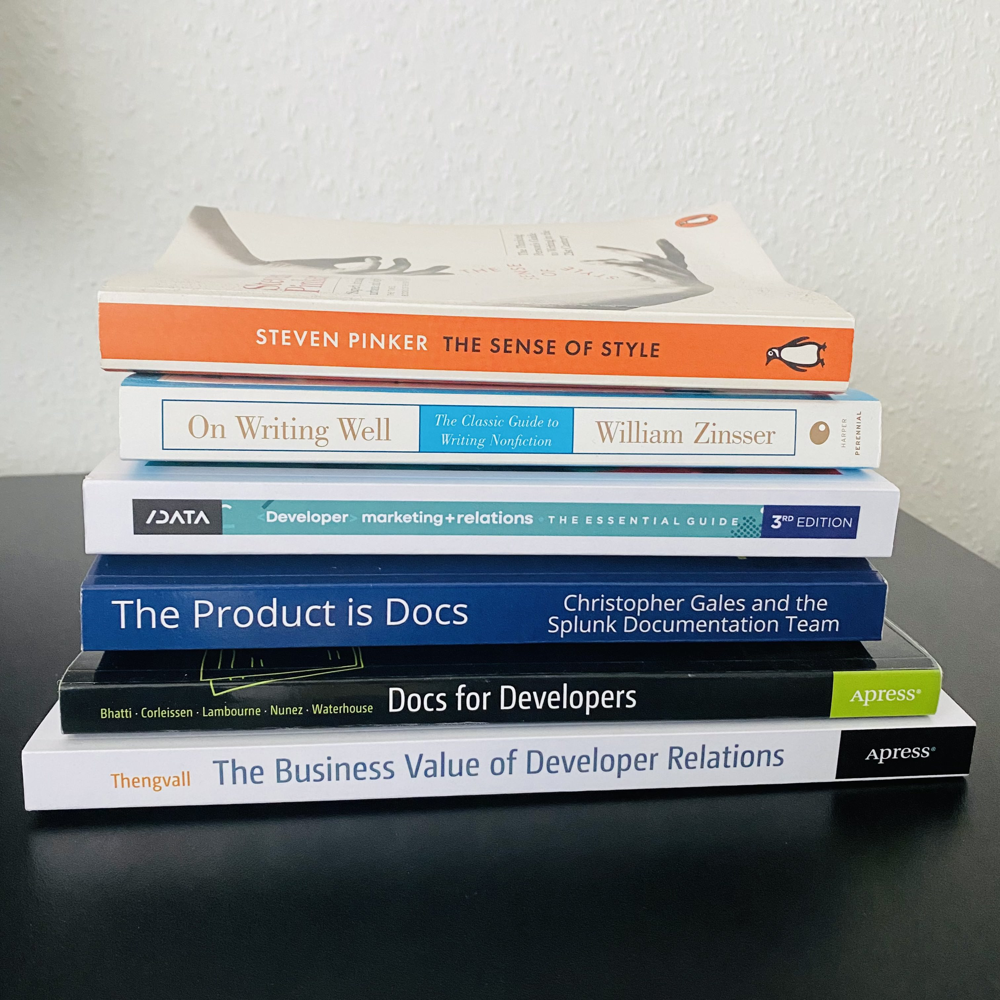

Books, podcasts, and courses to help technical writers hone their writing skills and collaborate with DevRel and Marketing teams.

<!--truncate-->

For over a year now, I've been working as a technical writer in a tech startup developing a workflow automation tool. I've been part of a Developer Relations (DevRel) team, then a Marketing team, as well as some Product in-between. This organization means that I had to (re)learn how to **collaborate** efficiently across teams with different strategies, and **commnicate** the value of technical writing for achieving different goals.

One thing that helped me in this challenge was diving into different resources on these topics. In the spirit of sharing knowledge with other fellow technical writers, here's a **list of books, podcasts, and courses around technical writing**:

## Books

### Technical writing

- [***Docs for Developers* by Jared Bhatti et al.**](https://docsfordevelopers.com/) offers a walk-through the entire software documentation process, from understanding users to publishing and maintaining docs. (Bonus points: it includes illustrations of corgies.)
- [***The Product is Docs* by Christopher Gales and the Splunk Documentation Team**](https://www.splunk.com/en_us/blog/splunklife/the-product-is-docs.html) takes *Docs for Developers* a step further by including best practices from the Splunk team and chapters about how technical writers can work with different teams (Support, Marketing, Engineering, Product, UX/Design, and remote).
- [***Docs like Code* by Anne Gentle**](https://www.docslikecode.com/book/)
- [***Every Page is Page One* by Mark Baker**](https://everypageispageone.com/the-book/)

### General writing

- [***The Sense of Style* by Steven Pinker**](https://www.youtube.com/watch?v=3ZKTmsgqi0U) is a modern guide on how to read and write clearly, that gets into the nitty-gritty details of the English language from a linguistics and cognitive science perspective.
- [***On Writing Well* by William Zinsser**](https://www.blinkist.com/de/books/on-writing-well-en) is an oldie but goldie among books dedicated to the art of writing non-fiction, and includes a chapter about technical writing.
- [***The Elements of Style* by Strunk/White**](https://www.gutenberg.org/files/37134/37134-h/37134-h.htm) is, to any English major and (aspiring) writer, a reference book on grammar and style rules (though some are outdated by now), with the maxim "Remove unnecessary words!"

### DevRel teams

- [***The Business Value of Developer Relations* by Mary Thengvall**](https://www.oreilly.com/library/view/the-business-value/9781484237489/) is a manual on how to build, manage, and measure the success of a DevRel team.
- [***Developer Marketing and Relations* by Caroline Lewko**](https://www.devrelx.com/book) is a practical guide on working at the intersection of DevRel and Marketing, with concrete good and bad examples from big tech companies.

## Podcasts

- [API the Docs](https://open.spotify.com/show/6QccUn9lMYwfnoO9s4shp1?si=222c36ae03774e60)
- [Knowledgebase Ninjas](https://open.spotify.com/show/6FvQBMNBUhqe4VN2ZVybnj?si=a39ba13487734980)
- [Content Components](https://open.spotify.com/show/7sfUcBaDWcaSMj2HrMBdtG?si=6dcaa5fbf5314a55)

## Courses

- [Technical Writing for Engineers (Google)](https://developers.google.com/tech-writing)
- [Technical Writing Fundamentals (GitLab)](https://about.gitlab.com/handbook/engineering/ux/technical-writing/fundamentals/)
- [Technical Writing: How to Write Software Documentation](https://www.udemy.com/course/start-your-career-as-user-assistance-developer/)
- [Project Management for Technical Writers](https://www.udemy.com/course/project-management-for-technical-writers/)
- [UX and Information Architecture Basics for Technical Writers](https://www.udemy.com/course/technical-writing-how-to-define-information-architecture/)
