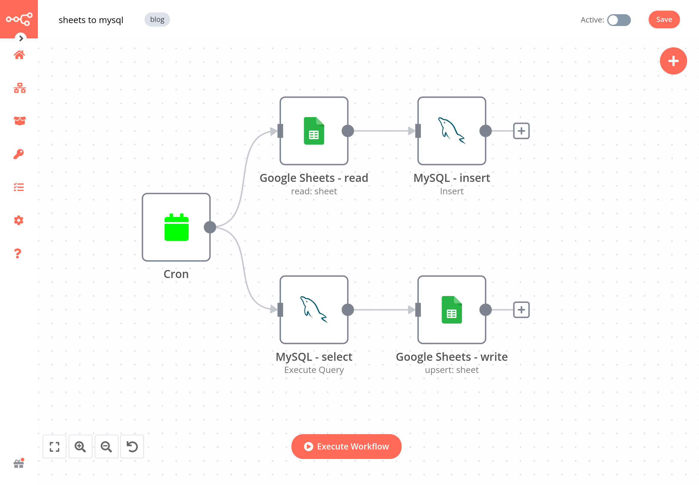

Discover two ways to connect MySQL with Google Sheets, and learn to build no-code workflows for automating it.

<!--truncate-->

If you've been struggling to connect your MySQL database with Google Sheets, you've come to the right place.

Establishing a connection from Google Sheets to MySQL allows you to avoid manually updating data in one source and importing/exporting data sets, thus reducing human errors.

Connecting Google Sheets with MySQL is also a way to limit access to a data source, while giving access to that data in another source. For example, if your company stores data about sales orders, but the sales representatives don't feel comfortable with querying the database, you can connect the database to Google Sheets, so they read and analyze the data in the spreadsheet.

In this tutorial, we'll show you how to sync Google spreadsheet with MySQL database in two ways: the hard code way using Apps Script, and the no-code way using n8n workflows.

## Can you connect Google Sheets to a database?

Yes, you can connect Google Sheets to a database like MySQL.

Establishing a connection between these two systems allows you to avoid manually updating data in one source and importing/exporting data sets, thus reducing human errors. You can also take it one step further and [synchronize data (one-way or two-way)](https://blog.n8n.io/how-to-sync-data-between-two-systems/) between a spreadsheet and a database. 

Connecting Google Sheets with MySQL is also a way to limit access to a data source, while giving access to that data in another source. For example, if your company stores data about sales orders, but the sales representatives don't feel comfortable with querying the database, you can connect the database to Google Sheets, so they read and analyze the data in the spreadsheet.

## Method 1: Google Apps Script to connect MySQL to Google Sheets

[**Apps Script**](https://developers.google.com/apps-script) is the cloud-based JavaScript platform from Google. With Apps Script, you can integrate with and automate tasks across Google products. For example, you can create scripts to connect MySQL to Google Sheets.

1. Set up your MySQL database and get the connectivity data:

  - Server
  - Database name
  - Username
  - Password
  - Port Number

2. In your Google Sheet, select Extensions > Apps Script.  
  This opens a new untitled project in Apps Script in your browser. The project includes a place-holder function in the code editor.
3. In the code editor, replace the place-holder function with the JavaScript code for creating a connection with MySQL. For example, you can use this [public code](https://gist.github.com/mike-seekwell/c54c62e1ba7560583a84b9fe4c1fd157).
4. Save the project under a descriptive name (e.g. *MySQL Connection*).
5. Run the script by pressing the Run Script icon. Note: The first time you run the script you will be asked to provide authorization to Google.

## Method 2: n8n automated workflows to connect MySQL to Google Sheets

Next, we'll show you two workflows that automatically import data from Google Sheets into MySQL, and the other way around.

**Prerequisites for building the workflows:**

- [**n8n set up**](https://n8n.io/pricing). The easiest way to get started is to [download the free desktop app](https://docs.n8n.io/hosting/installation/desktop-app/), but you can also [sign up for n8n Cloud](https://docs.n8n.io/hosting/installation/cloud/) or [self-host n8n](https://docs.n8n.io/hosting/installation/docker/).
- **A MySQL database and [credentials](https://docs.n8n.io/integrations/credentials/mysql/)**. You need these to use the [MySQL integration](https://n8n.io/integrations/109-mysql/) to access the MySQL API.
- **A Google account and [credentials](https://docs.n8n.io/integrations/credentials/google/)**. You need these to use the [Google Sheets integration](https://n8n.io/integrations/18-google-sheets-/) to access the Google Sheets API. The API is free to use, but beware of [usage quotas and limitations](https://developers.google.com/sheets/api/limits).

### Import data from Google Sheets into MySQL

[This workflow](https://app.n8n.io/workflows/1752) automatically imports data from Google Sheets into a MySQL database every week.

1. **Cron node** executes the workflow every Monday at 5am. You can change the time interval by tweaking the following parameters:

- Mode: Every Week
- Hour: 5
- Minute: 0
- Weekday: Monday
   

2. **Google Sheets node** reads data from a spreadsheet.

3. **MySQL node** inserts the data from Google Sheets into a MySQL table.
  Make sure that the column names in Google Sheets and the MySQL table match.

### Import data from MySQL into Google Sheets

[This workflow](https://app.n8n.io/workflows/1753) automatically imports data from a MySQL database into Google Sheets. The node configuration is similar to the previous workflow, 

1. **Cron node** executes the workflow at regular preset time intervals.
2. **MySQL node** selects all book titles and prices from the books table in the database. You can change what data you want to extract from the table by tweaking the following parameters:
   
  - Query: `SELECT * FROM books;`

3. **Google Sheets node** appends the data from the MySQL table to a sheet.
  Alternatively, you can update data or create new records in the the sheet by selecting the operation *Create or Update*. Note that in this case, you need to have a key column (for example, a unique ID) based on which to compare the new and existing data.

## What’s next?

In this post, you learned how to connect MySQL with Google Sheets in two different ways: using Google App Script and n8n workflows. Now you two workflow templates for connecting your database with spreadsheets, making your work more efficient. 

Here's what you can do next:

- Read more tutorials about importing data into Google Sheets, for example [how to import JSON from an API and local files](https://blog.n8n.io/google-sheets-import-json/).
- Check out the [workflow page](https://n8n.io/workflows/) for more automation ideas with Google Sheets and MySQL. For example, you can use add MySQL nodes to power up these workflows that [sync data between multiple Google Sheets](https://n8n.io/workflows/6/) or [get data via a REST API](https://n8n.io/workflows/226/).

> This post was originally published on the [n8n blog](https://blog.n8n.io/google-sheets-to-mysql/).